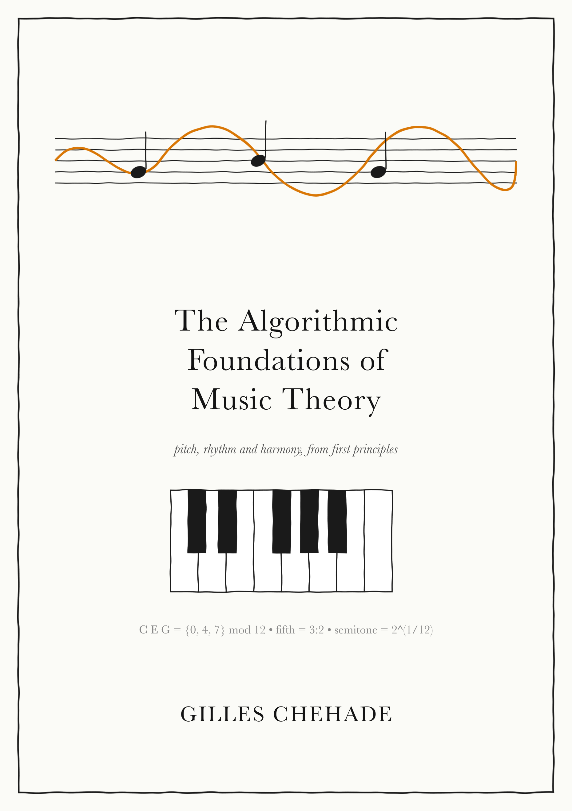

*Pitch, rhythm and harmony, from first principles.*

Published December 2026.

## About the book

Music theory is full of names, patterns and conventions, and most of us learn
them as rules to memorize. This book works out where they come from.

Take a simple example. In C major, the chord built on D is minor. You can
memorize that, or you can take every other note of the scale starting from D,
which gives D, F, A, and look at the intervals between them. Once you know how
that construction works, you can repeat it on any degree, in any key. One
procedure explains a whole family of results.

That is the algorithmic view: state the starting material, state each operation
applied to it, and follow the steps. Writing them down exposes the assumptions
a familiar name can hide, and gives you something to test. Change the input,
run the procedure, and compare the result with what you hear.

Not everything reduces to a construction. A chord's notes don't tell you what
it is doing in a phrase, and deciding where a melody should go involves style,
context and taste. When the book models that kind of behavior, it says which
relationships it keeps and which it leaves out.

The book grew out of years of music notebooks and a software project,
[go-harmony](https://github.com/poolpOrg/go-harmony), a music-theory engine
that builds intervals, scales, chords and progressions. Writing that engine
meant spelling out everything I "just knew", and those explanations became
this book.

## What's inside

The book concentrates on Western tonal theory and jazz, starting from sound and
time and building up to the relationships that organize notes into music.

- *Foundations*: sound, time, rhythm and perception; notes, intervals, tuning
  and temperament; scales, modes and chords; staff notation, analysis systems
  and MIDI.
- *Building harmony and melody*: harmony and secondary chords, texture, voice
  leading, cadences and phrase structure, melodic development, common
  progressions.
- *Advanced harmony*: extended chords, substitutions and reharmonization,
  Neapolitan and augmented sixth chords, modulation, pitch-class sets.
- *Rhythm and groove*: rhythmic placement, polyrhythm and cross-rhythm.
- *Form and application*: form and structure, a worked analysis,
  improvisation, composition and ear training.

Chapters come with exercises and worked solutions. A glossary and appendices
of Python listings at the back turn the procedures into code you can run.

## Who it's for

You can come to it from music, from programming, or from curiosity about how
the two meet. No prior music theory is assumed. The math is introduced where it
is used: ratios, logarithms and a little modular arithmetic. The Python
listings make the procedures concrete, but you can follow the main text without
running them.
