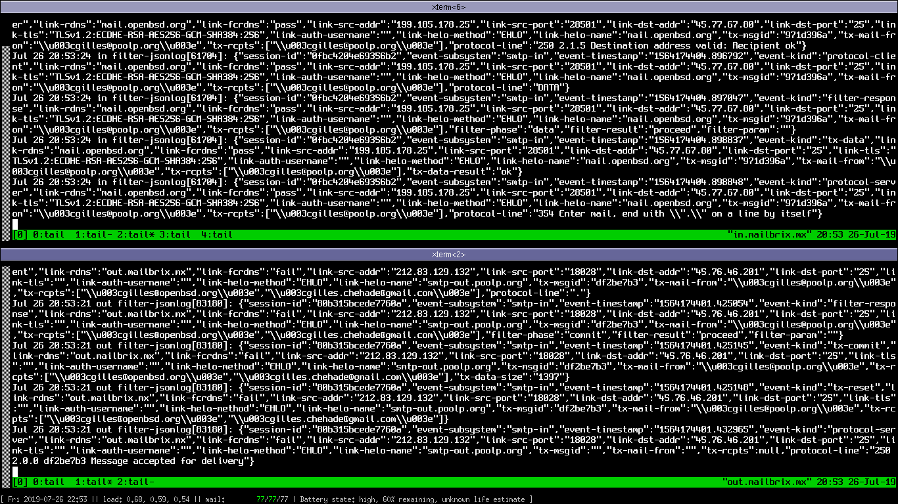

    TL;DR:
    - not much work outside of OpenSMTPD this week
    - OpenSMTPD portable builds with OpenSSL 1.1.x again
    - smtp-out reporting is working correctly on my laptop
    - wrote two filters that I'm actually using as you read this


Shout outs to my patrons !
--
As will become the tradition hopefully,
this report begins with a big thank you to my patrons,
cited by contribution then alphabetical order.

This month has been sponsored by:

- J. Derrick
- Mischa Peters
- Diego Meseguer
- Vegar Linge Halaand
- Bleader Raton
- Nick Ryan
- C
- Igor Zinovik
- Jan J


I have recently switched to a 75% part-time schedule at work so that I can spend
a "free" week each month working on my own stuff, mostly opensource, without any
kind of pressure: no one knows what I'll be working on and no one but me gets to
decide how I'll spend this time.
This comes at the cost of slashing a quarter of my wage, which is sustainable but
not ideal, so while most of my "free" weeks will be spent on opensource, I'll be
doing some sponsored development or short contracts to cover some of the loss if
needed.

I opened a patreon account so that people who care about my work can sponsor it,
allowing me to spend most (if not all) of these "free" weeks publishing code for
the community. If you want me to spend more time doing this then you know what
to do: [become my patron](https://www.patreon.com/gilles) !

So thanks again to my patrons who make this possible, I will list them in all of
my monthly reports, they are the sponsors of the work I describe below.


**What's in it for you ?**

Not much beyond the monthly public shout out,
the satisfaction of seeing some projects make progress thanks to you,
as well as my gratefulness for helping me spend more time on something I love.


The adventurous may even get early beta access to some code or private repository when stated in the report ;-)


OpenSMTPD portable builds again with OpenSSL 1.1.x
--
As I explained in [a previous report in May](https://poolp.org/posts/2019-06-02/may-2019-report/),
API changes that occured in OpenSSL after the LibreSSL fork caused enough divergence that it became impossible to build the same code for both.
Since OpenSMTPD is developed on OpenBSD which ships with LibreSSL,
this resulted in failures to build with OpenSSL 1.1.x and me trying to unfuck the situation through a maze of `#ifdef`s until my sanity began melting.


In May,
I brought a few functions from OpenSSL to LibreSSL to help reduce the divergence in OpenSMTPD scope and as a result,
with minimal work,
I have been able to build a working OpenSMTPD on an Ubuntu system with OpenSSL 1.1.x again.


```
$ uname -srm
Linux 5.0.0-15-generic x86_64
$ openssl version
OpenSSL 1.1.1b  26 Feb 2019
$ sudo smtpd -d
[sudo] password for gilles:
info: OpenSMTPD 6.5.0-portable starting
^C
```


When I announced that I would target LibreSSL and no longer OpenSSL,
a lot of people assumed that I was breaking OpenSSL support voluntarily which isn't accurate.
I just did not fix a breakage that was already there:
the same code could not build on LibreSSL, OpenSSL 1.0.x and 1.1.x,
but while LibreSSL was my daily target and would always build,
OpenSSL 1.0.x was still very widespread and OpenSSL 1.1.x was not yet packaged everywhere.


Even though it was pleasing to no longer deal with the differences between the three,
I did not enjoy the situation as it shrank our community considerably,
reduced the number of contributions we received,
forced people into switching to another MTA or use old versions of OpenSMTPD with old versions of OpenSSL...
It was possible to build LibreSSL and build an OpenSMTPD with LibreSSL everywhere,
I did it myself on various systems,
but the fact is there aren't many systems that provide an OpenSMTPD package depending on LibreSSL.
Either they stopped providing OpenSMTPD,
they packaged it with a ton of unsupported patches to make it build with OpenSSL,
or they took the easy path and had an old OpenSMTPD depend on OpenSSL 1.0.x,
causing many people to run very old versions of our code...


**So what has changed since then ?**

OpenSSL no longer supports most of 1.0.x so it's no longer as widespread as it used to,
only 1.0.2 will be supported until the end of this year,
most systems have already swiched to either LibreSSL or OpenSSL 1.1.x.
With that and the fact that I committed changes in LibreSSL to reduce the gap with OpenSSL 1.1.x,
the cost of supporting OpenSSL 1.1.x while keeping LibreSSL my daily target has become minimal.

We used to have `#ifdef`s in the code to cope with differences because it was VERY DIFFICULT to do otherwise,
but now the code can assume LibreSSL and the OpenSSL differences are handled in the compat layer outside of OpenSMTPD code itself.
I can look at the smtpd code without having to think "is this for LibreSSL or OpenSSL ?".

The only `#ifdef` that has creeped in the code is wether or not ECDSA server certificates are supported,
because the API is radically different,
but in this case it simply disables it if a function from LibreSSL could not be found.
This is very very manageable to me, I can live with that one ifdef.


These changes were all committed to the portable branch,
so the next OpenSMTPD release in November will support OpenSSL 1.1.x again and there will be no excuse not to run a recent version of OpenSMTPD :-)


Reporting API gets extended
---
The reporting API,
a mechanism by which OpenSMTPD can notify an external process of internal events in real time,
has been extended considerably.

As a reminder,
the API is a building block of filters as they can rely on it to construct an internal state for sessions,
but it can also be used to build a wide range of external tools that rely on analyzing events.
Improvements to the API can simplify considerably how filters are written,
just as it can make possible writing new tools that couldn't be written before.

The first extension to the reporting API is the `link-auth` event.
It is generated whenever an SMTP authentication is requested by a client,
and it records the username as well as the result of the authentication request.
By registering for this event,
it is possible to determine if a session was authenticated or not,
track which sessions were issued by which user,
etc...

```
report|1|1564213979.757908|smtp-in|link-auth|63dc9f08477410de|gilles|pass
report|1|1564214009.115878|smtp-in|link-auth|63dc9f06465b1cb2|gilles|fail
report|1|1564214037.439016|smtp-in|link-auth|63dc9f0732384d8d|gilles|error
```

While working on that,
I made sure that OpenSMTPD would obfuscate parameters to any event it reports when in an authentication phase.
This ensures that one can't accidentally leak credentials to a third party filter,
a database or a log file:
```
report|1|1562975948.315256|smtp-in|protocol-client|4772092f35819fed|AUTH LOGIN
report|1|1562975948.315572|smtp-in|protocol-server|4772092f35819fed|334 VXNlcm5hbWU6
report|1|1562975961.559697|smtp-in|protocol-client|4772092f35819fed|********
report|1|1562975961.559724|smtp-in|protocol-server|4772092f35819fed|334 UGFzc3dvcmQ6
report|1|1562975974.600669|smtp-in|protocol-client|4772092f35819fed|********
report|1|1562975975.325244|smtp-in|protocol-server|4772092f35819fed|535 Authentication failed


report|1|1563215271.737448|smtp-in|protocol-client|3138586bbd3c217b|AUTH PLAIN
report|1|1563215271.737705|smtp-in|protocol-server|3138586bbd3c217b|334
report|1|1563215272.493300|smtp-in|protocol-client|3138586bbd3c217b|AUTH PLAIN ********
report|1|1563215273.000374|smtp-in|protocol-server|3138586bbd3c217b|535 Authentication failed
```

The second extension is the introduction of a `tx-reset` event which is generated whenever a transaction is reset.
A transaction encompasses a sender, one or multiple recipients as well as a message,
so filters that deal with transaction will usually register multiple `tx-*` events to build a state with the informations they need.
Since multiple transactions can occur in a session,
there needs to be a way to clear the transaction data when it is no longer relevant.
Until now, to do this filters had to register for events that initiate or terminate a transaction `tx-begin`, `tx-commit` and `tx-rollback`,
to make sure that a cleanup function was called from each of these.
With `tx-reset`, filters no longer need to register these events if they don't intend to do anything with them,
they can register a `tx-reset` handler to cleanup transaction with the guarantee that when a transaction is no longer relevant the event will be generated.
```
report|1|1564191006.311117|smtp-in|tx-commit|f6369c781fea802b|fac552ff|2806
report|1|1564191006.311120|smtp-in|tx-reset|f6369c781fea802b|fac552ff

report|1|1564191100.066978|smtp-in|tx-rollback|f6369c8a16ddbcb8|8a4f9aad
report|1|1564191100.066982|smtp-in|tx-reset|f6369c8a16ddbcb8|8a4f9aad
```


Finally,
until now the reporting API "only" generated events for `smtp-in` which is incoming SMTP trafic,
but I have started teaching `smtp-out`, which is outgoing SMTP trafic, to also report all events.
This work is not fully done but it works enough that I have deployed it on my own MX:
```
report|1|1564191030.737128|smtp-out|link-connect|f6369c7b41a82d01|localhost|pass|45.76.46.201:40938|127.0.0.1:25
report|1|1564191030.738602|smtp-in|link-connect|f6369c7cc2cb4dfe|out.mailbrix.mx|fail|45.76.46.201:40938|127.0.0.1:25
report|1|1564191038.043809|smtp-in|link-connect|f6369c7d5157f9d8|mail.mailbrix.mx|pass|95.179.226.54:39341|45.76.46.201:25
report|1|1564191052.947431|smtp-out|link-connect|f6369c85f7a894d6|localhost|pass|45.76.46.201:4502|127.0.0.1:25
```

`link-auth` and `tx-reset` have already been committed,
the `smtp-out` work should be committed this month when I have built enough confidence it doesn't break anything.


Here comes my filter-rspamd
---
I had already written a proof of concept rspamd filter in Python a few months ago,
but it was meant to prove the API allowed such filters,
not to be usable for real so I didn't really care about it being robust or not.

Many people have asked me if I intended to improve and release it,
so I decided to actually take time and write a proper filter-rspamd that I would use myself.
I wrote the first lines of the filter yesterday early in the morning and by noon I had it deployed on my own MX.
I decided to write it in Golang because I didn't (and still don't) know that language,
so if I managed to write a useful filter in a language I don't know in just a few hours I guess the goal for a simple and useful API is reached ;-)

So how does it work ?

First the filter is built:
```
$ cd filter-rspamd
$ go build
```

Then it is installed:
```
$ doas cp filter-rspamd /usr/libexec
$
```

The smtpd.conf file needs to be updated:
```
[...]

filter rspamd proc-exec "/usr/libexec/filter-rspamd"

listen on all filter rspamd

[...]
```

And that's all, what's left to do is `rspamd` configuration outside of my scope :-)

Since I'm not confident in my Golang skills,
I wrote the filter in such a way that ANY error happening for pretty much any reason will flush message unprocessed as if the filter had been bypassed.
No matter if you forgot to start rspamd or if I made an error that causes my filter to fail parsing rspamd response in some situations,
any error will just output the mail as it was received: fail-safe by default.

As of today,
the filter already does a lot of useful things.

Adding X-Spam{,-Action,-Score} headers:
```
$ cat /var/mail/gilles
From gilles@laptop.home Fri Jul 26 08:54:35 2019
Return-Path: <gilles@laptop.home>
Delivered-To: gilles@laptop.home
X-Spam-Action: add header
X-Spam: yes
X-Spam-Score: 9 / 15
Received: from localhost (laptop.home [local])
	by laptop.home (OpenSMTPD) with ESMTPA id f5918d8b
	for <gilles@laptop.home>;
	Fri, 26 Jul 2019 08:54:35 +0200 (CEST)
From:  <gilles@laptop.home>
Date: Fri, 26 Jul 2019 08:54:35 +0200 (CEST)
To: gilles@laptop.home
Subject: test
Message-ID: <04eabdcea50bc883@laptop.home>

test
```

Rewrite Subject line:
```
$ cat /var/mail/gilles
From gilles@laptop.home Sat Jul 27 10:43:34 2019
Return-Path: <gilles@laptop.home>
Delivered-To: gilles@laptop.home
X-Spam-Action: rewrite subject
Received: from localhost (laptop.home [local])
	by laptop.home (OpenSMTPD) with ESMTPA id 97b0006c
	for <gilles@laptop.home>;
	Sat, 27 Jul 2019 10:43:34 +0200 (CEST)
From:  <gilles@laptop.home>
Date: Sat, 27 Jul 2019 10:43:34 +0200 (CEST)
To: gilles@laptop.home
Subject: *** SPAM *** test
Message-ID: <7e41c7e558f77a3e@laptop.home>

test
```

Reject content, greylist a session or soft reject a transaction:
```
$ echo 'XJS*C4JDBQADN1.NSBN3*2IDNEN*GTUBE-STANDARD-ANTI-UBE-TEST-EMAIL*C.34X' | mail -s test gilles
550 message rejected

$ echo greylist-test | mail -s test gilles
421 Try again later

$ echo softfail-test | mail -s test gilles
451 Try again later
```

Finally,
in addition to this,
filter-rspamd supports adding the DKIM-signature header provided by `rspamd` if any,
so by properly configuring `rspamd` to perform DKIM signing,
e-mails will be automagically DKIM signed when filter-rspamd is installed.
NO MORE FUCKING DKIMPROXY.

```
[...]
DKIM-Signature: v=1; a=rsa-sha256; c=relaxed/relaxed; d=poolp.org; s=opensmtpd;
	t=1564217527;
	h=from:from:reply-to:subject:date:date:message-id:message-id:to:to:cc;
	bh=g3zLYH4xKxcPrHOD18z9YfpQcnk/GaJedfustWU5uGs=;
	b=bPRnicsNRhVi+SdeF6UYQw7ZfViIloc460vRm+5qljYgNtBKmYSnda0JBhSKm1Kryn8Zde
	hRShh6QPHChc2RtCsh33U1il6MSE12OmC6vnI6TxDa0t2hXbYFFihx/4UNkFe7J1MYnR4i
	0hilMVclvtxknWwJf2sMIuVYFijl4b8=
X-Spam-Action: add header
X-Spam: yes
X-Spam-Score: 6.3 / 15
Received: from smtp-out.poolp.org (out.mailbrix.mx [212.83.129.132])
	by out.mailbrix.mx (OpenSMTPD) with ESMTP id a1b7fac1
	for <gilles.chehade@gmail.com>;
	Sat, 27 Jul 2019 08:52:06 +0000 (UTC)
Received: from localhost (poolp.org [local])
	by poolp.org (OpenSMTPD) with ESMTPA id c097ac23
	for <gilles.chehade@gmail.com>;
	Sat, 27 Jul 2019 10:52:06 +0200 (CEST)
From: gilles <gilles@poolp.org>
Date: Sat, 27 Jul 2019 10:52:06 +0200 (CEST)
To: gilles.chehade@gmail.com
Subject: test
Message-ID: <63dca0f89904c9b1@poolp.org>

test
```

All of these behaviors and thresholds are controlled from the rspamd configuration,
so filter-rspamd doesn't actually have any configuration itself.

The filter is still a work in progress,
so the code is not released yet ([patrons may get an early copy](https://patreon.com/gilles)),
but it is definitely useable as not only I'm running it on two MX but another OpenBSD hacker is also using it.
I'll likely release soon.


Here also comes my filter-jsonlog
---
I worked for years at a company dealing with large volumes of mails and know the importance of analytics and dashboards.
Until recently, the only way to push data for analytics was to parse the mail log,
extract patterns of information from lines to push them into a database.
The log format was designed to make this easier but it was not optimal as it was also meant to not overwhelm humans.

People have managed to
[create OpenSMTPD dashboard](https://www.tumfatig.net/20180129/monitor-opensmtpd-using-logstash-grafana/) using the mail log,
but also through parsing the output of `smtpctl show stats` which both work but are respectively unfriendly and hackish.
We can do better !

With reporting API came a format that was designed _solely_ for applications,
so the mail log format was simplified and trimmed from redundant informations,
whereas the reporting API would publish a lot of informations humans don't really care about when looking at logs.

I wrote a filter-eventlog last month which would simply write the reporting stream to a file:
```
[...]
report|1|1564217526.405901|smtp-in|protocol-client|63dca0f760bad4af|MAIL FROM:<gilles@poolp.org>
report|1|1564217526.406175|smtp-in|filter-response|63dca0f760bad4af|mail-from|proceed
report|1|1564217526.408265|smtp-in|tx-begin|63dca0f760bad4af|c097ac23
report|1|1564217526.408278|smtp-in|tx-mail|63dca0f760bad4af|c097ac23|<gilles@poolp.org>|ok
report|1|1564217526.408292|smtp-in|protocol-server|63dca0f760bad4af|250 2.0.0: Ok
report|1|1564217526.408414|smtp-in|protocol-client|63dca0f760bad4af|RCPT TO:<gilles.chehade@gmail.com>
report|1|1564217526.408630|smtp-in|filter-response|63dca0f760bad4af|rcpt-to|proceed
report|1|1564217526.410380|smtp-in|tx-envelope|63dca0f760bad4af|c097ac23|c097ac2360bfa130
report|1|1564217526.410400|smtp-in|tx-rcpt|63dca0f760bad4af|c097ac23|<gilles.chehade@gmail.com>|ok
report|1|1564217526.410417|smtp-in|protocol-server|63dca0f760bad4af|250 2.1.5 Destination address valid: Recipient ok
[...]
```

After discussing with a friend well versed in ELK he suggested I adopt a key-value format so it could be injected more easily,
so I added a command line option so the filter would output in the following format:
```
[...]
timestamp=1564217526.405901 subsystem=smtp-in evt=protocol-client session=63dca0f760bad4af line="MAIL FROM:<gilles@poolp.org>  "
timestamp=1564217526.406175 subsystem=smtp-in evt=filter-response session=63dca0f760bad4af phase=mail-from response=proceed
timestamp=1564217526.408265 subsystem=smtp-in evt=tx-begin session=63dca0f760bad4af msgid=c097ac23
timestamp=1564217526.408278 subsystem=smtp-in evt=tx-mail session=63dca0f760bad4af msgid=c097ac23 address=<gilles@poolp.org>   status=ok
timestamp=1564217526.408292 subsystem=smtp-in evt=protocol-server session=63dca0f760bad4af line="250 2.0.0: Ok"
timestamp=1564217526.408414 subsystem=smtp-in evt=protocol-client session=63dca0f760bad4af line="RCPT TO:<gilles.chehade@gmail.com> "
timestamp=1564217526.408630 subsystem=smtp-in evt=filter-response session=63dca0f760bad4af phase=rcpt-to response=proceed
timestamp=1564217526.410380 subsystem=smtp-in evt=tx-envelope session=63dca0f760bad4af msgid=c097ac23 evpid=c097ac2360bfa130
timestamp=1564217526.410400 subsystem=smtp-in evt=tx-rcpt session=63dca0f760bad4af msgid=c097ac23 address=<gilles.chehade@gmail.com>  status=ok
timestamp=1564217526.410417 subsystem=smtp-in evt=protocol-server session=63dca0f760bad4af line="250 2.1.5 Destination address valid: Recipient ok"
[...]
```

This was better as I could basically pipe this output into elasticsearch without post-processing and see these events in a Kibana dashboard,
however it only eased creating dashboards to compare different records for a similar event,
a much much better format would be to dump the entire session state for each event which would allow displaying ANY information for ANY event.

I wrote filter-jsonlog which is another golang filter that is slightly more complex than filter-eventlog.
Instead of just reading events from the stream and outputing them in a different format,
it actually builds an internal representation of the state of SMTP sessions as it receives events,
and for each event it outputs the state of the correspond SMTP session in json format since that format is easily injectable in various databases.

If we take the previous example,
while it would be very easy to create a piechart of top recipients because you'd be comparing data associated to a similar event,
it would be very hard if not impossible to create a piechart of TLS vs non-TLS sessions for a specific recipient.
With filter-jsonlog, because any event has its entire session state associated, visualzation can be created about ANY session information occuring at ANY event.

The output is logged to syslog so that syslog configuration can be used to determine in which file it should land,
and newsyslog can be used to determine the rotation policy,
while I use `filebeat` to inject the log to an elasticsearch node.
The setup for this is really trivial :-)

Here are two screenshots:

[full screen](2019-07-27-terms.jpeg)


[full screen](2019-07-27-kibana.jpeg)

Unfortunately I suck at creating dashboards myself,
so if you want to help me get things in shape to improve the jsonlog output and provide dashboard templates for the community,
get in touch with me !

This filter is also still a work in progress and the code is not released yet ([patrons may get an early copy](https://patreon.com/gilles)),
but it does work kinda.


What about the Fion window manager ?
---
I haven't talked about the Fion window manager because I didn't spend much time on it,
I was stuck trying to handle keyboard shortcuts correctly and I didn't want to waste my week on this,
however I got unstuck late last night so I will resume my work on it ;-)


What next ?
--
The smtp-out reporting is very important to me so it needs to be completed and committed.
I will also try to package filter-rspamd so it's one pkg_add away from a fresh install.
Hopefully people will help with filter-jsonlog and dashboards so I can move that faster than I would alone.

There's still work needed in the filters area but it's becoming good enough that I will start documenting,
making it easier for people to actually start playing with it.

If you like my work, [support me on patreon](https://patreon.com/gilles) !

--- 
Comments: [https://github.com/poolpOrg/poolp.org/discussions/103](https://github.com/poolpOrg/poolp.org/discussions/103)
