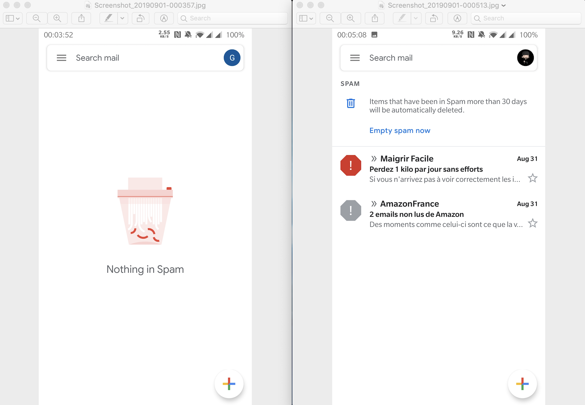


- Le mail n'est pas dur: les gens répètent ça parce qu'ils l'ont lu, pas parce qu'ils ont essayé
- Les Big Mailer Corps sont content de ce mythe, ça fait grossir leur base d'utilisateurs
- Les Big Mailer Corps contrôlent un large pourcentage de l'espace d'adressage des e-mails ce qui n'est bon pour personne
- C'est ok que des gens aient leurs adresses e-mails hébergés chez des Big Mailer Corps tant qu'il y a assez de gens en dehors



EDIT (2019-12-15)
--
Un guide pratique pour [installer un serveur de mail](/fr/posts/2019-12-23/mettre-en-place-un-serveur-de-mail-avec-opensmtpd-dovecot-et-rspamd/) a été publié sur ce blog.


# Avertissement

**<font color="red">CECI EST POUR LES SYSADMINS AVEC UNE COMPRÉHENSION TECH ET QUI SAVENT HÉBERGER DES SERVICES</font>.**
**L'auto-hébergement n'est pas DUR mais requiert du TRAVAIL, deux choss différentes.**
**Mettre en place une infrastructure de mail demande beaucoup de travail en amont, puis de la maintenance très basqie sur le long terme.**

Je travaille sur un serveur SMTP open source.
Je construit des solutions open source et propriétaires liées au mail.

Dans cet article,
je vais volontairement utiliser le terme `mail` parce qu'il est assez vague pour englober protocoles et logiciels.
Ce n'est pas un article très technique et je ne veux pas plonger dans les détails,
je veux que les gens qui n'ont jamais travaillé avec le mail puisse tout comprendre.

Je ne vais pas non plus expliquer comment j'accomplis les tâches que je décris comme simples.
Je veux que cet article se concentre sur le mythe "le mail est dur",
mettant de côté les solutions techniques utilisées pour les implémenter.
Je veux que les personnes qui lisent ceci puisse se renseigner sur [Postfix](http://www.postfix.org),
[Notqmail](https://github.com/notqmail/notqmail),
[Exim](https://www.exim.org) et [OpenSMTPD](https://www.OpenSMTPD.org),
et pas simplement aller directement sur OpenSMTPD parce que j'aurais donné des exemples.

J'écrirais ensuite un article pour y faire suite,
cette fois-ci en montrant comment je fais les choses avec OpenSMTPD.
Si des personnes écrivent des articles similaires pour d'autres solutions,
transmettez-les moi et j'en linkerai quelques uns.
Cet article sera mis à jour de temps en temps au fil des changements,
revenez de temps à autre.

Enfin,
Le nom Big Mailer Corps représente les fournisseurs d'e-mails principaux.
Je me veux pas en viser un spécifique,
vous pouvez concrètement remplacer Big Mailer Corps n'importe où dans ce texte par le nom d'un fournisseur qui détient plusieurs centaines de millions d'adresse de destinataires.
Gardez aussi à l'esprit que certains Big Mailer Corps permettent d'héberger sous votre propre nom de domaine,
donc quand je parle d'espace d'adressage e-mail,
si vous possédez un domain mais qu'il est hosté par un Big Mailer Corp,
alors votre domaine et vos adresses font partie de leur espace d'adressage.


# Il était une fois, "le mail est dur"
Lorsque vous commencez à cherchez à devenir indépendant pour vos e-mails,
dès lors que vous demandez de l'aide pour "monter un serveur de mail" sur un media tech, les gens vont invariablement sauter dans la discussion pour vous décourager d'essayer parce que "le mail est dur".

Non seulement "le mail est dur" mais il semblerai aussi que "les Big Mailer Corps ont déjà gagnés", que "tous les mails que vous enverrez à vos destinataires vont terminer en boite à spam", et que "vous serez inondés de spammers" qui vont "abuser de votre serveur pour lui faire relayer du spam au monde".

Wow, ça fait beaucoup là non ? :-|

Vous vouliez juste envoyer et recevoir du mail parce que ça semblai une bonne idée,
et c'est devenu la pire des décisions de votre vie. Mais est-ce que ça l'est vraiment ?


# Le logiciel est difficile
Le mail était dur...
Il y a longtemps, très longtemps.

Il était dur parce que les logiciels étaient durs à configurer correctement.
Un serveur de mail comme Sendmail demandait au moins un doctorat en théorie des langages pour se configurer, et la culture élitiste des postmasters qui pouvaient lire les "fichiers de configuration" de Sendmail n'a pas aidé à créer un environnement très amical pour les débutants.
Les postmasters se plaignaient de la complexité de Sendmail,
tout en déclarant leur amour inconditionnel pour le format m4 dans un concours de la plus grosse.
Je peux facilement imaginer ces gens se fouetter avec des orties fraiches par hobby.

Postfix est une alternative à Sendmail qui est présente depuis 1998.
Je ne la considèrerai pas comme "simple" même en étant très imaginatif,
mais elle est **des ordres de magnitude** plus simple que Sendmail.
Avec l'aide d'un moteur de recherche,
les débutants peuvent facilement trouver des tutoriels et identifier les **trois ou quatre** options de configurations à modifier.

OpenSMTPD est une autre alternative publiée pour la première en 2013.
Elle est également **des ordres de magnitude** plus simple que Sendmail.
La configuration se lit presque en anglais et un fichier de configuration utilisable peut tenir ... **dans un tweet**.


[full screen](/images/2019-08-30-tweet.png)

Je n'ai pas d'expérience avec les autres,
mais la plupart des systèmes d'expoloitation et des distributions fournissent plusieurs alternatives, pré-packagées pour pouvoir être installiées en une seule commande.

Les logiciels de mail ne sont pas durs.
Ils ne le sont que si vous avez arrêté de regarder dans les années 90.


# OK, les logiciels ne sont pas dur mais gérer le SPAM si

Le mythe continue en annonçant que le mail est difficile parce que dès lors que l'on fait tourner son propre serveur de mail,
les spammers débarquent en hordes et que gérer le spam devient un cauchemar quotidien.
Ça ne pourrait pas être plus éloigné de la réalité.

Maintenant qu'on se connait un peu et que nous avons établi un peu de confiance,
je ne vais pas vous mentir: il y a des hordes de spammers.

Lorsque vous branchez votre serveur sur internet,
vous allez voir des connections aléatoires de différentes sources essayer de faire passer du mail à travers votre serveur.
Vous les verrez venir depuis des connections domestiques,
depuis des pays lointains,
depuis des adresses IP qui partagent la même plage IP,
il n'y aura pas de fin à l'émerveillement que cela pourra vous procurer.

Mais concrètement,
elles entreront dans deux catégories:

- des clients qui essaient d'abuser votre serveur pour s'en servir en relai et spammer le monde
- des clients qui essaient de vous spammer vous après avoir obtenir votre adresse e-mail d'une certaine façon

Ceux de la première catégorie sont les plus simple à gérer:
**IGNOREZ LES**.
Ils cherchent des serveurs mal configurés et tentent des choses qui sont rejetées par un serveur correctement configuré,
où tentent de s'authentifier avec des attaques par dictionnaire qui sont garanties d'échouer si vous avez une politique de bons mots de passes.
Ce sont les équivalents des moustiques un soir d'été,
ils sont ennuyeux mais... mouais.

```
c1a89cb774083905 smtp connected address=185.234.219.64 host=<unknown>
c1a89cb774083905 smtp failed-command command="AUTH LOGIN" result="503 5.5.1 Invalid command: Command not supported"
c1a89cb774083905 smtp disconnected reason=disconnect
c1a89cb8c5b84cbf smtp connected address=193.32.160.143 host=<unknown>
c1a89cb8c5b84cbf smtp bad-input result="500 5.5.1 Invalid command: Pipelining not supported"
c1a89cb8c5b84cbf smtp disconnected reason=quit
c1a89cb9441966e7 smtp connected address=185.234.219.193 host=<unknown>
c1a89cb9441966e7 smtp failed-command command="AUTH LOGIN" result="503 5.5.1 Invalid command: Command not supported"
c1a89cb9441966e7 smtp disconnected reason=disconnect
```

Si vraiment, vraiment ils vous embettent ou que vous ne supportiez pas de voir ces tentatives échouées dans vos logs, écrivez un script qui détecte ces motifs dans les logs et ajoute les clients indélicats dans vos règles de firewall.
Par pure flemme,
je n'ai jamais utilisé de scripts comme cela en vingt ans d'hébergement de serveurs de mails et... je suis encore là pour vous en parler.
Tant que vous les voyez pas tenter quelque chose de surprenant,
contentez vous de les ignorer.

Ceux de la seconde catégorie sont un peu plus ennuyants parce que si vous les ignorez,
votre boite mail se retrouve pleine de spam.
Heureusement,
ils ne sont pas si durs que cela à filtrer au travers de plusieurs méthodes **simples** et il est très facile de réduire le spam à quelques mails,
de temps à autre,
le plus souvent classés dans la boite à Spam.
Je ne prends absolument aucune précaution pour cacher mon adresse e-mail,
[gilles@poolp.org](mailto:gilles@poolp.org),
et j'ai de temps en temps quelques spams qui arrivent dans ma boite a spam.
Non seulement ce n'est pas un cauchemar quotidien,
mais c'est en réalité moins que ce que je reçois sur mon compte Big Mailer Corp... que je ne communique pas autant et qui a pourtant entre trois et cinq fois la quantité quotidienne de spam.

Notez que certains filtres très simples que vous pouvez appliquer pour la seconde catégorie de spammers et aussi TRÈS efficace pour tuer la première catégorie:

```
a56dece24dcac3d2 smtp failed-command command="DATA" result="550 message rejected"
a56ded3dd6cda8c2 smtp failed-command command="" result="550 your IP reputation is too low for this MX"
a56ded3f7db5b96c smtp failed-command command="DATA" result="550 message rejected"
a56dec6ffdb2caef smtp failed-command command="" result="421 you must have rDNS to contact this MX"
a56dec895475b9bf smtp failed-command command="" result="421 you must have FCrDNS to contact this MX"
```

Je vais le dire une bonne fois pour toute:
**Vous n'atteindrez jamais le 0 absolu en spam**,
ça a déjà été prouvé dans les années 2000s (je n'ai plus la référence, désolé),
mais la quantité que vous recevrez en étant auto-hébergé peut être aussi basse,
voire plus basse,
que celle que vous recevrez chez un Big Mailer Corp.
Le spam n'est pas plus un souci en auto-hébergement qu'en Big Mailer Corp,
peu importe à quel point le marketing tente de vous convaincre du contraire.

Pour illustrer cela,
j'ai vidé ma boite à Spam sur mon compte poolp.org et sur mon compte Big Mailer Corp ce matin,
voici un screenshot des deux boites le soir même,
poolp.org à gauche et Big Mailer Corp à droite.
Aucun des deux n'a de spam en Inbox.




# OK le SPAM n'est pas le souci mais mes mails n'atteindront pas les Big Mailer Corps
Un autre mythe,
avec un peu plus de substance celui là,
est qu'envoyer un e-mail depuis une adresse qui n'est pas un Big Mailer Corp va nécessairement se retrouver rejetée ou en spam.

Laissez moi vous dire un secret:
Les Big Mailer Corps ne sont pas inquiets de vos mails mais de ceux des gros émetteurs qui harcellent leurs utilisateurs.
Ils ne se soucient pas de serveurs personnels qui envoient quelques mails,
même si ce sont quelques milliers par mois.
Ce qui est intéresse ce sont les ordinateurs infectés ou les serveurs compromis qui floodent leurs utilisateurs.
Ce qui les intéresse ce sont les entreprises de marketing qui chient littéralement sur eux,
envoyant individuellement des millions de mails commerciaux par jour,
en tentant d'éviter les filtres anti-spam,
et qui arrivent souvent à contourner un petit moment avant de se faire rejeter.
À moins d'envoyer des centaines de milliers de mails vers eux tous les jours,
honnêtement et sans vouloir heurter vos sentiments,
vous êtes biiiiiiiiiiiiiiiiiiiiiiien en dessous des radars.


Alors pourquoi j'ai dit que ce mythe avait plus de substance que les autres ?

Volontairement ou non,
les Big Mailer Corps ont introduit une preuve de travail dans les échanges de mail.

Contrairement aux émetteurs légitimes qui tentent d'atteindre un utilisateur specifique,
les spammers veulent atteindre une tonne d'utilisateurs quels qu'ils soient,
parce que statistiquement certains vont tomber dans le panneau qui est dressé.
Parmi ces spammers,
on va inclure les boites de marketing qui achètent des listes d'utilisateurs de leurs partenaires et qui envoient de manière indiscriminée pour les "activer" dans l'espoir d'atteindre un pourcentage d'ouvertures.

Ils se fichent de savoir qui va recevoir le mail du moment qu'il est ouvert,
parce que... vous savez... les statistiques tout ça.
Donc plus c'est dur pour eux,
plus il y a de chance qu'ils visent une autre cible pour pas perdre de temps et rester en avance sur leurs statistiques.
Ne pensez pas que je fantasme ça,
vous n'avez pas idée des astuces employées pour faire mécaniquement monter les ouvertures de quelques pourcents sur telle ou telle campagne.

À l'opposé de tout ça,
vous avez les émetteurs légitimes qui visent des destinataires spécifiques et ne peuvent pas simplement envoyer ailleurs. Des émetteurs qui vont nécessairement devoir faire ce qu'il faut pour que ça marche, quitte à bosser un peu plus.

Sachant cela,
les Big Mailer Corps sont arrivés avec un jeu de règles sur ce qu'un Bon Émetteur devrait faire pour pouvoir communiquer avec eux.
Ces listes de règles sont concrètement une preuve de travail:
elles ne garantissent pas que vous pourrez envoyer vers eux,
elles ne garantissent pas que vous irez en inbox et pas en spam,
mais elles sont l'ensemble minimal qu'il faut faire pour prouver que vous ne vous en foutez pas...
et comme certains spammers font de leur mieux pour paraitre sous un meilleur jour,
si vous ne le faites pas vous même ça veut concrètement dire que vous ne voulez même pas faire mieux que les spammers.

Ces règles ne sont pas là pour vous embêter,
elles sont même très efficaces:
certaines règles ne peuvent pas être respectées par un spammer qui aurait compromis une machine, par exemple, parce qu'il faudrait compromettre tout un domaine.
Ce paradigme de la preuve de travail est ennuyant parce qu'il augmente (en temps) le coût d'entrée,
mais il permet aussi à tous de bénéficier de ce travail pour tuer le spam.
Puisque les Bons Émetteurs veulent clairement passez chez les Big Mailer Corps,
si vous recevez des connections de clients qui ne font pas le minimum pour pouvoir livrer du mail chez eux,
vous pouvez probablement considérer qu'ils peuvent être pénalisés parce qu'ils sont déjà pénalisé sur la plus grosse portion de l'espace d'adressage.

C'est pour cela que je dis que ce mythe a plus de substance que les autres.
C'est vrai que **SI** l'ont ne fait pas le minimum de travail,
**ALORS** on commence à être pénalisé.

En pratique,
une notion de réputation est aussi en jeu.
Certaines personnes n'essaient même pas mais sont très n dessous des radars...
et peuvent se permettre d'envoyer n'importe quoi sans souci.
J'envoie souvent du mail vers mon compte Big Mailer Corp depuis un ordinateur portable de développement,
sur ma connexion domestique loin d'êtres correctement configurée,
et il arrive systématiquement en inbox.
Une bonne réputation permet de compenser des erreurs et de passer sans être 100% irréprochable,
alors qu'une mauvaise réputation augmente la quantité de travail à fournir pour montrer patte blanche.
En considérant qu'une bonne réputation est acquise en faisant les bonnes choses,
vous avez l'idée générale: faites les bonnes choses.

Le set minimal de règles à respecter est **TRÈS LOIN** d'être dur.
Pour citer quelqu'un sur Twitter:


> Je n'ai jamais eu de problème à inboxer [...].
> Reverse DNS + SPF/DKIM et c'est bon. [...].
> Je crois que le plus dur à gérer est le spam entrant.

Je rajouterai bien deux ou trois choses à sa liste mais ça montre bien que pour certaine personnes, c'est déjà bon avec juste du rDNS, SPF et DKIM.
La partie sur le spam entrant,
on en a discuté juste avant ;-)

# OK, alors pourquoi tout le monde dit que c'est dur ?
La première raison,
c'est parce que personne ne dit le contraire et,
comme Big Mailer Corps bénéficie de cette situation,
ils ne vont pas la contredire non plus.
Big Mailer Corps **BÉNÉFICIE** du mythe que le mail est dur parce que ça veut dire que davantage de personnes dépendent de leurs services,
ils contrôlent une plus grosse portion de l'espace d'adressage,
et ça se traduit par plus de mails qui peuvent être analysés pour de la publicité ciblée et du rapport de force.

Plus les gens sont découragés,
plus les gens vont éventuellement s'inscrire à leurs services,
et comme ils contrôle déjà une grosse portion de l'adressage,
ils peuvent rendre le mail encore un petit peu plus difficile en augmentant leurs pré-requis (plus difficile, PAS difficile).
Ce n'est **PAS** quelque chose qu'ils font par conspiration,
c'est juste la conséquence stratégique de leur donner plus de pouvoir parce que les gens s'éloignent de l'auto-hébergement.

Une autre raison est parce que ça a été dur il y a très longtemps.
Des gens ont été traumatisés par le niveau de difficulté pour ne pas rater et n'ont jamais réévalués la situation.
De nombreuses personnes aujourd'hui découragent d'autres de se lancer en citant des difficultés rencontrées il y a des décennies alors que beaucoup d'outils à disposition aujourd'hui n'existaient pas et que le paysage a bien changé.

Et finallement,
une autre raison est que des gens répètent ce qu ils ont entendu sans jamais essayer eux-mêmes.
Je le sais parce que des gens m'ont dit que le mail est dur ces dix dernières années et que chaque fois que j'ai demandé ce qu'ils trouvaient dur pour essayer de comprendre et améliorer la situation.
La **GRANDE** majorité des gens ont confessés ne jamais avoir vraiment essayé:
ils ont lu ou enten du que c'était dur,
souvent depuis une source de confiance,
ils ont accepté cela comme un fait et commencés à répéter à leur tour que le mail est dur.
On ne peut pas vraiment leur reprocher quand le mythe a été présent aussi longtemps,
si je n'avais pas de connaissances préalables et que je faisais une recherche rapide pour monter mon serveur de mail,
je déciderai probabelement que la complexité n'en vaut pas le bénéfice vu ce qu'en disent les gens.


# Alors on fait quoi maintenant ?
On doit récupérer le mail.
Je ne veux pas dire que personne ne doit être hébergé par Big Mailer Corps,
mais que ça ne devrait pas être le réflexe Pavlovien à la question "où est-ce que je peux ouvrir une boite mail ?".

Tant qu'il y a assez de serveurs de mail dehors,
Big Mailer Corps **DOIT** rester amical parce que leurs utilisateurs peuvent se plaindre que du mail légitime est perdu ou bloqué,
ce qui risque de faire fuire des utilisateurs ailleurs,
moins d'e-mails,
moins de ciblage,
moins de $$$.

Si le nombre de serveurs de mail se réduit au point que le trafic ne provenant pas d'un Big Mailer Corps est insignificant,
alors cela devient leur protocole et ils peuvent inventer de nouvelles règles qui ne sont plus soutenables par personne à part eux.

Encore une fois,
ce n'est **PAS** une théorie du complot mais un effet secondaire d'être une poignée aux manettes:
pourquoi se plier à des standards qui fonctionneraient pour tous et s'assurer une interopérabilité... si la plupart du trafic est déjà chez moi et que je peux customiser pour offrir des services qui vérouilleront les utilisateurs chez moi ?

C'est déjà en train de se produire avec l'un des Big Mailer Corp qui requiert que les e-mails soient envoyés depuis l'un de ses copains pour être inboxé... ou alors que les émetteurs fassent partie du carnet de contact (hébergé chez lui bien sûr) pour less autres.
Tout autre émetteurs commencera par faire un petit séjour en spambox avant d'éventuellement passer en inbox.

On ne peut pas laisser cela se produire:
autoriser les e-mails à être complètement controlés par une petite poignée d'entreprises privées revient à accepter qu'ils puissent imposer toutes les règles de la communication par e-mail.

Il est très important que l'on ne laisse pas le mythe se propagager plus.
Notre intérêt est d'avoir une GRANDE variété de choix de fournisseurs d'e-mail,
petits et grands,
commerciaux ou non.
Il faut augmenter le nombre de fournisseurs pour que le nombre d'adresse e-mail en dehors des Big Mailer Corps reste significatif.

Et surtout,
**il ne faut pas pousser tout le monde systématiquement à utiliser Big Mailer Corps**,
en particulier parce que beaucoup de ces personnes lisent leurs e-mails depuis un smartphone et se fichent de l'interface,
ils pourraient utiliser presque n'importe quel fournisseur et être contents.

J'espère que mon point sera entendu,
partagez cela où vous voulez et avec qui vous voulez,
redirigez vers cet article ou reproduisez le ailleurs.

Dans quelques jours,
je publierai un guide _pratique_ pour mettre en place un serveur similaire au mien,
fournissant de la protection spam pour le mail entrant,
et une preuve de travail suffisante pour rendre la plupart des Big Mailer Corps heureux.
