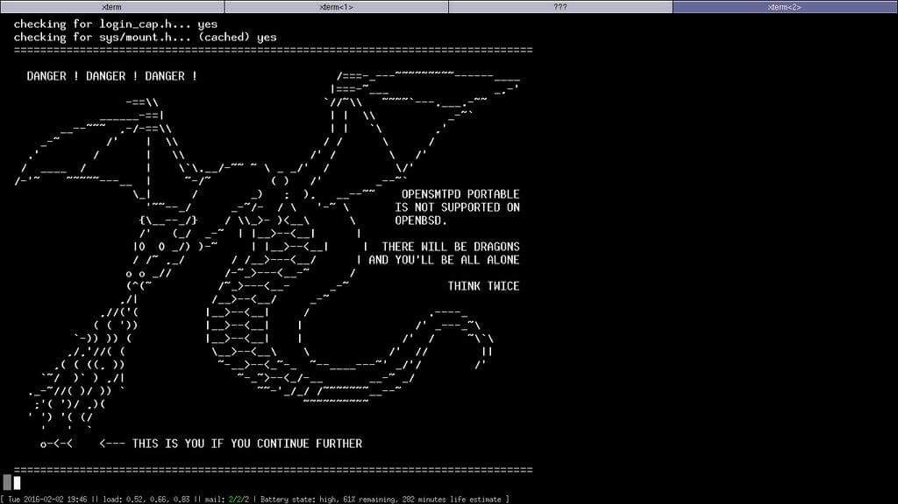


    - our CI was improved
    - a new OpenSMTPD release, 6.6.1p1 took place to deal with portable issues
    - multiple portability issues were adressed
    - new table API in the works
    - filter-rspamd and filter-senderscore were improved
    - filter-greylist proof-of-concept published
    - wrote 2 chapters for my book


Shout outs to my sponsors !
--
As usual,
a **huge** thanks goes to the people sponsoring me on [patreon](https://www.patreon.com/gilles) or [github](https://github.com/sponsors/poolpOrg), the work in this post was made possible by my [sponsorship](/sponsorship/).


Got myself a pinebook pro
--
I got myself an arm64 pinebook pro:
<center>

</center>

My only goal for it was to have a convenient machine on which I could learn some arm64 assembly,
and do some portability work on an architecture that's different from amd64.

I still aim at getting myself a proper laptop in a few months with the sponsorship money,
this one is not going to be comfortable enough,
but it's really a nice to have.

I bricked it on the first day,
it took me a while to get it back in shape,
but several issues I mentionned in this article were fixed on that machine !

Better CI
--
[Ihor Antonov](https://github.com/ngortheone) did a very neat job at improving CI infrastructure for the project.

Until his contributions,
we would only have Ubuntu+glibc in our CI so whenever someone reported a build breakage on another system or distro,
I would spin a VPS somewhere to install the same system and attempt a build there.

This was less than ideal because sometimes by fixing the build on a target,
I could break another,
and I would spend an afternoon spinning VPS with different systems until everything was back to normal on all.

He currently set up Arch, Alpine and Ubuntu, which provides us with a nice combination of glibc, musl libc, OpenSSL and LibreSSL build targets,
and helps spot build breakages right away.
This made some of the work I'll describe below **considerably** less painful.

It greatly improved our support for other systems.


OpenSMTPD 6.6.1p1 released and portable development branch work
--
The 6.6.0p1 version was released in October and,
since it became easier to install for several distributions,
it also led more users to test it and report issues on their distributions.

For most people it worked fine,
but on some systems the build was broken and on others the daemon would blow up at runtime.
Given where it blew,
it was pretty obvious that the issues were really related to the compatibility layer for the most part.
Still, it uncovered many interesting topics.

They were all fixed and a new version, 6.6.1p1, was released so people would have a working OpenSMTPD on all distributions,
then I proceeded to work on improving the compat layer so similar issues don't come back and haunt us in the future.

Below are explained the top issues I worked on for 6.6.1p1 and after.

arc4random()
---
On OpenBSD,
`arc4random()` provides high quality randomness which OpenSMTPD relies heavily upon for pretty much everything.
The implementation provides a stream cipher output which is sliced between consumers,
with the help of the kernel and userland,
so that consumers cannot backtrack or predict the stream.
There's an [excellent talk by deraadt@](https://www.openbsd.org/papers/hackfest2014-arc4random/index.html) which explains how this works.

In the portable release of OpenSMTPD,
we attempt to detect if `arc4random()` is available on the base system and provide a replacement implementation if not.
The replacement is a reliable stream cipher,
so it is not some low-grade best-effort hack,
however we still assume a system `arc4random()` to be stronger and preferable if only because it could provide system-wide slicing.

In addition,
OpenSMTPD prefers LibreSSL but can also link against OpenSSL.
The former provides an `arc4random()` implementation if one is not available on the system,
the latter doesn't.
So depending on the combination of system and TLS library,
we may not have `arc4random()` at all,
we may have it from the TLS library,
we may have it from the system or we may have it from both.
And we always want to use the best version available,
assuming LibreSSL's version to be preferable over ours (even if it really is the same).

The compat layer was not too good at catching these cases and it was also not too good at ONLY enabling bits of compat layer.
In some situations where it would not export our own version of `arc4random()`,
it would still export some internal symbols that led to an assortment of build time and runtime failures.

The whole `arc4random()` detection was reworked and works nicely now.


IPv6 broken on some systems
---
During the 6.5 -> 6.6 development cycle,
I realized that our way to represent IPv6 address in textual format was wrong and reworked it.
This was not a big rework,
the diff was fairly small,
and I merged it to the portable branch.
CI didn't complain and my initial testing didn't show problems because it perfectly dodged the problematic code path (more on that shortly).

There are some systems _\*\*cough cough\*\* using glibc \*\*cough cough\*\*_ that provide a broken `inet_net_pton()` function,
supporting only IPv4 and returning EAFNOTSUPPORT when passed an IPv6 address.
I first spotted this in 2013 and made a `temp_inet_net_pton()` function which would be used temporarily as a fallback if `inet_net_pton()` failed,
then renamed it to `broken_inet_net_pton_ipv6()` in 2016 when it became clear that this would never be fixed in glibc.

The OpenBSD code doesn't have this fallback code,
so when the merge was applied to the portable branch,
it didn't take into account that portable version needed a parameter change for `broken_inet_net_pton_ipv6()`.
On systems with a working `inet_net_pton()` the code would be bypassed,
so this issue was not visible,
but on other systems _\*\*cough cough\*\* using glibc \*\*cough cough\*\*_ it would lead to the function failing and broken IPv6 support.

Fix was applied and IPv6 worked again on systmes with a broken `inet_net_pton()`.


Alpine Linux issues (musl libc really)
---
There were reports of crashes from an Alpine Linux user.

I could not reproduce and the more I read the related code,
the more it read correct.
Futhermore,
he reported that the previous version of OpenSMTPD worked flawlessly,
and I couldn't see any relevant change that could led to his crash.

I couldn't reproduce so it took a long while to investigate,
but eventually we managed to obtain a backtrace which pinpointed `freeaddrinfo()` as being the culprit.

So what happened ?

On one side we have `getaddrinfo()` which resolves a node into a serie of `struct sockaddr *` wrapped inside a `struct addrinfo *` providing the linked list:
```c
struct addrinfo {
   int              ai_flags;
   int              ai_family;
   int              ai_socktype;
   int              ai_protocol;
   socklen_t        ai_addrlen;
   struct sockaddr *ai_addr;
   char            *ai_canonname;
   struct addrinfo *ai_next;
};
```

and on the other end,
we have `freeaddrinfo()` which releases the items from the linked list returned by `getaddrinfo()`.
Most notably every `struct addrinfo *` from the list but also the `ai_canonname` member of each item.

The interface for both functions is [standardized](https://pubs.opengroup.org/onlinepubs/009695399/functions/freeaddrinfo.html).

A common implementation for `freeaddrinfo()` is the following one:

```c
void
freeaddrinfo(struct addrinfo *ai)
{
	struct addrinfo *p;

	do {
		p = ai;
		ai = ai->ai_next;
		free(p->ai_canonname);
		free(p);
	} while (ai);
}
```

This is straight from the OpenBSD libc but you will find a similar implementation on other BSD systems,
on Android,
on OSX and on Linux/glibc.

So why would it crash on Alpine Linux ?

Here's the version of it on musl libc:
```c
void freeaddrinfo(struct addrinfo *p)
{
	size_t cnt;
	for (cnt=1; p->ai_next; cnt++, p=p->ai_next);
	struct aibuf *b = (void *)((char *)p - offsetof(struct aibuf, ai));
	b -= b->slot;
	LOCK(b->lock);
	if (!(b->ref -= cnt)) free(b);
	else UNLOCK(b->lock);
}
```

This version assumes an underlying `struct aibuf *` where the items of `struct addrinfo *` are stored,
not really as a linked list,
but rather as contiguous items linked together.
This allows musl to do pointer arithmetics to locate elements of the list,
it however diverges greatly from other implementations.

Not saying this at all as a critique to code quality,
but I _personally_ have trouble understanding this code,
I'm unable to understand from reading only if this violates the standard:

    The freeaddrinfo() function shall support the freeing of arbitrary sublists of an addrinfo list originally returned by getaddrinfo().

Intuitively the code seems to not accept `freeaddrinfo()` being called on the second element of the addrinfo list,
but I may very well be wrong and this needs testing,
maybe the next time I spin an alpine VM.

What is certain however is that `struct aibuf *` is a musl internal thing.
The consequence being that if `freeaddrinfo()` expects to find it,
then it can only be called on a `struct addrinfo *` that was built through `getaddrinfo()`.

Unluckily for us,
OpenSMTPD comes with an asynchronous resolver that crafts its own `struct addrinfo *`.
This results in a linked list that won't have the underlying `struct aibuf *` and will work everywhere... but on musl.

But then,
how comes the previous version of OpenSMTPD worked flawlessly then?

Here's the version of `freeaddrinfo()` that musl used until October 2018:
```c
void freeaddrinfo(struct addrinfo *p)
{
	free(p);
}
```

It **didn't** work flawlessly.

What happened was that before October 2018 the musl code didn't have an underlying structure,
so it didn't crash when playing pointer arithmetic tricks to locate elements from the list.
It however already assumed a unique contiguous chunk of memory and released it as a whole so,
when passed the linked list OpenSMTPD crafted,
it would _partially_ release the first item of the list and leak members from that item as well as the entire sublist.

I will contact the musl maintainers to see if they have a plan for this or won't fix,
however in the meantime I have introduced a `portable_freeaddrinfo()` to OpenSMTPD,
as a work-around,
so that whenever we call `getaddrinfo()` we release with `freeaddrinfo()`,
but whenever we craft a list ourselves we release with `portable_freeaddrinfo()`,
effectively making OpenSMTPD work again correctly with musl.


autoconf and openbsd-compat/ cleaned up
--
Our portable layer was released many many years ago thanks to the work of Charles Longeau,
who bootstrapped the OpenSMTPD portable project by gathering bits of the compat layer from OpenSSH and OpenNTPD.
This allowed us to make OpenSMTPD available to FreeBSD, NetBSD and Linux after a few weeks or work,
broadening our community and helping us get more reports to improve the software.

Neither of us was an expert in autohell and mistakes were made back then,
which we worked around throughout the years,
and things worked fairly fine as long as we didn't look too much into details.

The compat layer was meant to provide the features we detected as missing on a target system,
however it built the entire compat layer and played `#ifdef` games to exclude sections of code we didn't need on a host.
In some cases, the `#ifdef` didn't properly exclude everything and resulted in compat layer carrying a function that it shouldn't.
For functions like `strlcpy()` this wouldn't be an issue because who cares if we're using OpenSMTPD's version over the systems',
but for some others this was an issue.

The `arc4random()` section above described one case of where this could be an issue,
because we might pick a less preferable implementation,
or it might pick the proper implementation but shadow an underlying symbol with consequences ranging from nothing to a crash.

Another case is the _OpenSMTPD portable on top of OpenBSD_ case.
It makes sense that building OpenSMTPD portable on top of OpenBSD should result in an empty compat layer since...
well, there should be no missing OpenBSD function in OpenBSD.

In practice, the compat layer still carried things and this made me uncomfortable.
For years I discouraged using OpenSMTPD portable on top of OpenBSD,
claiming it was unsupported,
but this was an intuitive claim and while technically there should be no issue,
something felt really wrong about it.

<center>

</center>

Then OpenBSD's `pledge()` system call came to the scene and my worry became very real:
building OpenSMTPD portable on OpenBSD led to an executable that would crash at startup.
The compat layer didn't properly exclude a replacement function,
which relied upon a system call that we didn't allow in our pledges.
**BOOM.**

I proceeded to rework the compat layer and fix a few things:

First of all,
I have removed pretty much EVERYTHING that's not needed for OpenSMTPD.
Among the things we carried from OpenSSH or OpenNTPD are functions which are never used in OpenSMTPD,
and so I have removed their detection in configure as well as their replacement implementations in the compat layer.
Anything we have in the compat layer is now needed.

Then,
I have cleaned up a bit the function detection in configure.ac to make sure that functions we need replacements for are properly detected.
There is still work to do in terms of handling priorities,
as in "do I pick the system's or the one from a library",
but the logic to handle all detections THEN ULTIMATELY decide if we want a replacement is already there.

Finally,
I have switched from a mode where the compat layer is built with all of its `.c` files included but sprinkled with `#ifdef` to exclude portions,
to a mode where the compat layer conditionally includes `.c` files based on `configure` detection.
This has the nice side-effects that we can't accidentally carry something that was not properly `#ifdef`-ed,
but also that you can spot at build time what's included or not on a target host,
which can raise eyebrows right away if you see `arc4random.c` built on a system which provides `arc4random()` for instance.

This is already in place in the portable branch,
so this is what you get on an OpenBSD system:
```
laptop$ make
gcc -DHAVE_CONFIG_H -I. -I..  -I../smtpd -I../openbsd-compat  -I../openbsd-compat/err_h  -I/usr/include -I/usr/local/include   -g -O2  -fPIC -DPIC -Wall -Wpointer-arith -Wuninitialized -Wsign-compare -Wformat-security -Wno-pointer-sign -fno-strict-aliasing -fno-builtin-memset  -c -o empty.o empty.c
rm -f libopenbsd-compat.a
/usr/bin/ar cru libopenbsd-compat.a empty.o                                                          
ranlib libopenbsd-compat.a
laptop$
```

and on a Linux system (Archlinux, glibc, LibreSSL):
```
$ make 
gcc -DHAVE_CONFIG_H -I. -I..  -I../smtpd -I../openbsd-compat -I../openbsd-compat/err_h -I/usr/include   -g -O2  -fPIC -DPIC -Wall -Wpointer-arith -Wuninitialized -Wsign-compare -Wformat-security -Wsizeof-pointer-memaccess -Wno-pointer-sign -Wno-unused-result -fno-strict-aliasing -fno-builtin-memset -I/usr/include/libressl -L/usr/lib/libressl -Wl,-rpath=/usr/lib/libressl -D_BSD_SOURCE -D_DEFAULT_SOURCE  -c -o empty.o empty.c
gcc -DHAVE_CONFIG_H -I. -I..  -I../smtpd -I../openbsd-compat -I../openbsd-compat/err_h -I/usr/include   -g -O2  -fPIC -DPIC -Wall -Wpointer-arith -Wuninitialized -Wsign-compare -Wformat-security -Wsizeof-pointer-memaccess -Wno-pointer-sign -Wno-unused-result -fno-strict-aliasing -fno-builtin-memset -I/usr/include/libressl -L/usr/lib/libressl -Wl,-rpath=/usr/lib/libressl -D_BSD_SOURCE -D_DEFAULT_SOURCE  -c -o closefrom.o closefrom.c
gcc -DHAVE_CONFIG_H -I. -I..  -I../smtpd -I../openbsd-compat -I../openbsd-compat/err_h -I/usr/include   -g -O2  -fPIC -DPIC -Wall -Wpointer-arith -Wuninitialized -Wsign-compare -Wformat-security -Wsizeof-pointer-memaccess -Wno-pointer-sign -Wno-unused-result -fno-strict-aliasing -fno-builtin-memset -I/usr/include/libressl -L/usr/lib/libressl -Wl,-rpath=/usr/lib/libressl -D_BSD_SOURCE -D_DEFAULT_SOURCE  -c -o crypt_checkpass.o crypt_checkpass.c
gcc -DHAVE_CONFIG_H -I. -I..  -I../smtpd -I../openbsd-compat -I../openbsd-compat/err_h -I/usr/include   -g -O2  -fPIC -DPIC -Wall -Wpointer-arith -Wuninitialized -Wsign-compare -Wformat-security -Wsizeof-pointer-memaccess -Wno-pointer-sign -Wno-unused-result -fno-strict-aliasing -fno-builtin-memset -I/usr/include/libressl -L/usr/lib/libressl -Wl,-rpath=/usr/lib/libressl -D_BSD_SOURCE -D_DEFAULT_SOURCE  -c -o errc.o errc.c
gcc -DHAVE_CONFIG_H -I. -I..  -I../smtpd -I../openbsd-compat -I../openbsd-compat/err_h -I/usr/include   -g -O2  -fPIC -DPIC -Wall -Wpointer-arith -Wuninitialized -Wsign-compare -Wformat-security -Wsizeof-pointer-memaccess -Wno-pointer-sign -Wno-unused-result -fno-strict-aliasing -fno-builtin-memset -I/usr/include/libressl -L/usr/lib/libressl -Wl,-rpath=/usr/lib/libressl -D_BSD_SOURCE -D_DEFAULT_SOURCE  -c -o event_asr_run.o event_asr_run.c
gcc -DHAVE_CONFIG_H -I. -I..  -I../smtpd -I../openbsd-compat -I../openbsd-compat/err_h -I/usr/include   -g -O2  -fPIC -DPIC -Wall -Wpointer-arith -Wuninitialized -Wsign-compare -Wformat-security -Wsizeof-pointer-memaccess -Wno-pointer-sign -Wno-unused-result -fno-strict-aliasing -fno-builtin-memset -I/usr/include/libressl -L/usr/lib/libressl -Wl,-rpath=/usr/lib/libressl -D_BSD_SOURCE -D_DEFAULT_SOURCE  -c -o fgetln.o fgetln.c
gcc -DHAVE_CONFIG_H -I. -I..  -I../smtpd -I../openbsd-compat -I../openbsd-compat/err_h -I/usr/include   -g -O2  -fPIC -DPIC -Wall -Wpointer-arith -Wuninitialized -Wsign-compare -Wformat-security -Wsizeof-pointer-memaccess -Wno-pointer-sign -Wno-unused-result -fno-strict-aliasing -fno-builtin-memset -I/usr/include/libressl -L/usr/lib/libressl -Wl,-rpath=/usr/lib/libressl -D_BSD_SOURCE -D_DEFAULT_SOURCE  -c -o fmt_scaled.o fmt_scaled.c
gcc -DHAVE_CONFIG_H -I. -I..  -I../smtpd -I../openbsd-compat -I../openbsd-compat/err_h -I/usr/include   -g -O2  -fPIC -DPIC -Wall -Wpointer-arith -Wuninitialized -Wsign-compare -Wformat-security -Wsizeof-pointer-memaccess -Wno-pointer-sign -Wno-unused-result -fno-strict-aliasing -fno-builtin-memset -I/usr/include/libressl -L/usr/lib/libressl -Wl,-rpath=/usr/lib/libressl -D_BSD_SOURCE -D_DEFAULT_SOURCE  -c -o fparseln.o fparseln.c
gcc -DHAVE_CONFIG_H -I. -I..  -I../smtpd -I../openbsd-compat -I../openbsd-compat/err_h -I/usr/include   -g -O2  -fPIC -DPIC -Wall -Wpointer-arith -Wuninitialized -Wsign-compare -Wformat-security -Wsizeof-pointer-memaccess -Wno-pointer-sign -Wno-unused-result -fno-strict-aliasing -fno-builtin-memset -I/usr/include/libressl -L/usr/lib/libressl -Wl,-rpath=/usr/lib/libressl -D_BSD_SOURCE -D_DEFAULT_SOURCE  -c -o freezero.o freezero.c
gcc -DHAVE_CONFIG_H -I. -I..  -I../smtpd -I../openbsd-compat -I../openbsd-compat/err_h -I/usr/include   -g -O2  -fPIC -DPIC -Wall -Wpointer-arith -Wuninitialized -Wsign-compare -Wformat-security -Wsizeof-pointer-memaccess -Wno-pointer-sign -Wno-unused-result -fno-strict-aliasing -fno-builtin-memset -I/usr/include/libressl -L/usr/lib/libressl -Wl,-rpath=/usr/lib/libressl -D_BSD_SOURCE -D_DEFAULT_SOURCE  -c -o getpeereid.o getpeereid.c
gcc -DHAVE_CONFIG_H -I. -I..  -I../smtpd -I../openbsd-compat -I../openbsd-compat/err_h -I/usr/include   -g -O2  -fPIC -DPIC -Wall -Wpointer-arith -Wuninitialized -Wsign-compare -Wformat-security -Wsizeof-pointer-memaccess -Wno-pointer-sign -Wno-unused-result -fno-strict-aliasing -fno-builtin-memset -I/usr/include/libressl -L/usr/lib/libressl -Wl,-rpath=/usr/lib/libressl -D_BSD_SOURCE -D_DEFAULT_SOURCE  -c -o imsg.o imsg.c
gcc -DHAVE_CONFIG_H -I. -I..  -I../smtpd -I../openbsd-compat -I../openbsd-compat/err_h -I/usr/include   -g -O2  -fPIC -DPIC -Wall -Wpointer-arith -Wuninitialized -Wsign-compare -Wformat-security -Wsizeof-pointer-memaccess -Wno-pointer-sign -Wno-unused-result -fno-strict-aliasing -fno-builtin-memset -I/usr/include/libressl -L/usr/lib/libressl -Wl,-rpath=/usr/lib/libressl -D_BSD_SOURCE -D_DEFAULT_SOURCE  -c -o imsg-buffer.o imsg-buffer.c
gcc -DHAVE_CONFIG_H -I. -I..  -I../smtpd -I../openbsd-compat -I../openbsd-compat/err_h -I/usr/include   -g -O2  -fPIC -DPIC -Wall -Wpointer-arith -Wuninitialized -Wsign-compare -Wformat-security -Wsizeof-pointer-memaccess -Wno-pointer-sign -Wno-unused-result -fno-strict-aliasing -fno-builtin-memset -I/usr/include/libressl -L/usr/lib/libressl -Wl,-rpath=/usr/lib/libressl -D_BSD_SOURCE -D_DEFAULT_SOURCE  -c -o pidfile.o pidfile.c
gcc -DHAVE_CONFIG_H -I. -I..  -I../smtpd -I../openbsd-compat -I../openbsd-compat/err_h -I/usr/include   -g -O2  -fPIC -DPIC -Wall -Wpointer-arith -Wuninitialized -Wsign-compare -Wformat-security -Wsizeof-pointer-memaccess -Wno-pointer-sign -Wno-unused-result -fno-strict-aliasing -fno-builtin-memset -I/usr/include/libressl -L/usr/lib/libressl -Wl,-rpath=/usr/lib/libressl -D_BSD_SOURCE -D_DEFAULT_SOURCE  -c -o recallocarray.o recallocarray.c
gcc -DHAVE_CONFIG_H -I. -I..  -I../smtpd -I../openbsd-compat -I../openbsd-compat/err_h -I/usr/include   -g -O2  -fPIC -DPIC -Wall -Wpointer-arith -Wuninitialized -Wsign-compare -Wformat-security -Wsizeof-pointer-memaccess -Wno-pointer-sign -Wno-unused-result -fno-strict-aliasing -fno-builtin-memset -I/usr/include/libressl -L/usr/lib/libressl -Wl,-rpath=/usr/lib/libressl -D_BSD_SOURCE -D_DEFAULT_SOURCE  -c -o setproctitle.o setproctitle.c
gcc -DHAVE_CONFIG_H -I. -I..  -I../smtpd -I../openbsd-compat -I../openbsd-compat/err_h -I/usr/include   -g -O2  -fPIC -DPIC -Wall -Wpointer-arith -Wuninitialized -Wsign-compare -Wformat-security -Wsizeof-pointer-memaccess -Wno-pointer-sign -Wno-unused-result -fno-strict-aliasing -fno-builtin-memset -I/usr/include/libressl -L/usr/lib/libressl -Wl,-rpath=/usr/lib/libressl -D_BSD_SOURCE -D_DEFAULT_SOURCE  -c -o strlcat.o strlcat.c
gcc -DHAVE_CONFIG_H -I. -I..  -I../smtpd -I../openbsd-compat -I../openbsd-compat/err_h -I/usr/include   -g -O2  -fPIC -DPIC -Wall -Wpointer-arith -Wuninitialized -Wsign-compare -Wformat-security -Wsizeof-pointer-memaccess -Wno-pointer-sign -Wno-unused-result -fno-strict-aliasing -fno-builtin-memset -I/usr/include/libressl -L/usr/lib/libressl -Wl,-rpath=/usr/lib/libressl -D_BSD_SOURCE -D_DEFAULT_SOURCE  -c -o strlcpy.o strlcpy.c
gcc -DHAVE_CONFIG_H -I. -I..  -I../smtpd -I../openbsd-compat -I../openbsd-compat/err_h -I/usr/include   -g -O2  -fPIC -DPIC -Wall -Wpointer-arith -Wuninitialized -Wsign-compare -Wformat-security -Wsizeof-pointer-memaccess -Wno-pointer-sign -Wno-unused-result -fno-strict-aliasing -fno-builtin-memset -I/usr/include/libressl -L/usr/lib/libressl -Wl,-rpath=/usr/lib/libressl -D_BSD_SOURCE -D_DEFAULT_SOURCE  -c -o strmode.o strmode.c
gcc -DHAVE_CONFIG_H -I. -I..  -I../smtpd -I../openbsd-compat -I../openbsd-compat/err_h -I/usr/include   -g -O2  -fPIC -DPIC -Wall -Wpointer-arith -Wuninitialized -Wsign-compare -Wformat-security -Wsizeof-pointer-memaccess -Wno-pointer-sign -Wno-unused-result -fno-strict-aliasing -fno-builtin-memset -I/usr/include/libressl -L/usr/lib/libressl -Wl,-rpath=/usr/lib/libressl -D_BSD_SOURCE -D_DEFAULT_SOURCE  -c -o strtonum.o strtonum.c
gcc -DHAVE_CONFIG_H -I. -I..  -I../smtpd -I../openbsd-compat -I../openbsd-compat/err_h -I/usr/include   -g -O2  -fPIC -DPIC -Wall -Wpointer-arith -Wuninitialized -Wsign-compare -Wformat-security -Wsizeof-pointer-memaccess -Wno-pointer-sign -Wno-unused-result -fno-strict-aliasing -fno-builtin-memset -I/usr/include/libressl -L/usr/lib/libressl -Wl,-rpath=/usr/lib/libressl -D_BSD_SOURCE -D_DEFAULT_SOURCE  -c -o vis.o vis.c
rm -f libopenbsd.a
/usr/sbin/ar cru libopenbsd.a empty.o      closefrom.o crypt_checkpass.o    errc.o event_asr_run.o  fgetln.o fmt_scaled.o fparseln.o freezero.o  getpeereid.o imsg.o imsg-buffer.o   pidfile.o  recallocarray.o setproctitle.o        strlcat.o strlcpy.o strmode.o  strtonum.o    vis.o  
/usr/sbin/ar: `u' modifier ignored since `D' is the default (see `U')
ranlib libopenbsd.a
$
```

There is still a lot of work to do in the compat layer,
the library was part of it but the handling of missing headers and such is also not too good.
I have plans to keep working on this for the next few months until I'm comfident that running the portable branch on OpenBSD doesn't have side-effects.


table API rework
--
Something I mentioned last month was that I wanted to turn the table API into something similar to filters,
so people could easily write table backends in any language and rely on existing libraries.

I have **made very good progress** on this front and I wrote a couple table backends using the new interface,
however I'm not done yet and I will keep the details for another article.


filter-rspamd improved
--
My filter-rspamd got additional contributions from [Reio Remma (@whataboutpereira)](https://github.com/whataboutpereira),
to extend the headers and have them include the scoring for the symbols they matched.

This results from a discussion and a previous pull request that I had rejected as I felt the header was way too verbose.

The 0.1.4 release of `filter-rspamd` would display headers as:
```
X-Spam: yes
X-Spam-Score: 8.789999 / 15
X-Spam-Symbols: MIME_TRACE,
 FROM_NEQ_ENVFROM,
 ARC_NA,
 RCPT_COUNT_ONE,
 URI_COUNT_ODD,
 DMARC_POLICY_ALLOW,
 R_DKIM_ALLOW,
 HAS_X_PRIO_THREE,
 MIME_GOOD,
 HAS_REPLYTO,
 R_SPF_ALLOW,
 FROM_HAS_DN,
 TO_MATCH_ENVRCPT_ALL,
 RCVD_TLS_ALL,
 FORGED_SENDER,
 MID_RHS_MATCH_FROM,
 HTML_SHORT_LINK_IMG_1,
 RCVD_IN_DNSWL_NONE,
 DKIM_TRACE,
 RSPAMD_URIBL,
 PREVIOUSLY_DELIVERED,
 HAS_LIST_UNSUB,
 BAD_REP_POLICIES,
 SUBJECT_ENDS_QUESTION,
 ASN,
 REPLYTO_DOM_NEQ_FROM_DOM,
 RCVD_COUNT_TWO,
 TO_DN_NONE
```

In development,
it now replaces the `X-Spam-Symbols` with `X-Spam-Status` and outputs as follows:
```
X-Spam-Status: Yes, score=7.267 required=15.000
        tests=[ARC_NA=0.000, BAYES_SPAM=5.100, DCC_BULK=0.667
        FROM_EQ_ENVFROM=0.000, FROM_HAS_DN=0.000, MID_RHS_MATCH_FROM=0.000
        MIME_BAD_ATTACHMENT=1.600, MIME_GOOD=-0.100, MIME_TRACE=0.000
        PREVIOUSLY_DELIVERED=0.000, RCPT_COUNT_ONE=0.000
        RCVD_COUNT_THREE=0.000, RCVD_TLS_LAST=0.000, RCVD_VIA_SMTP_AUTH=0.000
        TO_DN_NONE=0.000, TO_MATCH_ENVRCPT_ALL=0.000]
```

This is not only more compact but also avoids having to go look into `/var/log/rspamd/rspamd.log` for details about what scored how much.


filter-senderscore improved
--
In [July](/posts/2019-07-27/july-2019-report-tons-of-smtpd-work-mostly/),
I wrote [filter-senderscore](https://github.com/poolpOrg/filter-senderscore) which looks up the reputation for a source address in the SenderScore database,
and allows blocking, junking and delaying sessions whose score falls below some threshold.


The filter works fairly well so I didn't bother making any improvement to it.

In [September](/posts/2019-09-21/september-2019-report-jules-opensmtpd-6.6.0-upcoming-release-and-related-things/),
the `junk` action was introduced which allows a filter to tell that a session or transaction can be junked by OpenSMTPD.
Since the filter was written before that feature,
it did the junking itself by registering for the dataline phase and injecting a `X-Spam: yes` header,
so I simplified by having the filter use the `junk` action instead.

While I was there,
I thought it would be nice to add an option to let user configure at which phase the client should be disconnected.
Until now,
if the `-blockBelow` option was provided and the reputation for an IP fell below the threshold,
the session would be disconnected at the banner.
The new `-blockPhase` option allows deferring the disconnect to later,
making it possible to track the sender or recipient addresses before disconnecting if needed.


filter-greylist proof-of-concept
--
The SMTP protocol provides a mechanism for "temporary failures" which requests a sender to retry transfer of a message.
A regular MTA like OpenSMTPD will honor that request but scripts and spam tools that are targeted at spamming _en masse_ will not necessarily retry,
as it would slow them and force them to keep track of which hosts need to be retried.

The idea behind greylisting is to trigger a temporary failure voluntarily when first contacted by an MX,
then keep a reasonnable window of time within which the MX should perform a retry.
If the MX retries in that timeframe then it is whitelisted,
otherwise it is either blacklisted or kept in temporary-failure-land forever.

Multiple greylisting solutions exist,
including the `spamd(8)`[(man page)](https://man.openbsd.org/spamd) daemon in OpenBSD.
A lot of them are unusable _as is_ with big mailers like Gmail / Yahoo / Hotmail because their retries do not come from the same MX host and they never get whitelisted.

A few years ago,
I introduced an `spf walk` utility which made things a bit better.

What it did was to perform an SPF walk to catch as many IP addresses as it could from an SPF record to they could be whitelisted.
Since all big mailers publish SPF records, it improved considerably the situation.

It wasn't perfect either because some SPF records are context-dependant and can't be looked up,
others rely on hostnames which have geo-localized IP addresses preventing whitelists from being shared across countries,
and finally whitelisting this way didn't account for updates of SPF records...
so `spf walk` had to be ran frequently and there was always a possibility that an SPF change happened right after a run.
A lot of people see `spf walk` as THE solution to the big mailer greylisting issue, but I don't.

I wrote `filter-greylist` as a proof-of-concept for an SPF-aware greylisting.

What it does is consider that there are two kind of senders,
those that do SPF and those that don't.
If a host doesn't do SPF, then retries are expected to come from the same IP address.
If a host does SPF, then the sending domain is remembered and ALL IP addresses part of the SPF record are considered as valid for the retry.
This means that if Gmail contacts from an IP, then retries from another, this will be considered as a valid retry.

I have been running with this filter for weeks and it works perfect,
to the point where I had actually forgotten that it was running.

The filter [has been published on Github](https://github.com/poolpOrg/filter-greylist) but since this is a bit more risky than my other filters,
test at your own risks.


2 chapters of the book written
--
I have written two additional chapters to my OpenSMTPD book.

I'm now focusing on the configuration examples which is probably the most interesting part for readers,
but by far the most annoying part to write for me given how many features we support :-)


What next ?
--
It's unclear what I'll do in December because I have multiple works in progress,
the table API will be worked on for sure,
the smtp-out reporting also.

I'd like to improve my filter-greylist proof of concept but it's not high priority for me,
I'll be happy to review pull requests ;-)

I have started writing articles outside of my monthly reports,
however they grow really big really fast,
I need to find how to properly split.

