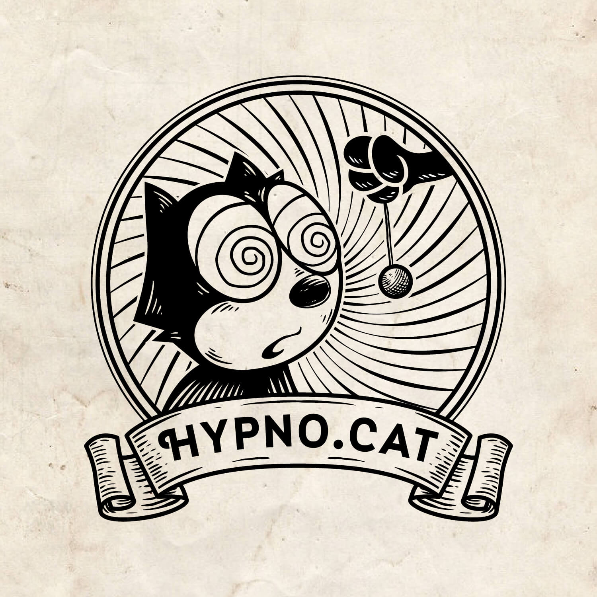


Haven't posted since July but I wasn't slacking,
got temporarily context-switched out of opensource stuff.


# I tanked a year in work psychology

As some of you know,
I study work psychology and have been attending evening classes for the last four years,
sometimes up to 9 hours / week and more often between 3 and 6 hours / week.
I'm pretty invested as you can tell, it's a lot of time that I could spend in bed but that I spend in class instead :-)

Last school year,
I was supposed to do a pair work field intervention which would then be used as the material for my upcoming master thesis dissertation.
This intervention was meant to take place physically with groups of employees and span over two or three months.
We had started interviewing with a company interested in our intervention,
**but the lockdown put this to a hold and was renewed over and over until the school year was over**.

Unlike other courses where it was possible to substitute the evaluation method,
like in psychometric testing course where we ended up analyzing a case study rather than having someone undergo interviews and tests,
**there's no way to substitute this intervention** without compromising the master thesis material so...
many of us plain tanked the course.

Because of the extraordinary situation,
we were told that if we could begin an intervention in September and be done by end of November,
the school year could be salvaged and we could integrate the thesis preparation course in December,
losing just a trimester instead of a year.
Since we were close to having a field,
there was a slight hope that we could pull this out and **I made this my priority**.

Understandably,
the company we were in discussions with had to shift its priorities post-lockdown and summer and ended up declining the intervention,
so I tanked for real and **began taking the same course again for a year**...

A year which begins with **another lockdown**.

# I opened my hypnosis office

I started learning hypnosis sometime in 2015 and eventually ended up attending multiple trainings and certifications.

After a year,
I began doing sessions for volunteers with specific problems so that I could practice these.
I only requested that they would donate an amount of their choice to a charity of their choice,
and that they would give me a honest feedback about what worked and not.
It lasted a while but then I gradually stopped asking for volunteers because it was no longer necessary in my opinion.

Two years ago,
I started getting enough people **referred to me** that it made sense to create a legal entity.
I began working as a **mobile hypnotherapy practitioner** during my time off work,
on evenings and week-ends.
When I switched to a part-time schedule,
I often plugged one or two sessions per day so that it could help me recover a bit from the financial loss.

This was nice and all but after two years of driving North and South of the city,
sometimes rushing from a client to another because a session ended late,
I started considering opening an office so it would be more confortable for me.
**I now receive people in two wellness centers**,
on Thursday and Friday.

  

Since I tanked a year in work psychology,
I thought I might as well make another project go through :-)

I won't be talking much about that activity here as it's so remote from tech,
however feel free to checkout **my dedicated website**, [hypno.cat](https://hypno.cat),
and feel free to **ask me anything** on [twitter](https://twitter.com/thehypnocat) as I'm at least as passionate about this topic than about tech.

# I brought poolp.org back home, literally

I have not had a static IP in a long time because the choice of ISP was limited in this new neighborhood,
but recently an option became available allowing me to have **FTTH with a static IP, IPv6 and outgoing SMTP trafic**.

I've been renting a ton of VPS at [vultr](https://www.vultr.com/?ref=6831037) (affiliation link) and am happy with them,
but I need to **reduce my expenses** and they cost me around 100 EUR / month.
I decided to stop hosting people for free as I've been doing for the last 20 years or so,
and cut on the number of VPS because [poolp.org](https://poolp.org) doesn't have to be such a high-availability service.
**I can live with a few downtimes myself if any**.

I got myself a refurbished machine from [backmarket](https://www.backmarket.fr/?f=160474237260) (affiliation link),
installed the latest OpenBSD on it and started moving everything there so I could progressively shutdown a few VPS.

  

You're reading this blog post from a machine **hosted in my appartment**,
plugged right behind a 10GB theoretical connection,
though the device only has a 1GB network interface :-)

# I automated poolp.org publishing in the Github CI

The posts on this blog are generated from **markdown files** that are available in a **[Github repository](https://github.com/poolpOrg/poolp.org)**.

I initially didn't automate publishing so the repository was just used to **version the posts**.
The action of publishing was **manual** and this explains why sometimes people would submit pull requests to fix a typo and the changes would not show up before days:
I could merge the pull request but **until I booted the proper laptop** to rebuild the website and rsync the directory to the server,
the change would not be visible.

It was annoying because it meant I could not fix anything quickly,
I always had to wait until I was in front of my OpenBSD laptop which is the only one allowed to auth to my server.
In one instance,
I messed up and **published an uncommitted draft** while doing an rsync from my laptop to fix a typo,
I realized because the unfinished article had been linked from hackernews before I had a chance to proofread and I could not unlink it right away.

So I took some time to rework this and now the blog is generated from the repository itself,
I no longer do rsyncs all over the place.
**If you submit a pull request to fix a typo or improve an article ,the blog will be updated shortly after I merge it**.

This is technically the first article ever that I will not rsync.

Not that you care, but I also did the same for [hypno.cat](https://hypno.cat) while I was at it ;-)

# Began preparing the OpenSMTPD portable release

I have brought **all upstream commits** from OpenBSD to the portable version of OpenSMTPD,
fixed a couple shortcomings in the way and I have a few issues I need to tackle before I can craft the release.

I should be done in the next couple weeks so the OpenSMTPD portable release can happen in **early December**.

# What's next ?

Not finding the time to produce useful work to write about since July has been irritating and getting back on track was not effortless.
I wrote this, even though it's not technical, to break the cycle of silence and pick up where I left.

There are several pull requests pending on many of my repositories,
I merged some and need to review others.

I intend to write some tutorials too.

See you in December !

