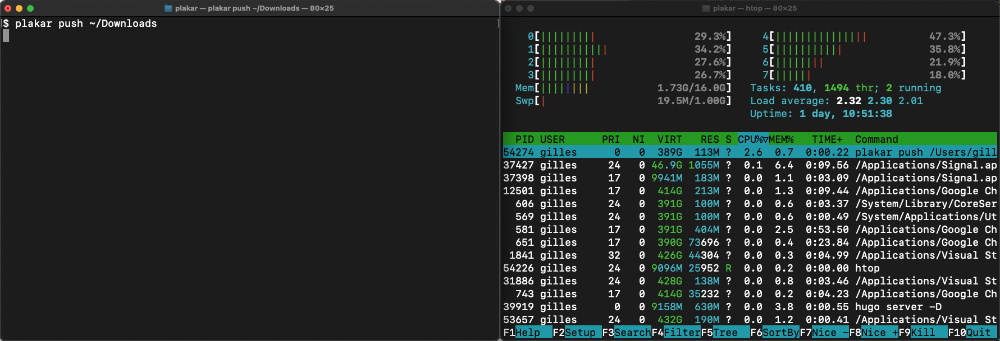


I have a discord now, feel free to join.
I refactored plakar, implemented a local cache, improved parallelism, modified the push strategy, played with fuse and networking.
I also did other stuff but let's keep that out of this article.



# I have a discord now

I have a [rubber duck](https://en.wikipedia.org/wiki/Rubber_duck_debugging) sitting on my desk...

<center>
    
</center>

...but I also like explaining to my peers what I'm doing,
as I'm doing it,
to **help me get new ideas or spot shortcomings in my reasoning**.
I used to do it a lot on IRC as I worked on OpenSMTPD,
with other developers and an active community,
but I miss that a lot now that I work mostly alone on low-profile projects.
I do [share ideas and progress on Twitter](https://twitter.com/PoolpOrg/status/1448329512253595649) but the tweet size limitation makes it hard to expand much and incite discussion.

I created a Discord where I'll hang out and discuss my projects as I work on them.
Feel free to hop in if you want,
and feel free to do just like me and share thoughts as you work on your own projects there:
**this is a virtual hack room**.

It may not be restricted strictly to code as I have other unrelated projects sometimes :-)


# Plakar refactor
I have been working on `plakar` on and off [for a few months now](https://poolp.org/posts/2021-03-26/march-2021-backups-with-plakar/),
with **approximately two weeks of cumulative work**,
and because it was experimental and my first real project in Go,
I made many mistakes both in design and implementation details.
I tested a lot of ideas,
some turned out to be good and I pushed them further whereas others turned out to be crap and I abandoned them.

For instance,
I wasn't sure if snapshots should be part of the storage engine or built on top,
I wasn't sure if encryption/compression should be at the snapshot level or at the storage level,
or even if it should be possible to encrypt some snapshots and not others within a store.
All of **these decisions are now settled**,
but I had to experiment a bit before understanding why I was taking a decision and why I believed it was the right one,
and this left the code with some weird parts as things weren't always done in the right place.

Now that I'm a bit more comfortable with Go and with how the project will move forward,
it was time to **scrap the draft** and rewrite it properly.
I spent an evening in a new branch,
rewriting all layers by bringing just the bits of code necessary and making sure that each package was not doing anything that should be done elsewhere.
This allowed me to kill a lot of dead code from older experiments,
simplifying the logic in all layers and clarifying some boundaries.

This is still the very early stages of the project with a lot of room for improvement on the code base,
but at least the foundation is now clean:
when I work on a feature, it is clear where I should add the feature and I don't risk breaking everything.


# Code made available on Github

Since I'm no longer ashamed of what I produced,
I decided to work in the open and make the code [available in a github repository](https://github.com/poolpOrg/plakar)
so I can reference a commit when I write about `plakar` here instead of leaving everything to your imagination.

**Don't use the project for anything serious:**

First of all,
**there are still issues** and you don't want to use something that has issues for your backups.
Then,
the utility still evolves a lot with regard to output or CLI,
and I don't want to provide support regarding last weeks' command line or output format when I have a different version on my laptop.
Finally,
the storage format hasn't fully stabilized yet as I make minor changes here and there to optimize some operations:
the **snapshots you make today may not be restorable next week** if I make use of a new metadata or change a data structure.

Of course,
I'd be **very happy** to have some people test and help me improve the tool,
so feel free to test and report issues... as long as this is only for testing and not for your real backups.


# Improved parallelism
Because of how `plakar` works,
many operations involve splitting data into chunks or fetching data from the store to reconstruct objects.

For example,
`plakar cat deadbeef:/etc/passwd` will:
- fetch the index for snapshot `deadbeef` from the store (or from cache if available)
- resolve `/etc/passwd` into an object identifier within the store
- fetch the object index from the store (or from cache if available)
- resolve the object into one or many chunks within the store
- fetch the chunks from store and output them in sequence to stdout

Whereas `plakar push /bin` will iterate through `/bin` and:
- open and split every file into chunks
- query the store for which chunks need to be written or have their reference count incremented
- write the missing chunks 
- write an object index for every individual object
- write the snapshot index which maps the path names to their backing objects, among other things


In my initial work on `plakar`,
all commands were implemented with a **very sequential approach**,
operations being performed one after another regardless if they could be parallelized or not.
There was a tiny bit of parallelism,
as `plakar` could work on multiple files at once,
but it would take a sequential approach for each of these files.

In many cases,
this caused it to operate at much slower speed than was possible to reach given the available resources on the host system.
For instance,
in the following screenshots,
it took roughly 55s to push my 2.5GB `~/Downloads` directory to an empty repository on my ~1000MB/s/writes SSD despite the 8 cores being underused.

<center>
    
</center>
<center>
    
</center>

I reworked the storage and the snapshot layers to improve parallelism and synchronization so that `plakar` could safely parallelize every possible operation.
This allowed it to fully exploit all available cores and avoid idling when it could be doing something,
like writing multiple chunks in parallel for the same file while processing multiple files,
and letting disk I/O limit the performances.

In the screenshots below,
it took only 14.4s to push the same directory to an empty store while utilizing all cores to their fullest.
It could certainly be optimized further because **the commit of a snapshot has not gone through optimization yet** and probably consumes **over half of this time**,
but the difference is already quite impressive.

<center>
    
</center>
<center>
    
</center>

This parallelism improvement is **not restricted to pushing snapshots**,
but benefits all `plakar` operations.
For instance restoring snapshots became significantly faster as it used to restore all files sequentially when it will now parallelize the whole process of rebuilding the file hierachy, creating the files and fetching the chunks.

I was afraid that the amount of goroutines would be unmanageable as I hit a couple panics when working on directories > 10GB with tens of thousands of files and even more chunks,
but I came up with a code pattern that ensured I could both **control the amount of concurrent routines** executing a specific task,
and **that they were all done before beginning a dependent task**.
I'll probably write about that in a future post as I find this solution very elegant and suitable for many use-cases.

I will likely be adding an option to specify the amount of parallelism allowed to prevent `plakar` from hogging all resources at the cost of slower operations,
but it is a very simple feature that I'll keep for when I want to pretend I worked hard on something :-)


# Snapshots and objects caching
When `plakar` creates a snapshot,
it has to scan file hierarchies and **read every files to split them into chunks** that will be checked against the store.
This isn't something that has to be avoided,
it is really what I want it to do,
but it is not _always_ desirable as it is only necessary for files that have changed.
Unless `plakar` is able to detect that,
it has to pay the price of reading all files including the ones that haven't changed.

I implemented a **local cache** which recalls,
among other things, the structure of objects that were part of previous snapshots and the inode informations associated to path names.

Whenever scanning a directory,
the inode informations for the current file are compared to the last known informations stored in the cache.
If it is determined that the file has not changed since the last version,
`plakar` will reuse the chunk information from the cache and increase the chunks reference count in store.
This **avoids a full read** during the chunking and **a potential full write** of all chunks to the store.


```go
$ plakar -time push ~/Downloads
time: 13.787579792s

$ plakar -time push ~/Downloads
time: 1.41720375s

$ plakar -time -no-cache push ~/Downloads
time: 7.432093292s

$ plakar ls
2021-10-26T11:51:01Z e5c24e03-7f72-4a9b-81d4-2b891951f965 2.5 GB (files: 1225, dirs: 282)
2021-10-26T11:51:20Z 784a2a28-0af5-45e7-b440-1246c5691080 2.5 GB (files: 1225, dirs: 282)
2021-10-26T11:51:26Z e6a24d44-f257-4540-8ff7-04f251acf522 2.5 GB (files: 1225, dirs: 282)
```

In the example above,
I pushed my 2.5GB `~/Downloads` directory in an empty plakar,
then pushed it again once with caching and once without caching.
Here,
the time difference for a push with or without cache is **very significant**,
but it is highly dependant on the number of directories,
of files,
of their redundancy and their sizes.

Just like for parallelism,
the local cache **doesn't only benefit the creation of snapshots** but also other operations,
**though the boost is not as beneficial due to its current implementation**:
it requires small disk reads for each lookup and while this can save a lot in the snapshot creation code path by avoiding big file reads and tons of writes,
it is not that interesting in code paths involving mostly the reading of chunks.

There is still a lot of room for improvement though:

First of all,
the structure of informations in cache is **not optimal** and makes it hard to use the cache for some operations that could benefit from it.
This is something simple to fix,
it's just that I figured what I should have done differently while I was writing this article :-)

Then,
I implemented the cache using individual files to represent snapshots and objects,
which means **each cache query involves opening, reading and closing a file**.
This was acceptable to bootstrap the API and start using it but has a lot of overhead which would not exist if the cache was stored in an SQLite database or similar.

I will continue working on local cache improvements but am already happy with the results of that first naive approach.

For console pr0n,
here's a run of a push with an empty cache and empty store:
```sh
$ plakar -trace push .
332752a6-c220-4d7f-ab22-290a1c67862f: New()
332752a6-c220-4d7f-ab22-290a1c67862f: cache.GetPath(./group): KO
332752a6-c220-4d7f-ab22-290a1c67862f: cache.PutPath(./group)
332752a6-c220-4d7f-ab22-290a1c67862f: cache.GetPath(./services): KO
332752a6-c220-4d7f-ab22-290a1c67862f: PutChunk(4910bfe2b7e551c4e2085b12c36941d1e1063491b7292cb0dbca7c5fe0854be5)
332752a6-c220-4d7f-ab22-290a1c67862f: cache.PutPath(./services)
332752a6-c220-4d7f-ab22-290a1c67862f: cache.GetPath(./passwd): KO
332752a6-c220-4d7f-ab22-290a1c67862f: cache.PutPath(./passwd)
332752a6-c220-4d7f-ab22-290a1c67862f: PutChunk(e45b72f5c0c0b572db4d8d3ab7e97f368ff74e62347a824decb67a84e5224d75)
332752a6-c220-4d7f-ab22-290a1c67862f: PutChunk(8c6e2a2647ee854f469a3bb798e02ba5a8b1812cab229ff129f073e7a80c1202)
332752a6-c220-4d7f-ab22-290a1c67862f: PutObject(8c6e2a2647ee854f469a3bb798e02ba5a8b1812cab229ff129f073e7a80c1202)
332752a6-c220-4d7f-ab22-290a1c67862f: PutObject(4910bfe2b7e551c4e2085b12c36941d1e1063491b7292cb0dbca7c5fe0854be5)
332752a6-c220-4d7f-ab22-290a1c67862f: PutObject(e45b72f5c0c0b572db4d8d3ab7e97f368ff74e62347a824decb67a84e5224d75)
332752a6-c220-4d7f-ab22-290a1c67862f: PutIndex()
snapshot: cache.PutIndex(332752a6-c220-4d7f-ab22-290a1c67862f)
332752a6-c220-4d7f-ab22-290a1c67862f: Commit()
```

And here's a run of a push using the cache:
```sh
$ plakar -trace push .          
0c8ab5bf-add9-4e20-9790-97d43cde35cc: New()
0c8ab5bf-add9-4e20-9790-97d43cde35cc: cache.GetPath(./group): OK
0c8ab5bf-add9-4e20-9790-97d43cde35cc: cache.GetPath(./services): OK
0c8ab5bf-add9-4e20-9790-97d43cde35cc: cache.GetPath(./passwd): OK
0c8ab5bf-add9-4e20-9790-97d43cde35cc: PutIndex()
snapshot: cache.PutIndex(0c8ab5bf-add9-4e20-9790-97d43cde35cc)
0c8ab5bf-add9-4e20-9790-97d43cde35cc: Commit()
```


# Push strategy

When `plakar` wasn't parallelized and didn't have a cache,
it was **easier to interact with the store on an object-after-object basis**:
it would open a file,
parse it into chunks,
write the chunks,
write the object,
then move to the next object.
This ensured that the full handling of a file could be isolated in a small process:
everything that needed to be done with the file would be done in the window of time that it was opened,
all in a very readable and sequential logic.

With parallelization and caching,
**it became more interesting to work in a different way**:
processing chunks at full speed first,
THEN processing object indexes at full speed when all chunks are already recorded in the transaction.
This allowed to simplify the logic by a great deal,
replacing the sequential pattern of read chunk / write chunk / read next chunk / write next chunk,
with a channel where chunks are **pushed out of order as they are read** and goroutines concurrently pop from the channel to **write to store as fast as they can**.
This also had the benefit to ease deduplication of chunks and objects within the snapshot itself.

The current push implementation is already much more interesting than the previous one but I'm not done yet and the good thing is that,
thanks to the refactor,
snapshots are built on top of the storage and I'm able to experiment knowing that all my changes are isolated in that layer.


# FUSE experiment

Another feature I'm experimenting with is FUSE,
an API to implement user-space filesystems.

I'm only beginning to play with it but have implemented `plakarfs`,
**a read-only user-space filesystem exposing a plakar repository**,
and `plakar mount` which allows mounting a `plakarfs`.
This makes it possible to browse snapshots and read files,
**as if all snapshots were restored**, but...
without consuming the disk space:

```sh
$ plakar ls                 
2021-10-26T10:43:12Z 9aed1ded-0e0d-4d6c-946a-6757178ec2f3 3.2 MB (files: 248, dirs: 42)
2021-10-26T10:43:13Z ecfef47f-24fc-4c6a-9dbc-fdf918f40689 3.2 MB (files: 248, dirs: 42)
2021-10-26T10:43:13Z 561edc6a-e531-4770-872a-610432d0a2b9 3.2 MB (files: 248, dirs: 42)

$ plakar mount /tmp/plakar &
[1] 19253

$ ls -l /tmp/plakar 
total 18912
dr-xr-xr-x  1 root  wheel  3224317 26 Oct 12:43 561edc6a-e531-4770-872a-610432d0a2b9
dr-xr-xr-x  1 root  wheel  3224317 26 Oct 12:43 9aed1ded-0e0d-4d6c-946a-6757178ec2f3
dr-xr-xr-x  1 root  wheel  3224317 26 Oct 12:43 ecfef47f-24fc-4c6a-9dbc-fdf918f40689

$ tail /tmp/plakar/ecfef47f-24fc-4c6a-9dbc-fdf918f40689/etc/passwd 
_logd:*:272:272:Log Daemon:/var/db/diagnostics:/usr/bin/false
_appinstalld:*:273:273:App Install Daemon:/var/db/appinstalld:/usr/bin/false
_installcoordinationd:*:274:274:Install Coordination Daemon:/var/db/installcoordinationd:/usr/bin/false
_demod:*:275:275:Demo Daemon:/var/empty:/usr/bin/false
_rmd:*:277:277:Remote Management Daemon:/var/db/rmd:/usr/bin/false
_fud:*:278:278:Firmware Update Daemon:/var/db/fud:/usr/bin/false
_knowledgegraphd:*:279:279:Knowledge Graph Daemon:/var/db/knowledgegraphd:/usr/bin/false
_coreml:*:280:280:CoreML Services:/var/empty:/usr/bin/false
_trustd:*:282:282:trustd:/var/empty:/usr/bin/false
_oahd:*:441:441:OAH Daemon:/var/empty:/usr/bin/false
$
```

The filesystem hierarchy within the mount is built using snapshot indexes,
including inode informations such as creation time, uid/gid or file size,
while file reading is implemented by **fetching the object index** and **just the chunks needed** to service the read,
so that chunks will be fetched as needed based on the current offset within the file.

I have a hard time getting around with the proper way to implement plakar as a filesystem,
so there are still a lot of glitches and a few limitations, but this looks very promising as far as I'm concerned.
In particular because this is built on top of snapshots,
themselves built on top of the store,
making this work transparently with encrypted or remote stores.


# Remote plakar

I had already written that I implemented server and client support for `plakar` [in this post](https://poolp.org/posts/2021-04-30/april-2021-opensmtpd-plakar-ipcmsg-privsep-and-a-small-hypnosis-talk/),
but the idea behind it was **only to validate that the storage primitives could be used over the network**,
not to be actually usable.
The client and server were implemented in a very ugly way,
hacked as custom storage backends,
lacking error checking and not designed to handle concurrency within a single snapshot transaction.


I'm now at the point were I want to implement them correctly,
so I have started looking at the transport and working on the protocol,
experimenting with different things.
I tested three PoCs at this point but am not satisfied yet.

Anyhow,
I expect this network mode to be working by the end of December as I'd like to have a plakar running on my NAS by then :-)


# Assorted other work

I also worked on other stuff but I didn't want to pollute this post so I will just summarize:

I submitted a diff to OpenBSD to [fix regex support in OpenSMTPD's table_db backend](https://www.mail-archive.com/tech@openbsd.org/msg65516.html) ([committed](https://github.com/openbsd/src/commit/27a76c62b441076b566293aa27febbdb8f958bd4)),
helped `eric@` fix and review a diff for a bug in SRS ([committed](https://github.com/openbsd/src/commit/8c505924421c15b1062c31a7489530a574db6fc9#diff-6cb46d1f1c7fb0972d7569a29ef930a534cade4034f526f1083e4dfb9f5a6599))
and am currently reviewing a diff to integrate my table_procexec as the backend to run external tables in OpenSMTPD.

I worked on a new project that I'll write about in a few months as it is not high priority and I'd like to get `plakar` mostly out of my way first,
but it involves mobile development,
something I haven't done in over a decade.

I also played a bit with Arduino to learn myself some new skills,
but I didn't do anything newsworthy.

