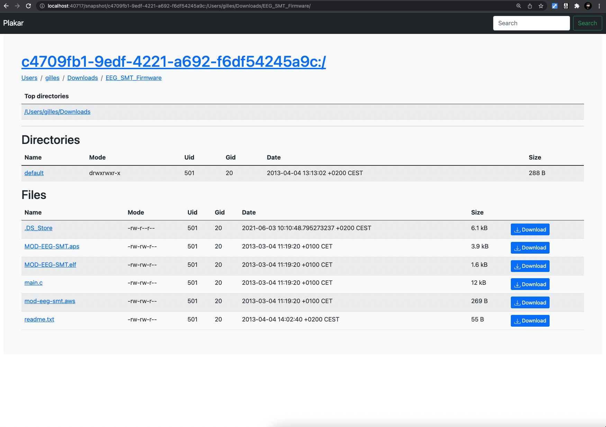


I still have a discord, feel free to join.
I worked on go-ipcmsg to make it nicer, go-privsep to make it more useable, and A LOT on plakar to make it plakar.



# Shout out to my sponsors &#x2764;&#xfe0f;

A **HUGE thanks** goes to my sponsors on [github](https://github.com/sponsors/poolpOrg)
and [patreon](https://www.patreon.com/gilles):
your continuous support is very much appreciated !


# Go-ipcmsg
[In April](/posts/2021-04-30/april-2021-opensmtpd-plakar-ipcmsg-privsep-and-a-small-hypnosis-talk/#go-ipcmsg),
I wrote about [`go-ipcmsg`](https://github.com/poolpOrg/go-ipcmsg),
a package to bring an [`imsg(3)`](https://man.openbsd.org/imsg_init.3)-like API to Golang and help me write code involving **message and fd-passing between processes**.

It took me a couple days of work and I was happy with the result so I left it there,
letting it rest in its Github repository,
until earlier this month when I figured the API could be simplified by a great deal...
so I decided to revisit and make some changes..

Back then,
each peer of an IPCMSG channel **received two Golang channels**,
and could simply read or write to the other process through them:

```go
func parent() {
    // just a basic function that sets up a socketpair, forks a child,
    // and returns the child's pid and the parent's side of the socketpair.
    pid, fd := fork_child()

    // read & write channels obtained here
    child_r, child_w := ipcmsg.Channel(pid, fd)

    // write to child, last parameter == fd to pass to the other process
    child_w <- ipcmsg.MessageWithFD(IPCMSG_PING, []byte("foobar"), -1)

    // read from child
    msg := <- child_r
}

func child() {
    // read & write channels obtained here,
    // fd=3 is the fork-inherited side of the socketpair.
    parent_r, parent_w := ipcmsg.Channel(os.Getppid(), 3)

    // read from parent
    msg := <- parent_r
    
    // write to parent
    parent_w <- ipcmsg.Message(IPCMSG_PONG, []byte("barbaz"))
}
```

In practice,
instead of inlining calls like this,
you'd declare **a handler function** which would process all messages on the read channel and reply through the write channel as such:

```go
func dispatcher(r chan ipcmsg.IPCMessage, w chan ipcmsg.IPCMessage) {
    for msg := range r {
        switch msg.Hdr.Type {
        case IPCMSG_PING:
            w <- ipcmsg.MessageWithFD(IPCMSG_PONG, []byte("barbaz"), -1)
        }
    }
}

func child() {
    parent_r, parent_w := ipcmsg.Channel(os.Getppid(), 3)

    dispatcher(parent_r, parent_w)
}
```

However,
I realized that pretty much every single use of the package would require writing that **very similar dispatcher function** looping over the read channel,
and I also disliked the pattern of letting the user access the Golang channels directly as it made it easier to introduce mistakes in code for no benefit whatsoever.

I decided to rewrite the `ipcmsg.Channel()` function to return an opaque structure **hiding the underlying channels**,
and to provide a `channel.Dispatch()` function to start reading from the channel.
With this change,
the sample of code above now looks like:

```go
func handlePING(channel *ipcmsg.Channel, msg ipcmsg.IPCMessage) {
	channel.Message(IPCMSG_PONG, []byte("barbaz"), -1)
}

func child() {
	channel := ipcmsg.NewChannel("child<->parent", os.Getppid(), 3)
	channel.Handler(IPCMSG_PING, handlePING)
	<-channel.Dispatch() // Run() and wait until it returns due to peer close
}
```

As you can see,
the message handling function receives an IPCMessage when one is available,
without having to loop on the read channel,
and the function setting up the channel can declare handlers for specific message types before calling the dispatcher.

In addition to this simplification,
I introduced a new mechanism:
**synchronized messages**.

In the [`imsg(3)`](https://man.openbsd.org/imsg_init.3) API,
because it is written in C which doesn't provide coroutines,
messages are sent and **code can't wait for an answer** as it would **block the entire process** meanwhile.
To avoid this,
code to emit a message and code to handle answers are **decoupled**:
a function sends and stops caring about the message... until another function gets an answer and resumes what the first intended to do if it could have waited for an answer.
Splitting code like this is always doable,
but it can be **more or less tricky with some patterns** where you'd benefit from having a very sequential read.

Because I can use Goroutines here and have them interrupt their execution in place without blocking the entire process,
I introduced two additional calls:

```golang
// channel.Query() blocks the goroutine and resumes execution
// only when the other end has used channel.Reply()
//
msgtype, data, fd := channel.Query(IPCMSG_PING, []byte("data"), -1)
if msgtype != IPCMSG_PONG {
    panic("THE WORLD IS COMING TO AN END.")
}
fmt.Println("got appropriate response to my query")
```

This pattern is not necessarily better than the split pattern,
they both have their use-cases which is why `go-ipcmsg` provides both,
but in some situations it **really makes code much less complex than interrupting execution to resume in another function**.

The code is already available [in a Github repository](https://github.com/poolpOrg/go-ipcmsg),
and it works enough that I use it in various proof of concepts I write,
but it still isn't ready to use in production and was only tested by me.

Feel free to test and report issues ;-)


# Go-privsep

[In April](/posts/2021-04-30/april-2021-opensmtpd-plakar-ipcmsg-privsep-and-a-small-hypnosis-talk/#go-privsep),
I also wrote about [`go-privsep`](https://github.com/poolpOrg/go-privsep),
a package to ease the writing of OpenBSD-style daemons in Golang.

The idea behind it is that most OpenBSD-style daemons use the same multi-process design,
yet every project has to have **a different setup logic** because they differ in the number of processes,
which processes communicate with each other,
and which messages they sent one to another.

I disliked having to bootstrap a new daemon but at least **I could copy** chunks from a previous one and adapt,
but this doesn't work with Golang as I have not found any OpenBSD-like daemon to copy from.
So I thought maybe I should solve the main issue which is making the part that annoys me... less annoying,
this way I don't have to bother much setting up a new daemon architecture and I don't have to copy code from another daemon either.

The result is a package that allows to **declare how the daemon is supposed to look like** when it enters its event loop,
and the package takes care of creating the processes,
the communication channels between them,
dropping privileges and chrooting where appropriate,
before having each process enter its own entry point.

In the following example,
I have **created a daemon with a design similar to OpenSMTPD**...
except that all entry points are idle because it's not a real daemon &#128513;


```go
func main() {
    privsep.Init()
    privsep.Parent("parent", parent.Run)
    privsep.Child("crypto", crypto.Run)
    privsep.Child("control", control.Run)
    privsep.Child("lookup", lookup.Run)
    privsep.Child("dispatcher", dispatcher.Run)
    privsep.Child("queue", queue.Run)
    privsep.Child("scheduler", scheduler.Run)

    privsep.GetParent().Username = "root"
    privsep.GetParent().TalksTo("dispatcher")

    privsep.GetProcess("crypto").Username = "_smtpd"
    privsep.GetProcess("crypto").Chrootpath = "/var/empty"

    privsep.GetProcess("control").Username = "_smtpd"
    privsep.GetProcess("control").Chrootpath = "/var/empty"

    privsep.GetProcess("lookup").Username = "_smtpd"
    privsep.GetProcess("lookup").TalksTo("dispatcher", "queue")

    privsep.GetProcess("dispatcher").Username = "_smtpd"
    privsep.GetProcess("dispatcher").Chrootpath = "/var/empty"
    privsep.GetProcess("dispatcher").TalksTo("parent", "lookup", "queue", "scheduler")

    privsep.GetProcess("scheduler").Username = "_smtpd"
    privsep.GetProcess("scheduler").Chrootpath = "/var/empty"
    privsep.GetProcess("scheduler").TalksTo("dispatcher", "queue")

    privsep.GetProcess("queue").Username = "_smtpq"
    privsep.GetProcess("queue").Chrootpath = "/var/spool/smtpd"
    privsep.GetProcess("queue").PreChrootHandler(queue.PreChrootHandler)
    privsep.GetProcess("queue").TalksTo("dispatcher", "lookup", "scheduler")

    if os.Geteuid() != 0 {
        log.Fatal("privileges separation requires root privileges")
    }

    privsep.Start()
}
```

This should be self-explanatory but to summarize:
you declare a list of processes with their names and entry points,
then for each process you declare some properties such as the username it should run as or a chroot directory,
and the list of processes it is allowed to talk to.

When `privsep.Start()` is reached,
the daemon bootstraps itself from the declarations and you end up with all processes setup:

```shell
$ sudo ./smtpd
$ ps au|grep smtpd
_smtpd 70584   0.0  0.0 409218992   8112 s003  SN   12:17AM   0:00.01 ./smtpd: scheduler
_smtpq 70583   0.0  0.1 409238336   9072 s003  SN   12:17AM   0:00.01 ./smtpd: queue
_smtpd 70582   0.0  0.1 409233888  11120 s003  SN   12:17AM   0:00.02 ./smtpd: dispatcher
_smtpd 70581   0.0  0.0 409218608   7264 s003  SN   12:17AM   0:00.01 ./smtpd: lookup
_smtpd 70580   0.0  0.0 409217440   6304 s003  SN   12:17AM   0:00.00 ./smtpd: control
_smtpd 70579   0.0  0.0 409225328   6320 s003  SN   12:17AM   0:00.01 ./smtpd: crypto
root   70578   0.0  0.0 409219376   7936 s003  SN   12:17AM   0:00.03 ./smtpd
root   70577   0.0  0.0 408638640   7296 s003  SN   12:17AM   0:00.03 sudo ./smtpd
$
```

The `go-privsep` package relies on `go-ipcmsg` so that each processes that have called `TalksTo()` in the declaration have IPCMSG channels setup between them,
and can declare message handlers or rely on `Message()` and `Query()` to communicate one with another.

Here's an example of **a small daemon forking two children exchanging PING/PONG messages** over and over:
```golang
package main

import (
	"log"
	"time"

	"github.com/poolpOrg/go-ipcmsg"
	"github.com/poolpOrg/go-privsep"
)

const (
	IPCMSG_PING ipcmsg.IPCMsgType = iota
	IPCMSG_PONG ipcmsg.IPCMsgType = iota
)

func parent_main() {
	<-make(chan bool) // sleep forever
}

func main_foobar() {
	<-make(chan bool)
}

func main_barbaz() {
	foobar := privsep.GetProcess("foobar")
	foobar.Message(IPCMSG_PING, []byte("test"), -1)
	<-make(chan bool)
}

func ping_handler(channel *ipcmsg.Channel, msg ipcmsg.IPCMessage) {
	log.Printf("[%s] received PING\n", privsep.GetCurrentProcess().Name())
	time.Sleep(1 * time.Second)
	channel.Reply(msg, IPCMSG_PONG, []byte("test"), -1)
}

func pong_handler(channel *ipcmsg.Channel, msg ipcmsg.IPCMessage) {
	log.Printf("[%s] received PONG\n", privsep.GetCurrentProcess().Name())
	time.Sleep(1 * time.Second)
	channel.Reply(msg, IPCMSG_PING, []byte("test"), -1)
}

func main() {
	privsep.Init()

	privsep.Parent("parent", parent_main)
	privsep.Child("foobar", main_foobar).TalksTo("barbaz")
	privsep.Child("barbaz", main_barbaz).TalksTo("foobar")

	privsep.GetProcess("foobar").PreStartHandler(func() error {
		barbaz := privsep.GetProcess("barbaz")
		barbaz.SetHandler(IPCMSG_PING, ping_handler)
		return nil
	})

	privsep.GetProcess("barbaz").PreStartHandler(func() error {
		foobar := privsep.GetProcess("foobar")
		foobar.SetHandler(IPCMSG_PONG, pong_handler)
		return nil
	})

	privsep.Start()
}
```

The code is also already available [in a Github repository](https://github.com/poolpOrg/go-privsep),
and it works enough that I use it in various proof of concepts,
though the API still evolves and I would discourage you from using it for anything but experimenting at this point.

Feel free to test and report issues ;-)


# Go-parsey

The last bit that I really miss in Golang when writing stuff is the **OpenBSD-style configuration** handling.

In OpenBSD,
all daemons share a `parse.y` file containing their specific (yet very similar) grammar built on top of the same lexer.
After a few years of making changes in it,
I grew to enjoy `parse.y` and the simplicity of configuration files produced by that common piece of code.

It already took me a while to get used to `ini` files in Python but when I realized that Golang developers tend to use `json`, `toml` or `yaml`,
I just couldn't.

I have started working on `go-parsey`,
a small package that allows declaring a configuration grammar that more resembles what I like.
**It's nowhere near done**,
at this point I wrote the lexer and am playing with the API to find what is the most usable way to obtain what I want.

It's at a so early stage that I can't even show something, except maybe the following example:

```go
// instantiate a lexer and teach it how to recognize tokens
lexer := parsey.NewLexer()
lexer.RegisterToken("listen")
lexer.RegisterToken("on")
lexer.RegisterToken("match")
lexer.RegisterToken("=>")
lexer.RegisterTokenMatch("FOOBAR", go func(v string) bool { v == "foobar?" })
lexer.RegisterTokenMatch("STRING", lexer.IsString)
lexer.RegisterTokenMatch("NUMBER", lexer.IsNumber)
lexer.RegisterTokenMatch("FLOAT", lexer.IsFloat)

// instanciate a grammar and teach it how to recognize token sequences
grammar := parsey.NewGrammar()
grammar.RegisterRule(configBuilderRule1, "listen", "on", "STRING")
grammar.RegisterRule(configBuilderRule2, "match", "=>", "STRING")

// instanciate a config parser using the configured lexer and grammar
config := parsey.NewConfiguration(lexer, grammar)

// parse a file using that parser
success, err := config.ParseFile(configFile)
if err != nil {
	log.Fatal(err)
}
```

which will parse the following format, supporting line breaks, comments, quoting and free whitespaces:
```
listen on fxp0
match => fxp0

listen on \
  fxp0
match       =>    fxp0
```

Of course the sample above isn't how this is going to work because **recognizing token sequences is not enough** to produce usable configuration files,
there needs to be support for **expressions and conditionals**,
both of which I already have code for on my laptop.
I'm currently more focused on what the API should look like so it isn't too difficult to use.

OH, and **why don't I use Goyacc**, you ask ?

It boils down to three reasons:

- First, I'd like to have a declarative setup similar to what I did in `go-privsep` and the ability to either freeze a config format or "extend" it dynamically if I wish.

- Then, I haven't hand-written a parser from scratch since I was a student and this will remove some dust in my brain, even if I end up not using it... **it's the journey, not the destination**.

- Finally, because it seems that I'm not smart enough to get Goyacc to do what I want otherwise I would have used it to start with and not bother with this &#128515;

Anyways,
**don't hold your breath**,
this isn't a serious project and I'll work on it on and off throughout 2022.


# Plakar

I did a TON of work on `plakar` with **over 150 public commits** and some more in a private branch.

The following subsections will describe the most interesting changes,
**in no particular order**,
though many more are interesting for the project but not so much for an article.


## Tried (failed) to fix `fuse` support build on OpenBSD...

But it turns out that after fixing my code,
then fixing the code in the dependency,
I hit a problem in Golang's runtime as the mount system call is not implemented for OpenBSD yet.
I have a diff but I haven't been able to test it yet as I don't feel like breaking my runtime right now.

The rabbit hole was deep and I fell in it.


## Rewrote the network code

I did a lot of work in both client and server code to clean them from the disgusting proof of concept to something decent,
and allowing more parallelism of operations.
I still have work to do in that area but the foundations are clean now.

The network code now uses `gob` to produce **a binary protocol** that I don't have to parse myself thanks to `gob` encoders/decoders working directly on a connection handler,
what a pleasure to not have to do that myself.

The server can now handle concurrent requests from the same client:
for example it is capable to process multiple requests at once contrarily to before,
speeding up considerably transfers.

The client also benefited from concurrency improvements.


## Reworked the storage interface

I reworked the storage interface to ease the writing of custom storage backends,
it is now relatively easy to write a backend and plug it in plakar without having to make changes outside of the implementation.

This sounds like nothing but interface implementation in Golang was puzzling me and I'm happy I worked it out.


## Added support for an SQLite storage backend

With the storage layer reworked,
I implemented an SQLite storage allowing `plakar` to use an SQLite database instead of the filesystem:

```shell
$ plakar on sqlite:///tmp/plakar.db create -no-encryption
$ plakar on sqlite:///tmp/plakar.db push /bin            
$ plakar on sqlite:///tmp/plakar.db ls       
2021-11-27T00:12:04Z  99e53a9c-e503-4c32-8622-924bf966f15b     11 MB /bin
$
```

<strike>This has advantages and disadvantages.</strike>

SQLite backend is **MUCH faster** than using the filesystem on a `plakar push` / `plakar pull`,
mainly because **operations are reduced to reads & writes** in SQLite when the FS has to **open / close** files too for each chunk and object accesses.
The **commit of a snapshot in SQLite is very efficient and fast**,
whereas on the FS it can take a long while due to **a lot of hard links tricks**.
<strike>But... on the other end,
I trust my filesystem more than SQLite and I don't have to worry about **multiple concurrent writers** there.</strike>

> Edit:
> After thinking more about it, my irrational fear of storing backups in a single structured binary file doesn't hold:
> I already do it with tarballs.
>
> I also had a concern with concurrent writes because, many years ago, a writer would lock the entire database.
> This would for instance prevent plakar from pushing a small snapshot while a very big one was holding a transaction for an extended period of time.
> But I was stuck in the past, as SQLite introduced a WAL ... 11 years ago.
>
> Thanks to Glandos @ Github for questionning my SQLite fear which had me revisit the concurrent writers concern and realize it no longer held ground,
> this will be very useful as even the SQLite code I wrote still assumed this old behaviour:
>
> For example, the local cache opens the database in read-only and keeps track of all writes it wants to do,
> then when a snapshot is committed, it reopens the database in write mode to flush changes and reduce the time it had to retain the database open.
> This whole contorted way of working is no longer relevant and code can be simplified a lot.
>

What's interesting is that SQLite support uses a generic SQL database connector,
so I will be able to implement support for any SQL database by rewriting some queries...
and obviously I have in mind databases that allow replication.


## Optimized local cache logic and replaced with an SQLite implementation

The local cache implementation was suboptimal,
only useful to test the logic but not really to improve performances,
partly because it's way of working was **stepping in the way of the push algorithm**...
so I reworked it to improve the situation.

While at it,
**I switched from the previous FS-based local cache to an SQLite local cache**,
mainly to avoid the cost of multiple system calls whenever checking if something was in cache.


## Implemented a small plakar shell

Nothing too fancy,
I just needed to be able to run multiple commands on the same plakar session,
the shell just accepts commands and applies them to the same opened plakar.


```shell
$ plakar on sqlite:///tmp/plakar.db shell
plakar@sqlite:///tmp/plakar.db> ls
2021-11-27T00:12:04Z  99e53a9c-e503-4c32-8622-924bf966f15b     11 MB /bin
plakar@sqlite:///tmp/plakar.db> ls
2021-11-27T00:12:04Z  99e53a9c-e503-4c32-8622-924bf966f15b     11 MB /bin
plakar@sqlite:///tmp/plakar.db> ^C
$
```

That doesn't look too useful but that's because in my articles I mainly provide examples on an `-no-encryption` plakar,
so you don't see me prompted for a passphrase every command I type.
When you have to type multiple commands,
using the `plakar shell` will only prompt at opening saving sanity.


## Implemented a filesystem view

The snapshot indexes consisted mainly of maps mapping checksums to pathnames or pathnames to file informations, etc...

This was efficient for **direct access to a resource by its name**,
like searching what's the file informations for `/etc/passwd`,
but not so much for operations involving **partial pathnames**,
such as finding what files are in a directory.
Unfortunately such operations are numerous as `plakar` supports a `ls` command to browse the snapshot,
but also `cat`-ing, `pull`-ing or even creating tarballs from subdirectories within a snapshot.

To work around,
I had implemented helpers that would do things like comparing full pathnames and determining if a path was within another,
but this was confusing and inefficient as it required looking at the entire set of entries in the snapshot,
and playing games with string prefixes.

I **implemented a filesystem within the index in the form a tree of file informations**,
as well as a set of functions to lookup pathnames in that tree.
This has considerably simplified a lot of code and allows to lookup resources in the index similarly to how I would on the real filesystem.

I kept the maps as indexes for direct lookups so that whenever searching for a precise resource,
there is no need to go through the filesystem and traverse nodes,
but so that whenever searching for a set of resources or trying to discover what's in a directory hierarchy,
the tree can be used instead.


## Implement CPU throttling

Until now,
`plakar` would **use all of the available resources** to perform operations as fast as possible.

<center>
    
</center>

While I think the default should be to **run as close as possible to max limit** and let the machine throttle,
it's also not a good idea to not leave at least one core for the OS to work correctly.

I implemented CPU throttling so that `plakar` can be told to limit itself to a certain number of cores with the `-cpu` option,
and I set the default to be between `1` and `cpus-1` cpus, whichever is the most.
On a 1 core VPS,
it will consume up to a full CPU,
while on my 8 core laptop it will consume 7 by default.

The effect of passing a `-cpu` option are quite visible as you can see with this `plakar -cpu 4 push ...`
<center>
    
</center>


## Simplify and optimize `plakar push`

I reworked the `push` logic to simplify and optimize the strategy,
leading to **less store calls** and much improved performances with much more readable code.

With the help of discord user Spire,
improvements were made leading to performances boosts due to **code patterns that caused too many allocations**.

There are still improvements to make but things are looking bright &#128515;


## Parallelized `plakar keep`, `plakar rm`, `plakar ls`

Both `plakar keep` and `plakar rm` worked by **removing snapshots sequentially** from the store,
I updated them so that they could run the **removals in concurrency**,
allowing for faster execution.

The `plakar ls` case was similar in that to display the snapshots listing,
it had to fetch the snapshot indexes,
and it did that sequentially.
When multiple big snapshot indexes were in the store,
this could lead to a delay before the listing was displayed as **each snapshot index would be fetched and deserialized sequentially**,
not exploiting the availability of multiple cores.
I converted `plakar ls` to use concurrency for the fetch and deserialize,
synchronizing the routines before the sorting and display.


## Fixed UI

The UI was badly broken due to the many changes I made in the API,
so I spent a while fixing it and **taking advantage of the new snapshot filesystem view** to provide directory browsing:

<center>
    
</center>

I also improved slightly the view for individual resources,
added the ability to **download file**s or **tarballs**.


## Implemented `plakar clone`

I wrote a `plakar clone` command to fully replicate a repository:

```shell
$ plakar on sqlite:///tmp/plakar.db clone /tmp/cloned
$ plakar on /tmp/cloned ls
2021-11-27T00:12:04Z  99e53a9c-e503-4c32-8622-924bf966f15b     11 MB /bin
$
```

This allows creating an **exact replica of an existing plakar repository**,
regardless of where it's located (filesystem, network or database) into a local directory,
and respecting the internal structure of the original repository:
it is not just a dumb file copy but really the **cloning of the internal state**,
**preserving reference counts and such**.

The fact that it can only clone to a local directory is a temporary technical limitation that **will be lifted in the future** as my ultimate goal is to be able to:

```shell
$ plakar on plakar://192.168.1.2 clone plakar://192.168.1.1
$
```

... and have a plakar be reconstructed from a remote machine to another remote machine.

The idea is that you can clone an off-site plakar on a regular basis and know that if something happened to the main one,
you'd still have a version of it that has a **coherent internal state**.
When the local filesystem technical limitation is lifted,
I'll working on a **synchronization mechanism** so that two remote plakar may exchange chunks, objects and snapshots in an efficient way,
without having to clone the entire repository.


## Implemented `plakar check` and fast checking

The `plakar check <snapshot>` command already existed to **check the integrity of a snapshot** by requesting the store to return each of its chunks and objects,
allowing `plakar` to both validate that it could perform a full restore if needed and that checksums matched.

After a discussion on Discord,
I implemented **fast checking** which is a relaxed check requesting only that the store acknowledges existence of chunks and objects.
This allows speeding up **considerably** the snapshot checks when you trust the store to respond honestly on the availability of resources.

I finally implemented `plakar check` (no snapshot parameter) to perform a **full plakar repository coherency check**,
validating that the store doesn't contain orphan chunks and objects,
but also that they have a reference count matching the number of snapshots relying on them,
and that no snapshot lacks a reference to a resource that's still in the store... only because it is held by another snapshot.

As long as a resource is available in the store,
even if the snapshot lost its reference somehow,
plakar will manage to restore the resource:
this is nice because you don't want to fail recovering something for which you do have the data,
but you also don't want that to hide the fact that there was a corruption in the store somehow.

In theory,
**unless you poke in the store and remove resources yourself**,
these checks are never meant to fail but I'll sleep better knowing that I can have daily snapshots fast checks,
weekly snapshot checks and monthly repository checks...
and that if something goes wrong,
I can pull a backup and investigate what went wrong.

A nice improvement would be to provide the ability to repair some corruptions when doable,
but since this is not supposed to happen in the first place,
it's not very high in my list &#128513;


# Assorted other work

After a month of learning,
I can now play **Ode to Joy**, **Autumn Leaves**, and **And I love her** on the piano, that required some assorted work.


