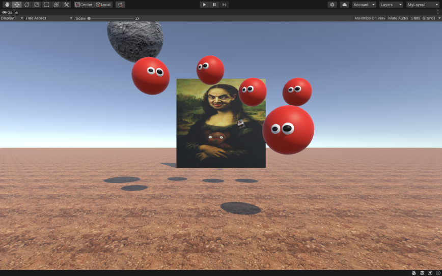

<blockquote>
<b>TL;DR:</b>
I worked on plakar, go-fastcdc a FastCDC implementation for plakar, and some useless stuff.
</blockquote>

# Shout out to my sponsors &#x2764;&#xfe0f;

A **HUGE thanks** goes to my sponsors on [github](https://github.com/sponsors/poolpOrg)
and [patreon](https://www.patreon.com/gilles):
your continuous support is very much appreciated !

I created a Discord where I hang out and discuss my projects or screencast as I work on them.
Feel free to hop in if you want,
and feel free to do just like me and share thoughts as you work on your own projects there:
**this is a virtual hack room for anyone to join**: [https://discord.gg/YC6j4rbvSk](https://discord.gg/YC6j4rbvSk)


# This activity report will be short

This activity report will be short because **I spent the last ten days caring for my kid who got sick**...
before catching his stomach bug myself and spending the last few days in a somewhat familiar and unpleasant hell,
unable to do everything I intended for this month.

I didn't want to skip this report as it's the last of the year,
but I'm exhausted and don't have the energy to spend hours writing and rephrasing,
I'll make it up to you next year.


# First, plakar

The last few months,
I worked on and off on the `plakar` project and while it's not at a stage where I want to release it,
it's most certainly **at a stage where feedback from early testers would be useful**.

If you have followed it through the last two or three reports and are interested in where this is going,
feel free to **join my [discord](https://discord.gg/YC6j4rbvSk)** where a room is dedicated to this project,
where you can provide feedback as you test,
and where I can fix things live as you break:

```diff
- DO NOT USE PLAKAR
+ DO NOT USE PLAKAR (UNLESS YOU'RE HELPING ME MAKING IT USABLE)
```

If I get enough feedback and assurance that it's not too buggy and can't collapse into a singularity,
this might even get a first release sometime early 2022 if it keeps on at the pace it was going this last quarter.


# Since we're on the subject of plakar...

I did a ton of optimizations,
not just code-wise but in terms of index format and such,
storage representation is not fully stable yet but barely changes anymore and plakar snapshots made this week are likely to be restorable with a build from next week.
Work these days is mainly focused on improving the command line interface and features built on top of snapshots themselves, not on how data is dealt with.

One of the things I really wanted to improve,
and which is the main thing I did this month,
was to change the chunker...
so let's talk about that.


# What's a chunker ?

To save space and avoid storing multiple copies of a same file content,
`plakar` checks if that content is already in the store and only records a reference if it is.

Instead of checking for an exact copy of the file,
which would no longer match if a single byte was appended,
it **slices the content into chunks** and checks for them individually so as to only write chunks that are not already present.

A very naive approach to this slicing is that of **fixed chunking** where the file is sliced into chunks of fixed size,
say 16KB,
which works nicely for any file **that's not supposed to change** (hello `/bin`, you're awesome) or **that only gets appends** (I see you `/var/log/maillog`).
This approach is naive because it works perfectly... as long as nothing causes a shift in chunk alignment:
prepend a single byte in front of a 1GB log file that's already in the store,
and all chunks are now shifted, none can be found in store and the whole file needs to be stored again.

A solution to this problem is the use of **content-defined chunking**,
an approach that uses the content itself to dynamically determine the location of **chunk boundaries**,
rather than using fixed boundaries.

The basic idea is that if you use a rolling buffer of data to **somehow determine the chunk boundaries**,
then even if you insert a byte at the beginning or the middle of the stream and process the stream again again,
**after a while** the rolling buffer will contain the same content as before the byte was inserted and therefore **end up in the same chunking cycle**...
so it should be possible to **compute a rolling hash** of some kind and use specific outputs of that rolling hash as a condition to delimit chunks.

This is nice and all but **it doesn't come for free**.
If chunking is not of a fixed size,
then it's no longer a simple fixed cursor increment but the result of computation done on content...
which means that the more content needs to be seen to determine chunks,
the slower chunking becomes.
**ORDERS OF MAGNITUDE slower**.

Luckily for me,
there's a research community focused on content-defined chunking which has smarter people (**ORDERS OF MAGNITUDE smarter**) coming up with ways to speed things up,
and while there's no way it'll ever reach the speed of fixed-length chunking,
they made so much progress these last decades that it's actually fast enough to be usable.
Not only that,
but through **improvements on resources consumptions** like for instance not pegging a CPU during the whole process of chunking,
some of the time lost on chunking can be regained on parallelization of tasks for example.

Anyways,
I digressed...

In my very early Python PoC of plakar years ago,
I started with fixed-length chunking to bootstrap the code then implemented a [Rabin-Karp](https://en.wikipedia.org/wiki/Rabin%E2%80%93Karp_algorithm) rolling hash to provide contend-defined chunking.
It worked and it was slow (a.f.),
probably because it was Python,
probably because it was my code,
probably because Rabin-Karp isn't... too fast.

When I revisited this project from scratch in Golang a few months ago,
I thought I'd just use any existing chunker available to me while bootstrapping the project,
then take serious time investigating what's the chunker algorithm I really want to use and if I really need to implement it myself.

For a few months,
I relied on [restic's chunker](https://github.com/restic/chunker) which... is a rolling Rabin hash (hooray, no surprises),
but this month I decided to reconsider as it doesn't perform as fast as I'd like and having plakar depend on another backup utility was a bit weird and came with its own issues.

I did some quick search and found a paper titled [FastCDC: A Fast and Efficient Content-Defined Chunking Approach for Data Deduplication](https://www.usenix.org/conference/atc16/technical-sessions/presentation/xia),
claiming:

> we propose FastCDC, a much faster CDC approach for data deduplication than the state-of-the-art CDC approaches while achieving a comparable deduplication ratio.
> [...]
> Our experimental evaluation demonstrates that FastCDC obtains a chunking speed that is about 10× higher than that of the Rabin-based CDC and about 3× that of the Gear- and AE-based CDC while achieving nearly the same deduplication ratio as the Rabin-based CDC.

SAY NO MORE, SCIENTIST, YOU CONVINCED ME WITH YOUR WISE WORDS.

I did a bit of github search,
found implementations,
tested them but they didn't work too well for me as one crashed,
the other had an interface optimized for streaming,
and both copied optimizations that I didn't understand from a different implementation in a different language.

The paper was nicely written,
came with pseudo-code displaying a very simple algorithm,
so...


# go-fastcdc

The [go-fastcdc](https://github.com/poolpOrg/go-fastcdc) package hosts my implementation of the FastCDC paper with no bells and whistles...
except that it takes special care to avoid unnecessary buffer allocations and has an **implementation-specific** optimization of my own,
unrelated to how FastCDC itself works.

Basically,
a chunking loop looks like this:
```go
    for {
        chunk, err := chunker.Next()
        if err != nil {
            if err == io.EOF {
                // no more chunks to read
                break
            }
            log.Fatal(err)
        }

        // do something with the chunk
    }
```

In other implementations that I read,
the call to `Next()` is what computes the chunk boundaries so that in this loop the chunker only works during `Next()`,
then remains idle while the caller does something with the chunk.

My optimization was to have a goroutine part of the chunker to **keep ensuring that the next chunk is available** as soon as possible,
and make `Next()` return the next chunk as soon as it is made available by the goroutine.
This doesn't seem like much but it actually ensures that **the chunker doesn't remain idle while the caller works with a chunk**,
making the calls to `Next()` almost "free" as the cost of chunking is paid concurrently to whatever work the caller is doing (if caller isn't pegging the CPU that is)
The chunker goroutine only ensures ONE chunk ahead and will sleep as long as that chunk isn't consumed.

On a **loop similar to the one above** with no work done on the chunk,
this will bring absolutely **no benefit**,
but for `plakar` which does **a lot of chunking** but also does **a lot of stuff with chunks** before requesting the next one,
this **saves several seconds** on the snapshot of a 1GB directory.

There's not much more I can say about it,
it takes an input reader,
produces content-defined chunks out of it following the FastCDC algorithm,
not much to see,
chop chop.

It is ISC-licensed, use it for whatever you see fit,
or don't use it and read what follows.


# plakar uses go-fastcdc

With go-fastcdc available to use,
I broke ties with the restic chunker and switched plakar to go-fastcdc as its chunker,
~~it was a very tricky change that involved a ton of~~
I wish I could write about the challenges I faced but it was a trivial change that took two minutes as I used the same interface.

The performance improvement was **not as great as advertised by other fastcdc implementation** but it is slighly faster for my use-case,
I fully know the chunker code and am the maintainer of it so if anything needs tweaking, it's a big win.

Does that mean that `plakar` will rely on FastCDC ?
I dunno.

See, it took me a day to switch from the previous chunker to my own FastCDC implementation,
removing the downsides I had,
so **it was worth doing that work** but this doesn't mean that FastCDC is the one I want to go with in the end.

The **FastCDC** paper was published in 2016 claiming to be up to 10x faster than CDC,
but then **RapidCDC** was published in 2019 claiming to be up to 33x faster than CDC,
and now **QuickCDC** was published this year claiming to be even faster.
Speed isn't everything but... in my case it kinda is.

Unless the trade-offs (cpu cost / ram cost) are unbearable,
there's **no reason to stick with FastCDC if anything else is faster**.
I only had the time to read and implement FastCDC before my son tripped me into a hell of body fluids,
but I'll be carefully reading (and probably implementing) RapidCDC and QuickCDC so I can do tests and pick what's the best for `plakar`.


# THAT'S ALL FOR THE USEFUL STUFF, BELOW IS JUNK


# Assorted experiments to reduce my mental backlog


## Implemented my first genetic algorithm

I learnt the theory behind (some) genetic algorithms reading a book when I was a student **approximately a century ago**,
but there was no school project involving one and since I was already drowning in work (and really wanted to graduate),
I decided not to disperse myself and plain forgot about the topic.

Somehow,
something reminded me of genetic algorithms this month and since I never wrote one and didn't want to remain ignorant,
I searched for a tutorial and ran into this presentation:

<center>
<iframe width="560" height="315" src="https://www.youtube.com/embed/YrgTSPSdhSw" title="YouTube video player" frameborder="0" allow="accelerometer; autoplay; clipboard-write; encrypted-media; gyroscope; picture-in-picture" allowfullscreen></iframe>
</center>

I spent an hour implementing both examples,
another hour trying to come up with smart optimizations to speed things up as it was painfully slow,
then yet another hour to experiment with them further until I understood what they were useful for and what they were unusable for.

It was lovely,
I'm not sure I'll be using one again before the next decade but who knows.


## Implemented a custom DHT

Many years ago,
I worked at a company that sells services built on top of a distributed storage powered by a [chord](https://pdos.csail.mit.edu/papers/chord:sigcomm01/chord_sigcomm.pdf)-inspired DHT.
I had never heard about DHT before so I studied the paper in anticipation of the interview,
wrote a very basic network-less implementation,
fell in love with the idea,
and enjoyed my time working there with this technology even though I didn't work on the DHT itself but on a project built on top of it.

Life went on,
I switched job and city,
but I kind of kept a regret that I never worked on the DHT layer myself ...

... and since this month was already screwed in terms of usefulness,
I spent a couple evenings experimenting with a DHT implementation of my own that has some properties I'm interested in.
Some ideas were nice,
others sucked or didn't produce the result I expected.
It's an ongoing work to understand what I want to retain and what should be thrown away.

I have a working implementation,
with a memory-based key/value store built on top of it,
networking and all,
but there's nothing really interesting to show so I'll continue experimenting as a low-priority exercise and I'll write about it here if anything nice ever comes out of it.


## Hello, VR !

If 2020 and 2021 have taught me anything,
it's that **there's an overwhelming amount of people that I wish would live on another planet**.
A number so high,
in fact,
that even if they all agreed to board a shuttle right away and head to the sun,
I'd still consider moving away from this planet while they board because oh my I wish they lived on another planet.

I had huge plans for relocating on Mars ever since I read Ray Bradbury's Martian Chronicles as a teenager,
but now there's this electric car guy who wants to ruin there too so...
nu-uh,
I need another place,
preferably the opposite direction.

Venus seemed very promising but the NASA won't be floating outposts there before my time is over,
I'm screwed.

This only leaves me with VR.

I picked up a book and started learning about VR development.
This way,
when I have a rough day and I just can't anymore with the human race,
I can wear a mask and instantly put a few million kilometers between others and myself,
even if just for a few deep breathes and the sight of an asteroid putting this place out of its misery.

<center>
    
</center>

I'm not quite there yet but it seems achievable in a more realistic timeframe than my travel to Venus.


# That's all folks!

As I do every year,
I'll write a more personal retrospective of this year in a few days,
maybe late 2021 or early 2022,
it's been an intense year and I need to pour it out so my head is empty again.

Hope you enjoyed reading this post,
happy Xmas,
happy new year and may life bring you joy and happiness.

---- 
Comments: [https://github.com/poolpOrg/poolp.org/discussions/144](https://github.com/poolpOrg/poolp.org/discussions/144)
