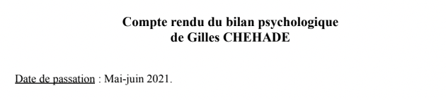
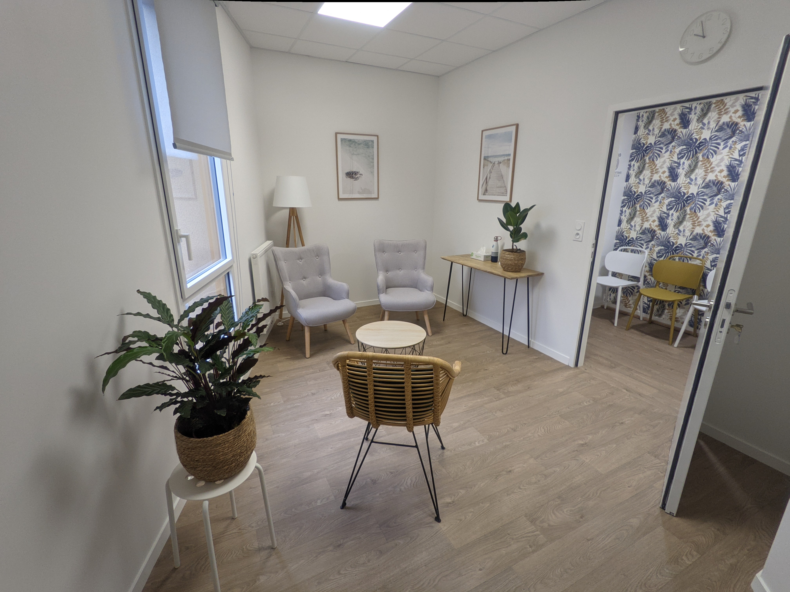
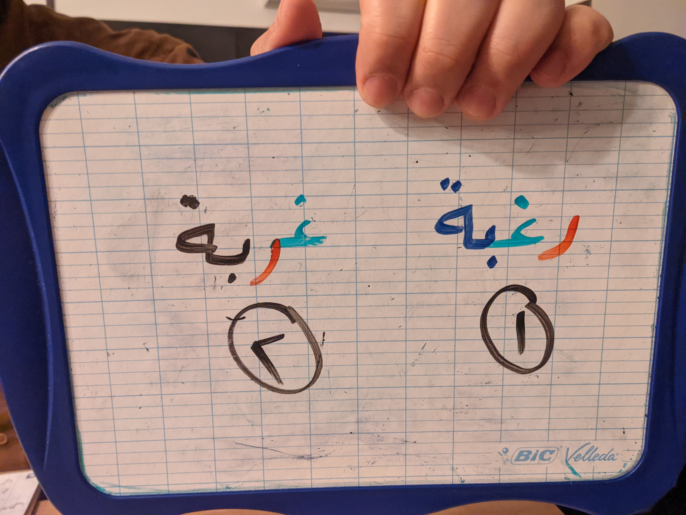
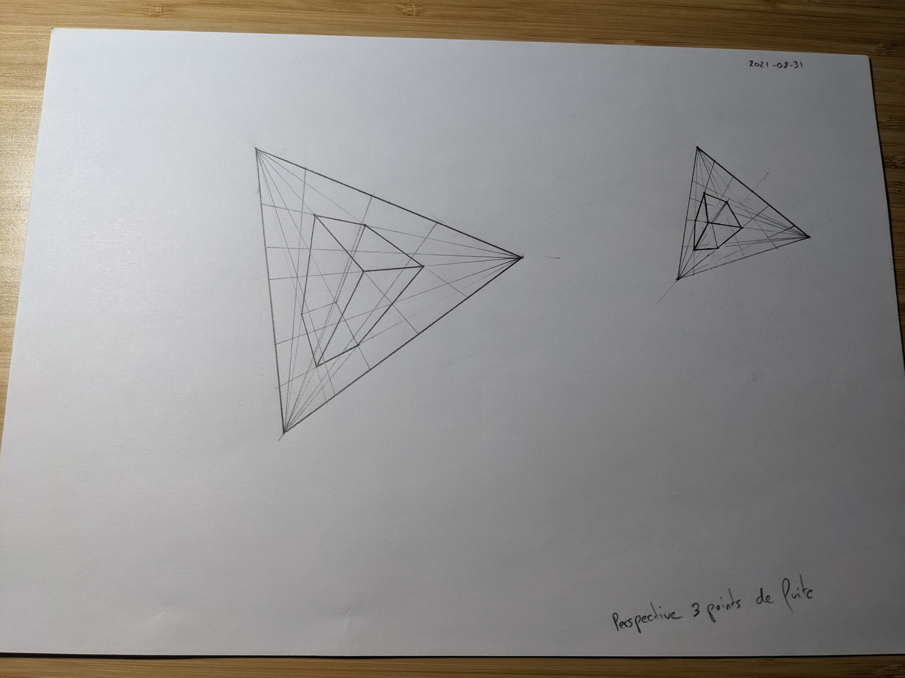
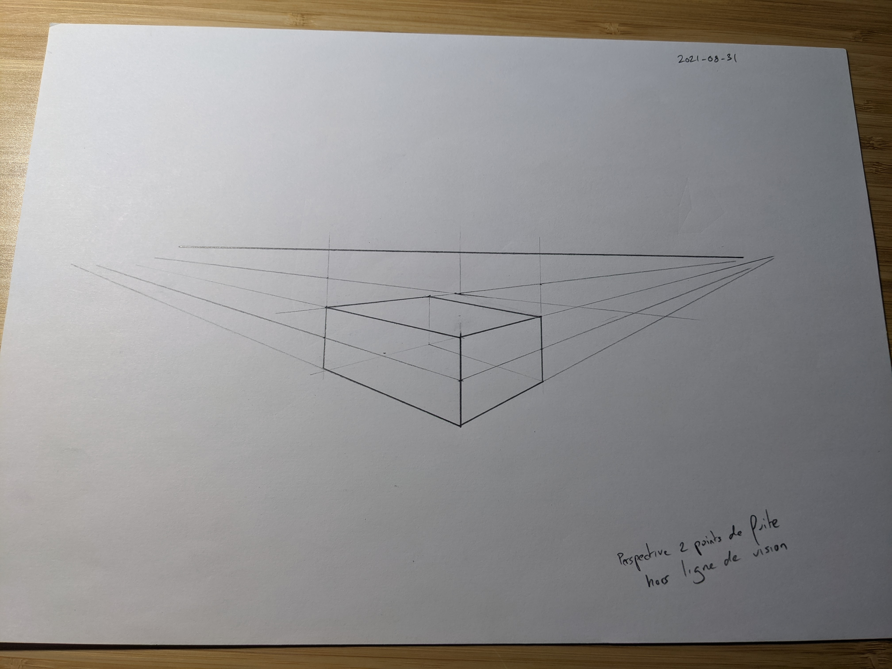

<blockquote>
<b>TL;DR:</b>
A retrospective of 2021
</blockquote>

# 2021 was a good year overall

Pandemic and lock-downs set aside,
2021 was a good year overall.

I've really enjoyed my daytime job,
my physical health was fine,
my mental health was... meh... but ok, I guess.

# Learnt about my neuro-divergences
I took a psychological assessment which pinpointed what's _"wrong"_ with me,
the source of my alexithymia, generalized anxiety disorder and life-long uneasy feeling.

  
   
   

It was painful (a.f.) to cope with the result,
and it'll still take some time for me to get over it,
but at least I now have a much better understanding of how I'm wired,
what works and doesn't work for me,
and some actions I need to take to effectively improve my life.

It sucks to discover neuro-divergences past 40 years old,
with ~half of my life already passed,
but also a career and life decisions taken on partial informations.
There's a bit of grieving required,
but it's all for the best:
I can acknowledge and move forward.

I won't disclose the details as I'm not comfortable sharing them publicly,
but if I decided to write this,
it's because I hope it can be helpful to others in similar situations:
**taking a psychological assessment is nothing to be ashamed of**,
it doesn't make you weak,
and if you ever feel psychological suffering that you fail to understand,
it can help put some perspective where it's lacking.
I wish I had someone tell me this twenty years ago,
so I'm doing my part in case someone needs to read this now.

## Work psychology studies
Because of the pandemic I had to put my studies of work psychology on hold,
which is a shame considering that I'm only a year away from starting my master thesis,
but **finding a company that would welcome me for a field intervention has proven impossible**...
two years in a row...

I'll take a break until the pandemic is behind and life is back to normal rather than spend a third year going to evening classes for nothing,
I'd rather spend these hours playing with my son and learning new stuff.
It'll take considerably longer than expected to obtain the diploma but it's ok,
I'm not in a rush and there are other fields I want to study in 2022.

## Hypnosis office
Despite suffering from the consecutive lock-downs and curfews,
work at the hypnosis office remained active throughout the year,
which allowed me to reach break-even.
Considering that hypnosis is not my main activity,
that I do not depend on it for a living,
and that I'm only doing it because I enjoy doing it and need it in my life...
I'm happy that it breaks even and that I don't have to stop that activity like so many people around me.

Here's a picture of my new office which looks lovely:

  
   
   

Starting January 2022,
I'll be doing self-hypnosis workshops and I'm considering doing a few hypnotherapy workshops too,
though I need to evaluate how much effort I can pour into this first.

## Resumed doing some open-source work
For the last two years,
I had lost motivation to write code and work on opensource projects:
I'd sit in front of my computer and find a thousand creative ways to procrastinate.
Then it struck me:
I **lost touch with why I enjoyed writing code** in my spare time and this is why I no longer could.

I loved writing code because I loved experimenting,
learning new tricks,
writing broken throw-away experiments,
testing stuff and seeing what comes out of it.
I loved writing code because I primarily wrote it **for myself**,
not for others,
and because I had no other goal but to enjoy the puzzle solving...
or giving up when interest decreased.
I loved it because **it was a hobby** and I could do whatever I want.

This last decade,
my spare time coding was spent for others, not myself.
I wrote tons of code that I had no interest in whatsoever,
just because it was what others expected to see happening,
and everything I did was done thinking about how useful it would be to others and how they'd view my work.
No one forced me, it just happened and I did not see how this affected me.

It's hard to switch that mindset but I decided to try **no longer giving a damn**.

I'll work on projects I want,
regardless of how useful they are,
and I will try not to care how people feel about these projects.
I'll keep sharing them because that's how I learnt and I want to give back,
but also because that's how people teach me new tricks by pointing at things I've done wrong or inefficiently.

If people find these projects useful,
I'll be happy,
but if a project starts putting pressure on me I'll step back,
let people who care fork and maintain it,
then move on to work on something else.

  
   
   

These realization and decision unlocked me and,
as a result,
I worked on many projects as can be seen from my last few monthly reports.
Some of them,
like `plakar`,
are useful and entertaining to me while others served no other purpose but entertainment.
This is how it's going to work for me from now on ;-)

## Learnt myself some arabic speaking
I spent 2021 learning how to speak Arabic with weekly classes and I could not be happier as I can now hold basic
**kid-level discussions** but still feel like I could be dropped in the Middle-East and manage to find my way and not starve.
When I go back to Lebanon,
I'll be able to order my shawarma, manaïche and baklawa without relying on French, English or someone to translate for me.
I won't be fluent before a while but I only care about being understood,
so that's ok.

I just began learning how to read,
hopefully by the end of 2022 I can read a simple book,
or better,
one of my aunt's novels <3

  
   
   

Hopefully I'll also be making better use of my US-arabic keyboard which currently only proves useful at extending the character set of my passwords ;-)

## Began learning how to draw
In September,
I began learning how to draw from scratch (because I suck) and I actually enjoyed it.

I wasn't very constant as I got context switched a lot and didn't draw every day,
but I have prepared myself a schedule so that I have dedicated time starting in 2022.

At this point,
I can't really say I learnt much but I got a grasp at some key concepts:

  
   
   

  
   
   

  
   
   

  
   
   

I'll keep this blog updated with my progress as a mean to keep motivated ;-)

# Started learning the piano
Late 2020 I took a try at creating LoFi tracks because I wanted to know how to ...

<iframe width="560" height="315" src="https://www.youtube.com/embed/videoseries?list=PLPkj9YHXkB0G9UbuT9SuEYvBQwJUL_3CU" title="YouTube video player" frameborder="0" allow="accelerometer; autoplay; clipboard-write; encrypted-media; gyroscope; picture-in-picture" allowfullscreen></iframe>
 
 

... and this year as I was having fun with a piano VST and my MIDI controller keyboard plugged,
I got hooked and spent several evenings improvising single-hand melodies on top of songs I liked.
It was fun and all but I realized that **I really needed a piano in my life** (and also to learn how to play with both hands).

That's how I ended getting myself a Yamaha YDP S54 piano this summer,
after **successfully convincing my second-half that it would benefit the kid and be plenty nice in the appartment** (don't pull this at home kids, it was a professional stunt)...

  
   
   

... but I couldn't play it right away as we left for holidays right after I brought it home,
then I got carried away in September by all the kid / work things you have to deal with when coming back from summer vacations.

I started taking courses in November and I absolutely loved it from the first session,
so much in fact that I have not touched any other instrument since then (yes, that's bad...),
and that I actually play with it every single day.

I took five courses so far so there's a looooooong road ahead,
but I can definitely picture myself sticking with that instrument in the long run.

  <iframe width="560" height="315" src="https://www.youtube.com/embed/up7YCZ-eFxo" title="YouTube video player" frameborder="0" allow="accelerometer; autoplay; clipboard-write; encrypted-media; gyroscope; picture-in-picture" allowfullscreen></iframe>
   
   

  <iframe width="560" height="315" src="https://www.youtube.com/embed/RqpaR8bx2vw" title="YouTube video player" frameborder="0" allow="accelerometer; autoplay; clipboard-write; encrypted-media; gyroscope; picture-in-picture" allowfullscreen></iframe>
   
   

Satie was the main reason I wanted to learn the piano so... yay, I can play a few measures :-)

## Probably forgot a few things

I probably forgot a few things,
I kept myself busy all year long and didn't keep a log of every little thing I did.

These were my most important achievements this year and I'm happy about all of them.
I wish I could say that I'd take some rest in 2022,
but...
I have a stack of books sitting next to me (literally on a chair) and the one on top is _already_ keeping me busy.

My biggest achievement in 2021 was to realize that **I STILL can do anything I want**,
nothing is out of reach and if something actually is, then...
**heck, I tried** and I'm free to give up any time,
I'll still have made progress on the way.

## HAPPY NEW YEAR

I'll close this retrospective with a **HAPPY NEW YEAR EVERYONE** !

I wish you success at everything you attempt and may a ton of good things happen to you in 2022.

Peace.

---- 
Comments: [https://github.com/poolpOrg/poolp.org/discussions/147](https://github.com/poolpOrg/poolp.org/discussions/147)
