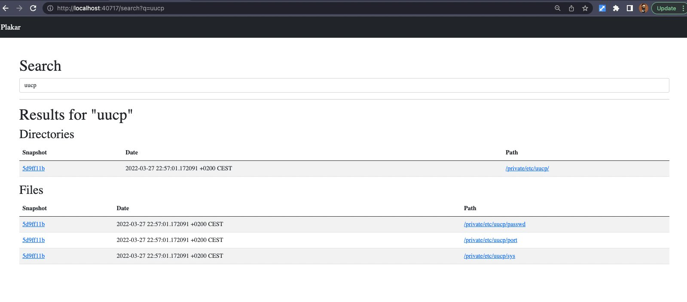
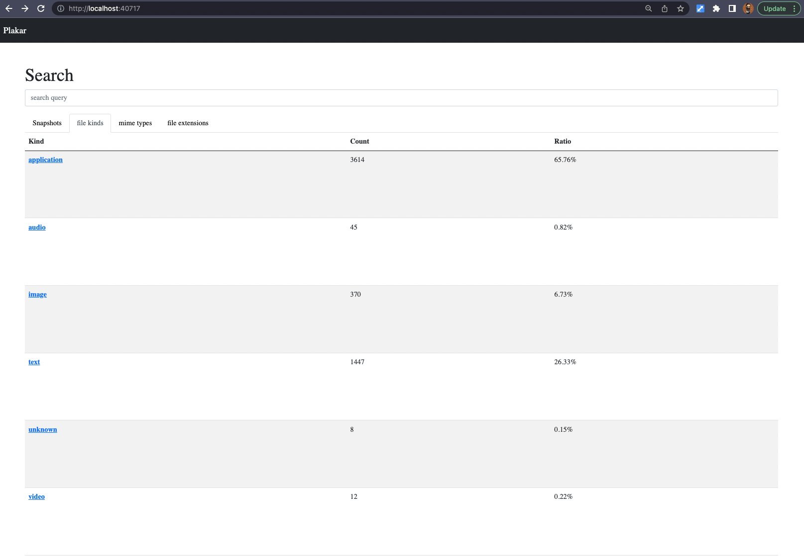
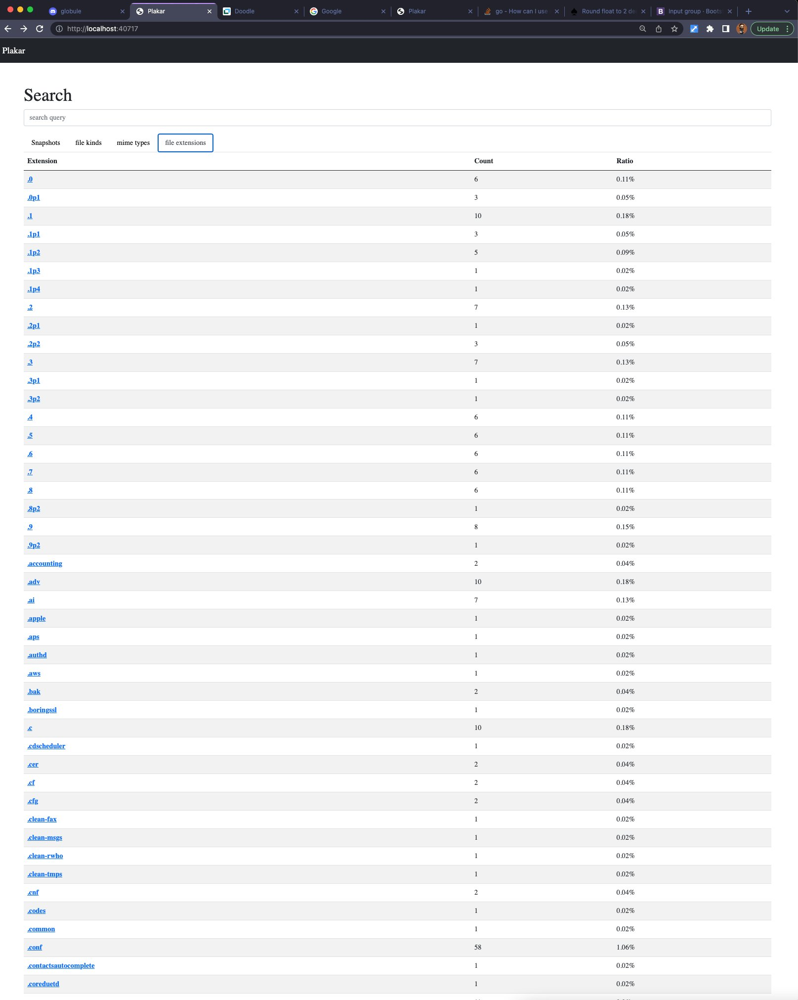
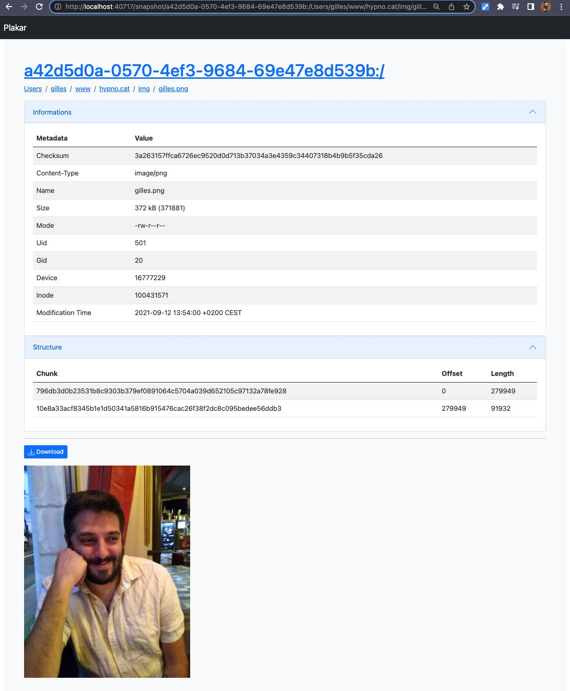
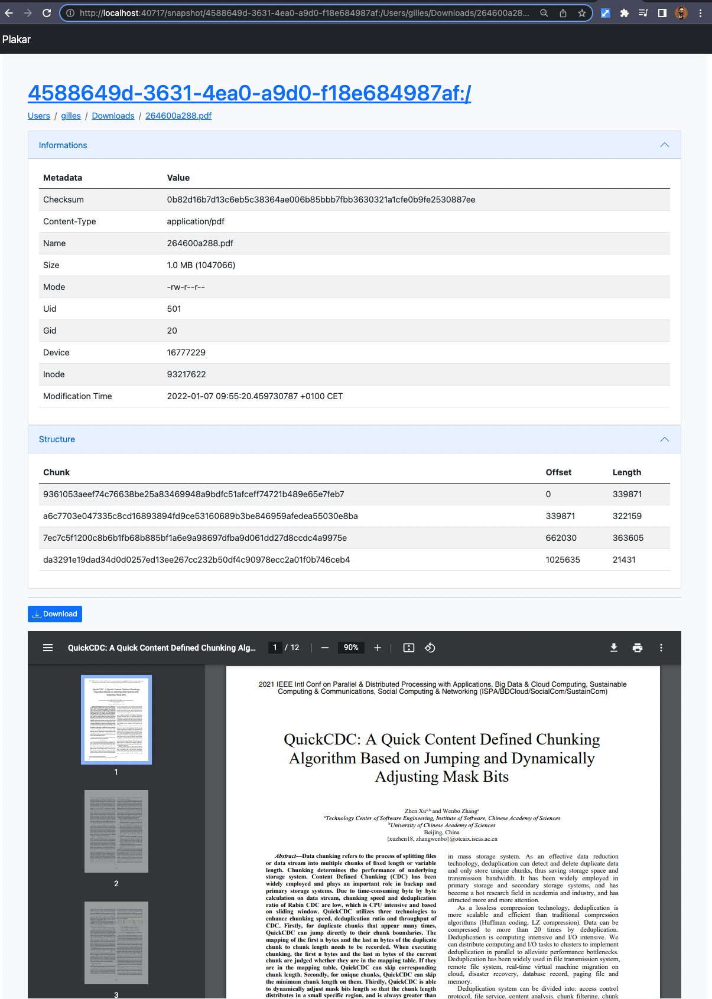
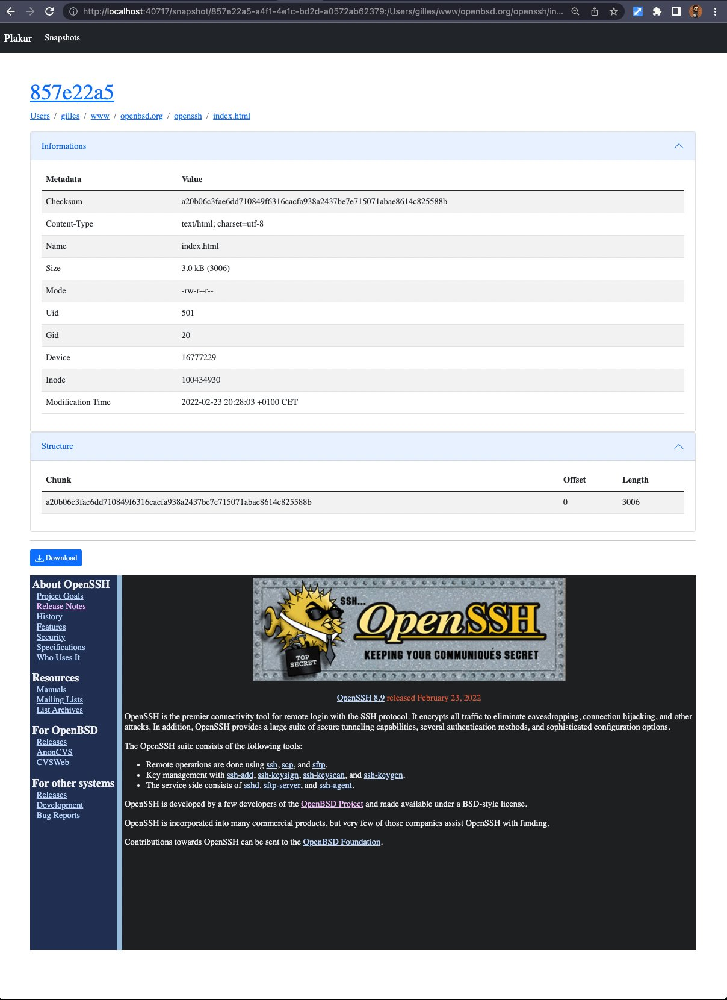
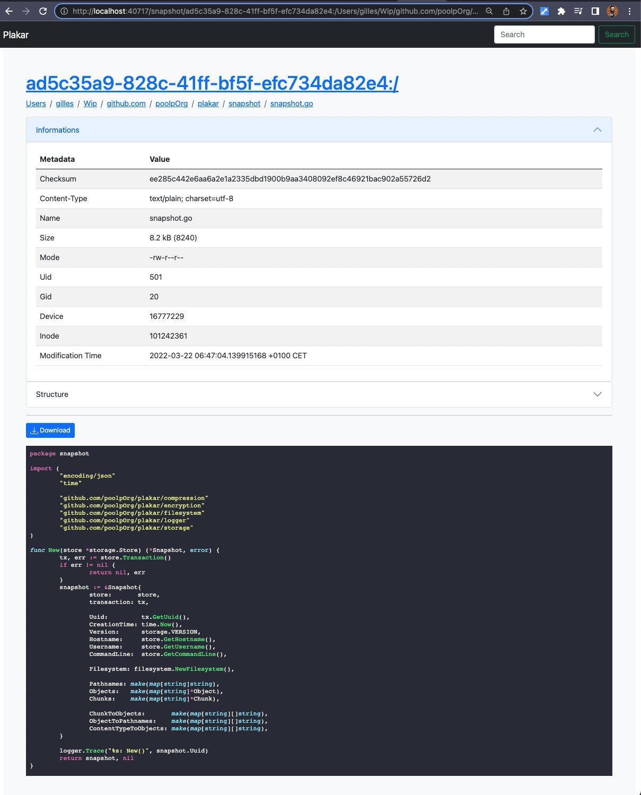
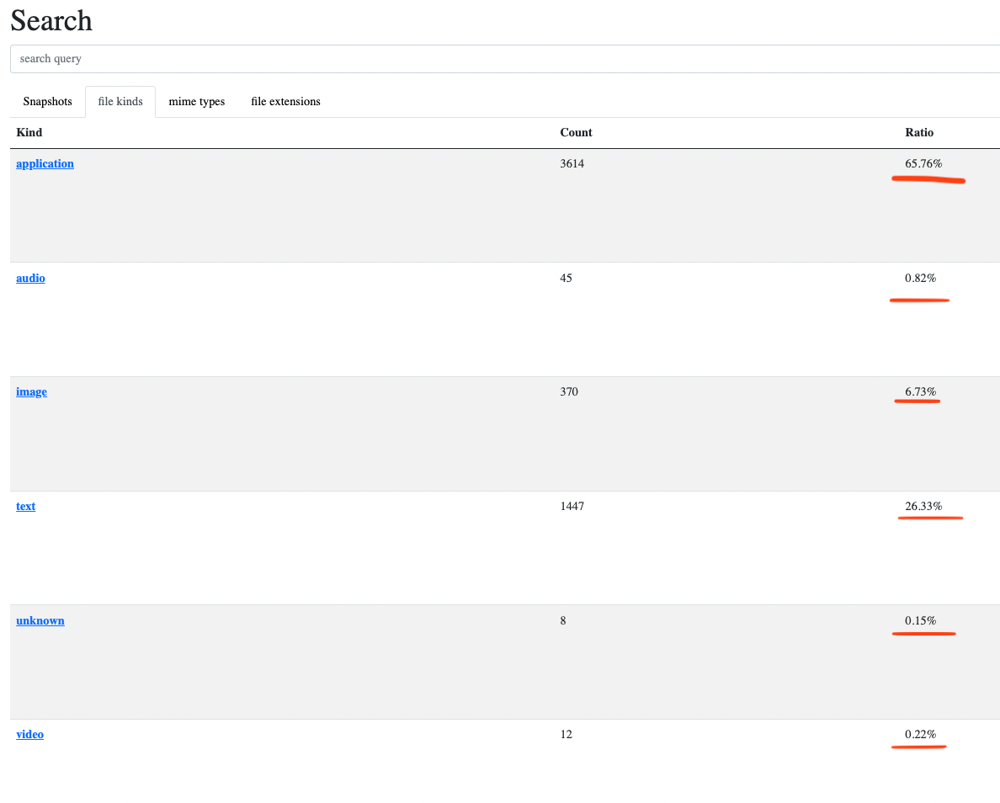
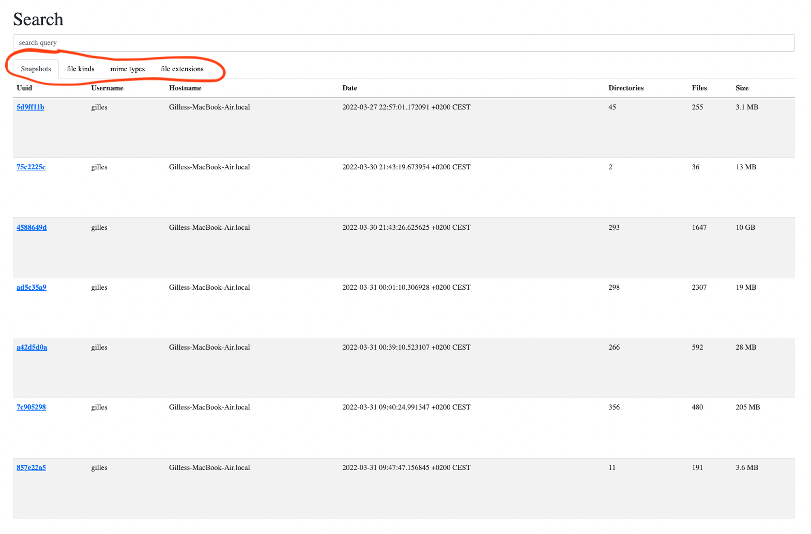


I did key and UI stuff, mostly search related. There's going to be plenty of images in this post.


# Shout out to my sponsors &#x2764;&#xfe0f;

A **HUGE thanks** goes to my sponsors on [github](https://github.com/sponsors/poolpOrg)
and [patreon](https://www.patreon.com/gilles):
your continuous support is very much appreciated !

I created a Discord where I hang out and discuss my projects or screencast as I work on them.
Feel free to hop in if you want,
and feel free to do just like me and share thoughts as you work on your own projects there:
**this is a virtual hack room for anyone to join**: [https://discord.gg/YC6j4rbvSk](https://discord.gg/YC6j4rbvSk)

# Reworked plakar keys

I won't expand much on that as I'm not done yet,
but I spent a couple days reworking the way `plakar` handles keys for encrypted repositories.

When a user creates its first encrypted repository,
`plakar` will complain that **a key needs to be generated before encryption can be used**.
The key is really a bundle,
**identified by a UUID**,
and containing both a key-pair and a master key,
the former being used for signing purposes and the latter to do the actual encryption within a repository.
Once generated,
if an encrypted repository is created,
it will **record the bundle UUID in its configuration** so that a client can immediately know if it possesses the proper bundle to work with that repository.

This was fine to bootstrap the project,
but there are some issues with that approach.

First,
because the master key is in the same bundle as the key-pair,
they become **too tied** and a user can't use the same key-pair to work with repositories encrypted with different master keys.
This meant that either **all repositories** had to be encrypted using **the same master key**,
or that a user had to generate **as many key bundles as repositories** encrypted with different keys.

Then,
for the reasons above,
it was difficult to allow multiple users to work over the same repository despite the fact that it's been designed for that.
If I wanted to give two SREs access to the same repository,
then they'd **need to share the same bundle** which would prevent proper auditing and making it very painful to revoke an access...
unless different bundles would share the same master key and the repository configuration recorded a master key UUID rather than a bundle UUID,
which would still tie key pairs to a specific master key.

There are many ways to improve this but they **all share the same initial step**:
breaking the relation between the key pairs and the master keys used by repositories,
which is what I did.
The master key for a repository is now generated when the encrypted repository is created,
with **no ties whatsoever to the key pair**,
and different users may share the same master key while having different key pairs.

I'll detail this in a future post as there's still some work to do,
however I have successfully created multiple repositories relying on different master keys and worked with them transparently,
just as I have shared them between two different users and worked with them transparently as well despite different key pairs.
**The first step towards a proper solution is done**.

# TONS of UI improvements

I work a lot with the CLI and I find it very easy to use for creating or restoring snapshots,
as well as performing a lot of small operations **when I know what I want to do**,
but sometimes what I really want to do is browse around a bunch of old snapshots and **it's not necessarily as user-friendly**.

A while back,
I wrote the `plakar ui` command which launches an interface that allows browsing through snapshots,
obtaining a lot of informations regarding metadata or objects structures,
as well as providing a basic viewer.

As time passes, the UI is increasingly usable and friendly, but it still lacks some interesting features.

## Searchable repository

A feature that I believe is very important is **the ability to search through a repository or snapshot**.

There was already a bit of commented code to do that,
but it was very limited as it only allowed searching for path names that contained a particular string,
however snapshot indexes contain a lot of useful informations that I could make use of.

So the first step was to uncomment and **bring back the basic search capability**,
which allows to lookup a directory of file by name:

    

I then added the ability to **search files matching a particular kind of data**,
like for instances searching only files that are applications, images, videos, audio, text, or other kinds:

    

Which I then extended to allowing **the search of files matching an exact content type**,
like for instance **searching specifically for PDF or JPEG files**:

    

And finally,
I implemented a **filter on file extensions**,
because quite often what I'm looking for is really a `.go` or `.py` file which I forgot the name of:

    

At this point,
the search is **global to a repository and looks into every snapshot**,
but the next step is to implement a **context-aware search** so that it is possible to search from **within a snapshot** or even **within a directory within a snapshot**.
I'll also be adding a few more useful search criteria,
like being able to filter on users or dates.

At some point,
I'll be working on a far more advanced full-text search,
I know how to do it so that it can work with plakar regardless of encryption and locality of the repository,
but this heavy work so I won't start before I'm already happy with the basic features.

## Improved object viewer

The UI has a page for each file that's part of a snapshot,
and that page not only **lists metadata** regarding the object but also provides **a small viewer for text and images**:

    

The viewer has a special case so that it only tries to display raw `text/*` and `image/*`,
as I don't really want the content of a binary file displayed.
It worked nicely but I thought it was a bit sad that other types,
like PDF for example,
didn't get a chance be properly rendered when the browser knows how to do it.
I made a few changes to the code and I now have this rendering properly done for **PDF files**...

    

... which is rendered just as if it had been downloaded from a website,
since that's exactly what it does :-)

HTML files are very interesting as **they resolve local links within the snapshot itself**.
I have pushed a copy of the OpenBSD's website and the page below renders the `index.html` from the `openssh/` subdirectory,
which uses the CSS and image that are part of the snapshot and renders just as fine as from a regular directory.

    

This makes it very nice to browse backups of websites and see their different versions :-)

Since I'm a developer and rely a lot on **syntax highlighting**,
I took an extra step and added support for that too:

    

It doesn't show above because I took these screenshots before,
but I made a change to the UI so that **I can decide if I want a file rendered raw or highlighted**,
when that makes sense.

For instance,
the HTML example above had the page rendered raw but a button allows toggling between raw and displaying the HTML source code highlighted.

## failed experiment with statistics...

I did a **failed experiment with statistics**,
trying to display doughnut charts about file types, repartition, duplication and other interesting informations,
but it turned out that with large snapshots **the amount of data makes these unreadable**...

    

... so I gave up on that idea and took a different approach.

Instead,
I added columns to **tables containing categories of objects and display proportions there**.
It is less sexy than charts but is readable and I can think about displaying small charts that showcase a specific category vs all others to make it more visual:

    

## ... that led to a refactored landing page

The landing page used to only display a table with a row for each snapshot.

I reworked it so that it encompasses all the changes described in this post:
it contains **a set of tabs that allow switching from snapshots listing to file kinds, file types or file extensions listings**,
providing easy access to filtered searches as well as statistics by kinds, types and extensions:

    

# What's next ?

Working on the UI is a priority as **it is the easiest way to browse through snapshots**,
but it is also particularly painful as **I suck at making non-CLI stuff** and because Go's `html/template` is **orders of magnitude higher in the pain-in-the-ass scale** compared to Python's `jinja2` or `bottlepy` template engines which I'm familiar with.
Stuff that could be done in a few minutes easily take me an hour to achieve when I don't give up for a few days.

I'll continue working on the search capabilities,
but there are two features that I really want done next month too:
being able to **find all duplicates of a file on all snapshots**,
regardless of their path names,
and being able to **find all files that have changed between snapshots and provide diff** in the UI.
Basically,
I should be able to find all copies of a single file anywhere in the repository,
but also be able to tell that `/etc/passwd` is identical in four snapshots but has changed in the fifth and display the change.
This is already doable in the CLI but it needs some user-friendliness in the UI.

Voila.

