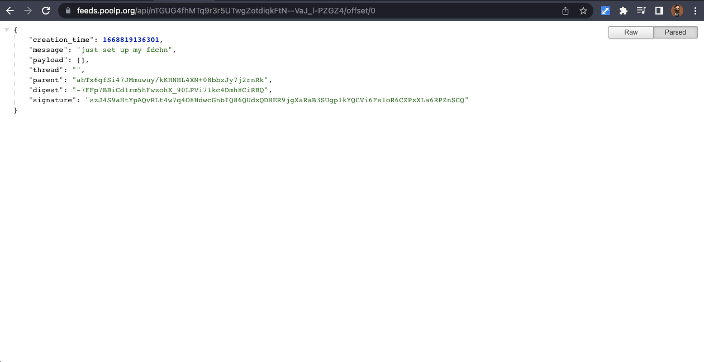
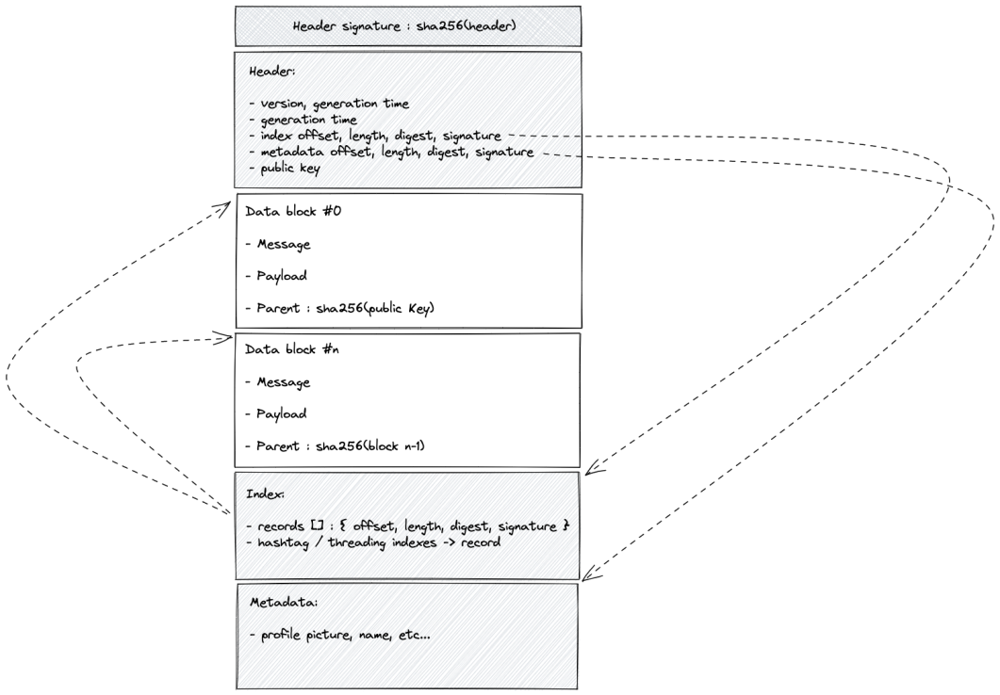


I implemented a file format to support a standalone feed of news similar to what I have on Twitter,
as well as a proof of concept code for a reader, a writer, a publishing node, and some more.
oh and fuck you, elon, you're a dick.



# This is not my activity report

**This is not my activity report** which I'll publish later this month or early December.
I've worked on several projects but I thought this one would be better off discussed in a dedicated article.


# The problem...

In just a month,
two services that I was **heavily relying upon** turned into shit.

The first one is Signal,
a secure messaging system,
which **removed a key feature** to the point I no longer have any use for it as **most of my contacts uninstalled**.
It sucks and I can't really do anything about it,
there are alternative just not ones that would embark non-techies like my mother or my wife as easily as Signal did.

The second one is Twitter,
which is taking a very dramatic turn as the, hum, how do I put it... "Genius" who bought it managed to get **most employees fired or resigned in less that two weeks**,
bringing the service to a point where it's unclear if there are even enough people left to care for the machines that host it (according to comments from former engineers there).

Unfortunately for me,
I don't use it only for the fun of it but also to communicate about stuff while I work on them,
which comes with a ton of benefits for me,
the most obvious one being the freelance gigs that occasionally come as a result from sharing information there.

A solution adopted by many has been to move to Mastodon,
which I also may end up doing,
but I dislike the idea that I'll have to trust yet another service with keeping my data and not shutting down in a year or two putting me in a similar position.
There are also many other reasons which are also causing me to think twice before making a move there,
including as an operator of my own instance.

So what do I do with that :-/


# I worked on a new little project...

Feedchain is a project to maintain a feed of news that can be **published as a standalone file**,
**distributed from various locations**,
while allowing to **fetch specific portions** of it,
guaranteeing the **authenticity and integrity** of the content and expecting **as little requirements as possible** for both the publisher (me) and the readers (you).

Think of it as a kind of RSS feed...
but an RSS feed that's not XML,
that contains an index for random access to any information chunk contained in the feed,
and that has a signature for the whole feed as well as for each individual chunk.
And like an RSS feed,
it will not require a specific server to work but any service that can expose the file and preferably support range queries to avoid full fetches.


# I have a working PoC

I have split the PoC into small applications **to make it easier for me to experiment with it**,
however it'll obviously **have to be merged into a single useable application** so it's not a pain in the ass to use for others.

The first application is a feedchain `writer` which can **generate an empty feedchain**,
**update its content or metadata**,
and **publish it somewhere**.

The writer generates an ed25519 keypair,
the feedchain is identified by the public key stored in the header and a name stored in the metadatas to ease referencing it.
For instance,
my feedchain has the public key `nTGUG4fhMTq9r3r5UTwgZotdiqkFtN--VaJ_l-PZGZ4` and is identified by the name `@poolpOrg`,
the header, index and metadata chunks are signed with my private key so it can be verified by a feedchain reader.

```sh
% writer -create -name poolpOrg
created feedchain nTGUG4fhMTq9r3r5UTwgZotdiqkFtN--VaJ_l-PZGZ4
%
```

From this point the feedchain exists on my machine and because I only have one,
I don't have to provide the name when adding data to it,
it'll figure out where to write:

```sh
% writer -write "just set up my fdchn"
% writer -write "let's see how this little project goes :-)"
%
```

The feedchain that results from this **can be uploaded directly to any web server**,
for example using `scp`,
but because not everyone knows how to configure and run a web server...
I implemented **feedchain node servers that handle publishing and distribution**,
and which anyone can run at the cost of providing disk space and some memory,
and I deployed one at `https://feeds.poolp.org` to bootstrap the project.

```sh
% writer -publish
%
```

From this point,
the feedchain is public and distributed by `https://feeds.poolp.org` at the following address `https://feeds.poolp.org/nTGUG4fhMTq9r3r5UTwgZotdiqkFtN--VaJ_l-PZGZ4`:
```sh
% curl https://feeds.poolp.org/nTGUG4fhMTq9r3r5UTwgZotdiqkFtN--VaJ_l-PZGZ4 >/dev/null
  % Total    % Received % Xferd  Average Speed   Time    Time     Time  Current
                                 Dload  Upload   Total   Spent    Left  Speed
100  1245  100  1245    0     0   9867      0 --:--:-- --:--:-- --:--:-- 10462
```


The second application is a feedchain `reader`,
which knows how to **parse the feedchain file format**,
**verify signatures** and **use the index to access specific chunks**.

It supports reading the content from a local file or from a remote HTTP(S) server as long as it supports range queries.
The example reader outputs all content from the feedchain,
but a smarter reader could apply filters to extract the last `n` chunks,
restrict to a specific timeframe,
match hashtags, etc...

```text
% reader ~/.feedchain/nTGUG4fhMTq9r3r5UTwgZotdiqkFtN--VaJ_l-PZGZ4
[2022-11-19T01:52:16+01:00] (sha256:fbb1...4414): just set up my fdchn
[2022-11-19T02:03:59+01:00] (sha256:fbdf...c88e): let's see how this little project goes :-)

% reader https://feeds.poolp.org/nTGUG4fhMTq9r3r5UTwgZotdiqkFtN--VaJ_l-PZGZ4
[2022-11-19T01:52:16+01:00] (sha256:fbb1...4414): just set up my fdchn
[2022-11-19T02:03:59+01:00] (sha256:fbdf...c88e): let's see how this little project goes :-)

%
```

The third application is a feedchain `watcher`,
which knows how to **follow/unfollow** feeds **by URL** (no dependency to a feedchain node) or **by name** (requires contacting a feedchain node):
```text
% watch -follow poolp.org/nTGUG4fhMTq9r3r5UTwgZotdiqkFtN--VaJ_l-PZGZ4
%

% watch -follow poolpOrg
%
```

... then monitor them for changes to produce a live output:
```text
% watch
[2022-11-19T01:52:16+01:00] @poolpOrg (nTGU...ZGZ4): just set up my fdchn
[2022-11-19T02:03:59+01:00] @poolpOrg (nTGU...ZGZ4): let's see how this little project goes :-)

[output updated as feeds are updated...]
```

The feedchain nodes which I mentioned briefly are standalone servers that makes it easier to publish feedchains.

They have an endpoint for posting a feedchain which makes it public if the feedchain is **correctly formatted and has a valid signature**:

```text
% curl -XPOST --data-binary @/etc/group https://feeds.poolp.org/nTGUG4fhMTq9r3r5UTwgZotdiqkFtN--VaJ_l-PZGZ4
header signature verification failed

% curl -XPOST --data-binary @/Users/gilles/.feedchain/nTGUG4fhMTq9r3r5UTwgZotdiqkFtN--VaJ_l-PZGZ4 https://feeds.poolp.org/nTGUG4fhMTq9r3r5UTwgZotdiqkFtN--VaJ_l-PZGZ4
%
```

Then, they allow fetching the raw file from that same endpoint while allowing range requests,
making it possible for the reader to fetch the header, the index then seek and read from specific offsets.

Because a feedchain is basically an RSS on steroids,
nodes also provide **an RSS view** of the feedchain though it still needs a bit of work to be rendered more nicely by an RSS reader:

<center>
    
</center>


They also provide **a REST API** to allow fetching informations from a specific feedchain.
The API exposes the header, the index, metadatas and individual blocks which may be indexed either by their digest or by their offset in the feed:

<center>
    
</center>


By contacting a node and using its API,
it becomes possible to **easily consume a feedchain from client-side code** to embed portions of a feedchain on a website,
or to **implement a more advanced application without having to reimplement a feedchain parse** but relying only on HTTP requests.


Finally,
I learnt myself **a bit of Dart** so I could **start playing with Flutter** and see what it meant to create a native mobile application,
but I will need a bit of time to have something usable (screenshots taken from an earlier version).
<center>


</center>


# About the format

The feedchain file is structured in the following way:

<center>

</center>
<br />

It begins with a signature of the header's digest,
**allowing to check that it changed by reading the first 64 bytes**,
and **verifying that the header was not altered by reading the first 320 bytes**.

The header contains the offset, size, digest and signature for both the index and metadata chunks,
it is followed by all data chunks and ends with the index and metadata chunks.
The index contains the creation time, offset, size, digest and signature for each individual chunks,
the chunks themselves contain the digest of their predecessor chunk (similarly to a blockchain),
and as a result the headers digest protects the structure of the entire chain.

Not much more to be said,
it is really straightforward,
**to read a feedchain you read the header**,
**locate the index** and **iterate over the index records** to **locate the offsets and lengths of blocks**,
validating digests and signatures as you iterate.


# Limitations and rationale
First,
AND VERY OBVIOUSLY,
**this isn't a Twitter replacement and does not / can not cover a lot of the features you'd expect from Twitter or Mastodon**.
It barely tackles the issue of having to provide a third-party the ownership on data and it allows decoupling a feed from a specific hosting provider,
whereas **features like searching or user interactions are completely out of the scope**.

Can these even be implemented at all ?

Yes, however they would be implemented **as services _around_ feedchains** with specific server-side code provided by nodes.
For instance,
to be able to follow a feed by name rather than URL,
I had to implement a service to perform a name lookup on feeds hosted on a specific node.
This is not a feature of the feedchain itself but a feature of the hosting node.
This means that,
by default,
likes and private messages and whatnot do not exist in feedchain,
they _MAY_ only exist if server-side code supports them as optional services on the side.

I want the feedchains to **remain standalone files usable from a static web server**,
not requiring the use of specific server-side code _BUT_ being able to take advantage of server-side code _IF_ desired.
By limiting the features of a feedchain to its standalone file,
and adding optional features around,
I can guarantee that **feeds can be moved around easily without causing too much disruption**,
they can be **republished anywhere easily** and **nodes can operate as a directory**.

I can decide to provide a direct link to my feedchain hosted on my static web server and not rely on any feedchain node,
or I can decide to publish my feedchain to a node because I don't have resources for self-hosting and if it goes down, I'll publish elsewhere.
There's no requirement to rely on nodes and,
as a matter of fact,
I could publish on my website and someone else could find my feed interesting enough to track it from my static web server and mirror it on a node.

This is something that _by design_ can't be prevented,
the way feedchain works means that I can't impose hosting on a node of mine.


# But it means you keep rebuilding and uploading the whole feed ?

YES ... and NO, it depends.

What's for sure is that using a standalone file means that adding, removing or updating **can mean** having to rewrite portions of the file,
and that publishing **may mean** having to upload the whole file.
So does that mean that whenever I add a small status update to my feed,
I HAVE to push the whole feed again because the file was rewritten and no longer has the same checksum and signatures on header and index ?

Well,
in the proof-of-concept implementation YES,
but that's because **publishing must support uploading a full chain and it was easier to start from that point**...
however in practice,
there are MANY ways that this can be avoided because of how the file is structured.

First of all,
the file is structured in such a way that **the most common operation of editing metadata or adding/updating/deleting from the end of the feed is cheaper**.
In such cases,
**only the end of the file needs to be rewritten** as it may cause offset shifts,
the header being **fixed-sized** can have **signatures and checksums overwritten in place**.

When **publishing to a static website**,
the **full chain** would need to be re-uploaded,
but **when publishing to a node exposing an API**,
**partial updates** through **diffs** and **in-place overwrites** would be possible.

Then,
locally,
it's not because the end result is a standalone file that the client HAS TO to work from that file.
It could store header, chunks, index and metadata separately and build the feedchain from them,
so shifting, deleting, updating would not be so complex.

What's for sure is that feedchain **is not an immutable feed**,
**it _allows_ updating older entries**...
but at the **cost of recomputing the full chain beyond edit**,
**altering chunk identifiers (digests) on the way**.
This is a design choice as **it is technically possible to avoid this** by **removing the blockchain structure** (blocks containing the previous block digest),
however by enforcing this it **discourages the rewrite of history** and ensures that **people referencing a chunk do not get tricked when the chunk suddenly changes to something else**.
I think it's better to support edits through the use of new chunks referencing previous ones than by rewriting old ones.

If this is a topic of interest,
let me know and I'll write more in a future article about how all operations work in feedchains.


# Next steps

I don't have clear steps as I'm mostly experimenting around at this point,
but among the next steps are:

1- extending the node server code to **support p2p distribution of indexes**,
so you could run your node and bootstrap it from mine,
they would share indexes of feeds they know so that when someone asks my node if it knows where a feed is located,
it could point to yours transparently.

2- **move away from proof of concept to higher-quality code** for clients.
Having to rely on a reader app, a writer app and a watcher app is nice to help me debug and experiment,
but it's not so nice for regular use.

3- **implement an application in Flutter** so non-techies can use feedchain on their mobile phones or computers without having to understand a thing about what I wrote today.


# Want to help and contribute ?

I have only played with this for a few cumulated hours to be fair,
so there's plenty of iterations to do on it to make it nicer.

There's code to write in Golang,
there's code to write in JavaScript,
there's code to write in Dart,
and **you could implement feedchain in your favorite language** using the examples from the proof-of-concept and asking question on my discord.

Is it tricky ?
Nope.
I implemented the initial proof of concept in Golang,
I knew nothing about Dart and wrote a full implementation for it in just a few hours,
so anyone could probably implement feedchain in whatever language of their choice in a really short timeframe.
