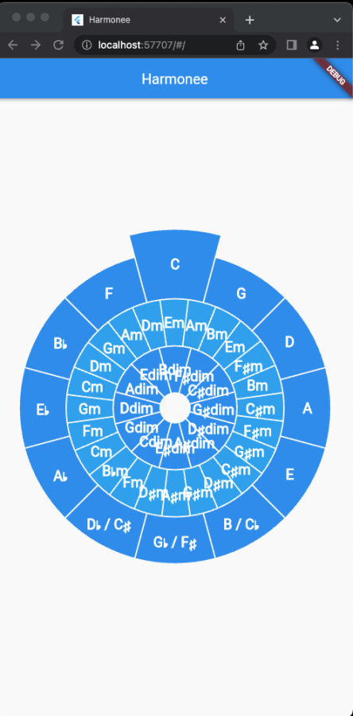
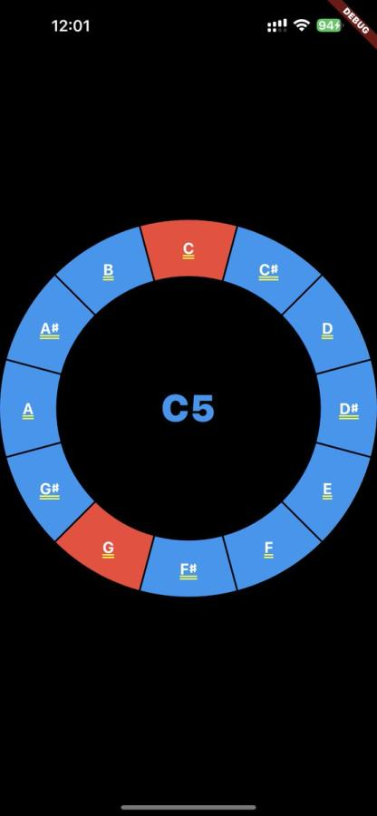
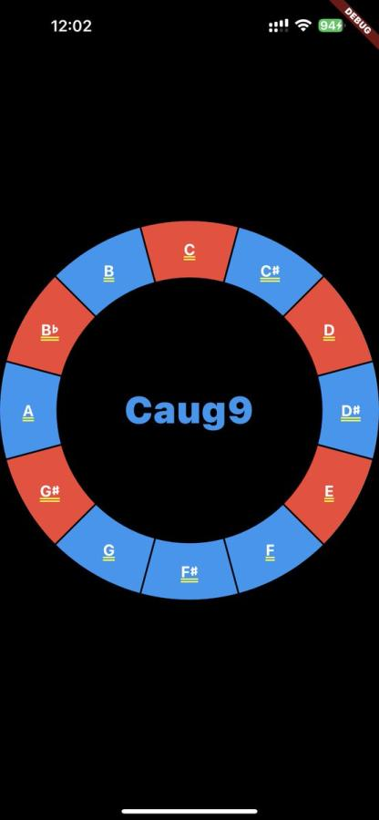
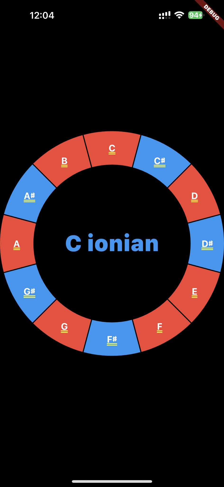
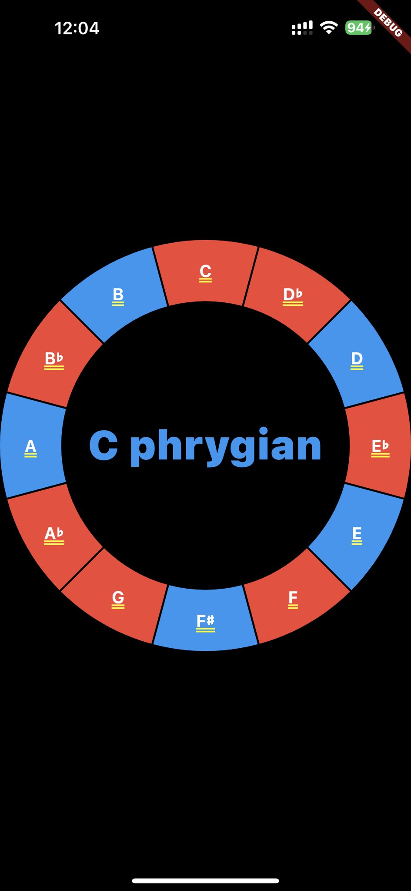


busy month, did a lot of non tech stuff, but also worked on a new project called feedchain,
fixed issues and added new features to go-harmony, and started two projects called dart-harmony and harmonee,
both related to music.


# Shout out to my sponsors &#x2764;&#xfe0f;

A **HUGE thanks** goes to my sponsors on [github](https://github.com/sponsors/poolpOrg)
and [patreon](https://www.patreon.com/gilles):
your continuous support is very much appreciated !

# Table of content

- [Music-related stuff](#music-related-stuff)
- [Hypnosis-related stuff](#hypnosis-related-stuff)
- [I worked a lot on the feedchain project](#i-worked-a-lot-on-the-feedchain-project)
- [go-harmony](#go-harmony)
- [dart-harmony, wait what ?](#dart-harmony-wait-what)
- [Harmonee (the name might change)](#harmonee-the-name-might-change)

# Music-related stuff
No music productions this month,
I lacked time,
but I have recorded the result of some guitare practice sessions which amounts to **hours of struggle** :-)

|||
|:----------:|:-------------:|
|<iframe width="560" height="315" src="https://www.youtube.com/embed/34j3UZ50T6I" title="YouTube video player" frameborder="0" allow="accelerometer; autoplay; clipboard-write; encrypted-media; gyroscope; picture-in-picture" allowfullscreen></iframe>| <iframe width="560" height="315" src="https://www.youtube.com/embed/lAWfGqy45WA" title="YouTube video player" frameborder="0" allow="accelerometer; autoplay; clipboard-write; encrypted-media; gyroscope; picture-in-picture" allowfullscreen></iframe>|
|<iframe width="560" height="315" src="https://www.youtube.com/embed/_D3eN4WZZd8" title="YouTube video player" frameborder="0" allow="accelerometer; autoplay; clipboard-write; encrypted-media; gyroscope; picture-in-picture" allowfullscreen></iframe>| <iframe width="560" height="315" src="https://www.youtube.com/embed/Rg8mYGu9m2E" title="YouTube video player" frameborder="0" allow="accelerometer; autoplay; clipboard-write; encrypted-media; gyroscope; picture-in-picture" allowfullscreen></iframe>|
|<iframe width="560" height="315" src="https://www.youtube.com/embed/bMCBYCw4RXs" title="YouTube video player" frameborder="0" allow="accelerometer; autoplay; clipboard-write; encrypted-media; gyroscope; picture-in-picture" allowfullscreen></iframe>| <iframe width="560" height="315" src="https://www.youtube.com/embed/nXvzvLJ5bcg" title="YouTube video player" frameborder="0" allow="accelerometer; autoplay; clipboard-write; encrypted-media; gyroscope; picture-in-picture" allowfullscreen></iframe>|

# Hypnosis-related stuff
I **gave a two-hours talk** in French,
along with two other hypnotists,
to **fifty-ish psychology students at the faculty of Nantes** on the topic of **hypnosis and myths** surrounding it.

It was very nice yet a bit stressful as I had roughly a week to prepare the slides while I had a ton of other things to do,
and luckily for me it's a topic I'm comfortable enough to go without rehearsing otherwise the anxiety disorder would have kicked in ;-)

As a result,
I had **no time to work on my hypnosis podcast** for this month but I'll be **writing the scenario and recording next week** as I wish to complete the fourth episode in early December.
This will leave me with **four episodes** on the topic of dreams, hypnosis, traumas and hypnotherapy **before I complete the serie** and move on to another project.

I have a book under writing with the intent to self-publish.
It's about ~150 pages at this point but still needs a lot of work and I'll try to focus a bit on it as I'd like to avoid letting it linger for too long.
It covers the topic of **hypnosis from a mechanical point of view**,
essentially following the podcast but with much greater details.
When it's finished and published,
I'll likely translate from French to English.

# I worked a lot on the feedchain project
As you may have seen from [my previous article this month](/posts/2022-11-20/feedchain-is-a-standalone-news-feed-project/),
I worked a lot on **an experimental project** called Feedchain.

I designed the **general structure in a few hours** but made **iterative changes here and there for days**,
while constantly adapting the **proof-of-concept Golang implementation** to reflect these.
Since I already had the Golang implementation,
I also wrote a **publish server** that undertands how to to verify feedchains and serve them efficiently.
The next step was to write a proper client for feedchain,
but I decided to **take a step back and not implement that in Golang but in Dart instead**.

Why Dart, you ask ?

It turns out that for this project and others I keep telling myself I should make a nice UI,
as a native application or a web interface,
but **I don't have the motivation and time to learn too many frameworks to handle too many targets**.
I've grown curiosity for the Flutter framework which **allows building native applications for multiple targets using a single codebase in Dart**,
and so it made sense to learn myself some Dart if only to give it a try.

So I implemented the feedchain parser in Dart,
as well as classes to both produce and consume feedchains,
which **surprisingly took me only a couple hours with no prior experience with Dart**.
I then tried building an application in Flutter that would play nice with feedchains I generated from my Golang proof-of-concept,
and this is where the struggle began because...
believe it or not,
after >20 years of writing code that executes in a console,
it turns out **I'm not an UI guy and I suck at making anything look nice**.

    

 

I'll continue working on this,
but I needed to also work on other projects.

# go-harmony
I wrote a bit about my `go-harmony` package [back in June](/posts/2022-06-14/june-2022-go-harmony-and-earmuff/),
and **not much had changed** since then.

So I dived back into it and **fixed a few issues**,
related to interval arithmetics for the most part,
but also added **a lot of new features** like support for **progressions**,
for **all missing intervals**,
for **various new chord structures (7sus2, 7sus4, M7sus2, M7sus4, sus2sus4, b5, ...)** or improvements on the **handling of chord inversions**.

I also implemented a **scale scanner** that,
given a chord,
will output all scales sharing more than two notes with the chord and sorted by most notes matched first:

    

 

Keep in mind that **the project is the engine**,
not the useless CLI :-)

At this point,
though not exempt of glitches,
`go-harmony` can already:

- parse note names, chord names, scale names
- determine interval between two notes
- determine note at a specific interval from a root note
- transpose note or chords to a specific interval on the fly
- build a ton of different chords by applying a chord structure to a root note
- build several scales by applying a scale structure to a root note
- compute diatonic triads and seventh chords for a specific scale
- compute relative minor / major for a chord
- compute inverse intervals
- recognize a chord from a set of notes if the chord structure is already implemented

and so I did what had to be done ... **I threw some MIDI at it** :-)

I wrote a tool that could **ingest some MIDI** and use `go-harmony` to **try to make sense to what was happening** in the track,
try to detect scales, chords and what not, and...
the result was both interesting and unimpressive at the same time.

It was interesting because on some tracks it did manage to understand what was happening,
what chords and scales were being played.
At one point,
I thought there was a bug in the code because it was not displaying the same chord name as the score but `go-harmony` was actually right,
**it provided a more accurate name than what was written**.
Another interesting thing is that I tested on-the-fly transposition and it worked lovely,
both to convert a track from minor to Major,
but also to transpose all notes a perfect fourth upper as they were read.
That's not a huge feature but I was happy it worked flawlessly as I have plans for it.

It was unimpressive because **it still lacks some key features** (pun intended),
such as `add` / `omit`,
which causes a lot of chords to go undetected or misdetected.
A LOT.
Too many actually that it prevents me from moving forward with some of the more interesting features I have in mind,
so I really need to tackle these detection failures before anything else...
and **it's not trivial** :-)

# dart-harmony, wait what ?
Yeah, I'm spending time on a Golang implementation of a music theory engine...
and **I'm reimplementing it in Dart at the same time**.

Bear with me.

    

 

I'm not really doing the work twice because they are **essentially implementing the same calls and structures**,
just implementing in two different languages because I have two different uses for this.

The `go-harmony` implementation is meant to be used both by **a REST API** that I'll probably make public next year,
and by other stuff I have in mind but that **I'm not willing to disclose yet**.

The `dart-harmony` implementation is meant to be used by Flutter apps so that I can start building useful stuff,
tools that people can actually **install on their devices without having to understand how to "compile" something**,
but more importantly tools that I need to have on me frequently **even if not in front of a computer** :-)

The `dart-harmomy` project was started 8 days ago and it has already caught up with `go-harmony`,
it is even **slightly ahead** as I have started building stuff with it and had to add missing features.
It supports pretty much all of what `go-harmony` supports...
but code keeps getting improved as I learn new Dart tricks.

# Harmonee (the name might change)
With `dart-harmony` it became possible to start implementing tools in Flutter,
so I gave a try at various stuff to get familiar with Flutter programming.

The first tool I wrote is a circle of fifths implementation which consists in three nested circles,
the outter circle being the actual circle of fifths,
the middle circle being the minor chords that map to the outer circle,
and the inner circle being the diminished chords.
The circle is dynamic,
clicking on a specific section rotates the circle so the relevant key is exposed on top.

    

 

My main issue is that this doesn't scale well on screen resizes,
so I really need to work out a better way to display it:

    

 

Thanks to `dart-harmony` there's a **TON of informations** that could be associated to each block of the circle,
like **related chords**,
**related scales**,
**substitutions**,
etc...
but the issue is really **how to display information effectively** and I still need a lot of work to be more effective at designing nice stuff.

So I decided to **temporarily split into multiple different pages** so I can experiment with different ways to display data,
and I implemented a **search engine which will dynamically display cards as you type your query**.
On the examples below,
I started typing `A` which resulted in the natural A, the note A in the default octave, the A major chord and the A major scale,
but as I continued typing `A7` it refined to the note A in the 7th octave and the `A7` chord,
when I typed `Amyxolydian` it diplayed the `A myxolydian` scale:

    
    
    

 

Just as I said for the circle of fifths,
I have plenty of **additional informations that could be displayed** on each card,
I just haven't figure out the nicest way to display them yet.

Ultimately I decided to give another try at displaying things in a circle,
and came up with something nice _as a starting point_ to implement a **chord dictionnary**:

    
    
    

 

and a **scale dictionnary**:

    
    
    

 

... again, I have **access to more informations**,
like **interval below each note** or **diatonic chord for each degree**,
but it quickly makes the interface unreadable...

So the bottom line is,
**I need more time to undertand how to make this really useful as what I really want**,
ultimately,
is a tool to rule them all:
**a complete assistant for all music theory related topics**.

The nice thing is that it allowed me to deep dive into Flutter,
I did test **building and deploying on real hardware** as I could test Harmonee **on my phone**,
and the entry cost to start making interfaces was very low:
I came up with usable tools,
even though limited,
in **just a few hours** of playing with it.
I hope I can come up with very nice things as I get more experienced.

# What's next ?

December will be a very short month for me as my kid has two weeks of holidays and one of them falls right in my free-time week,
meaning I won't have much time to work on anything beyond my noon breaks and sleepless nights ;-)

I'll probably keep working a bit on `dart-harmony` as time allows and will write my yearly retrospective late December,
don't expect too much done before 2023 !
