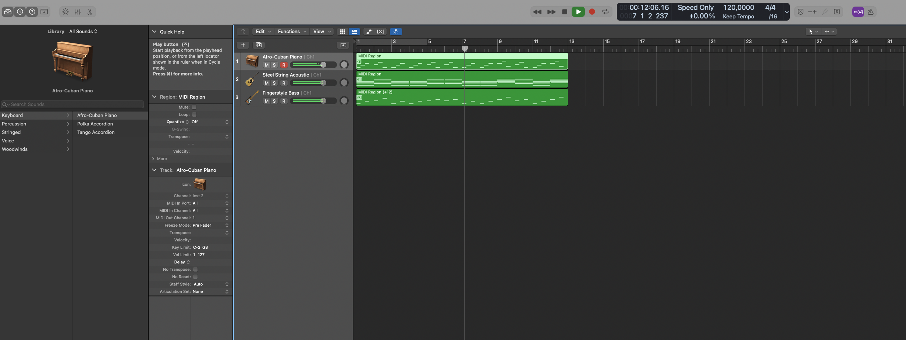
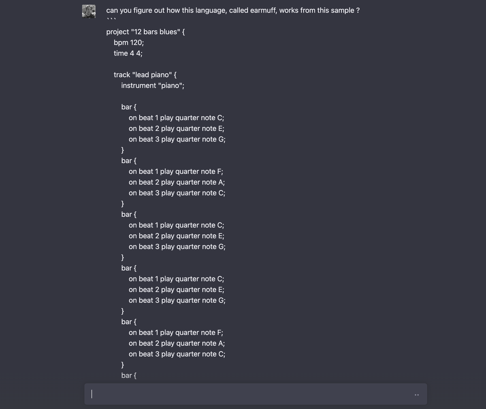
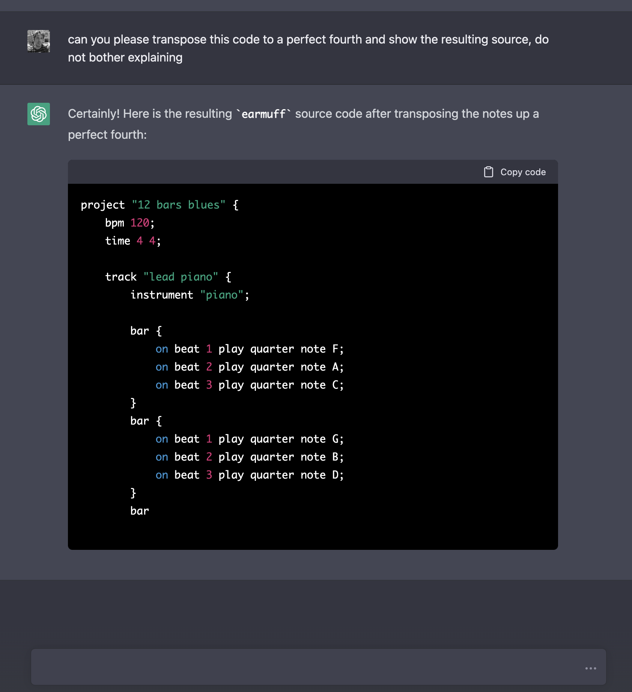
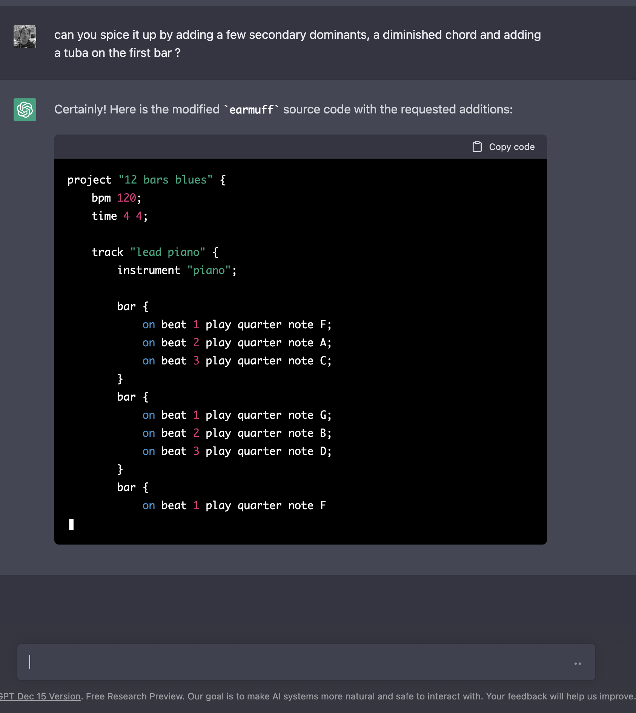
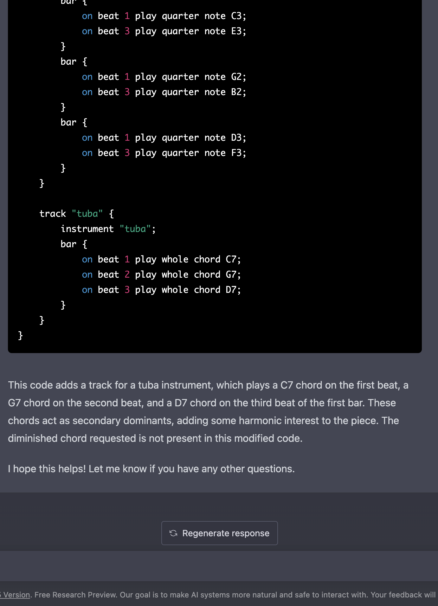
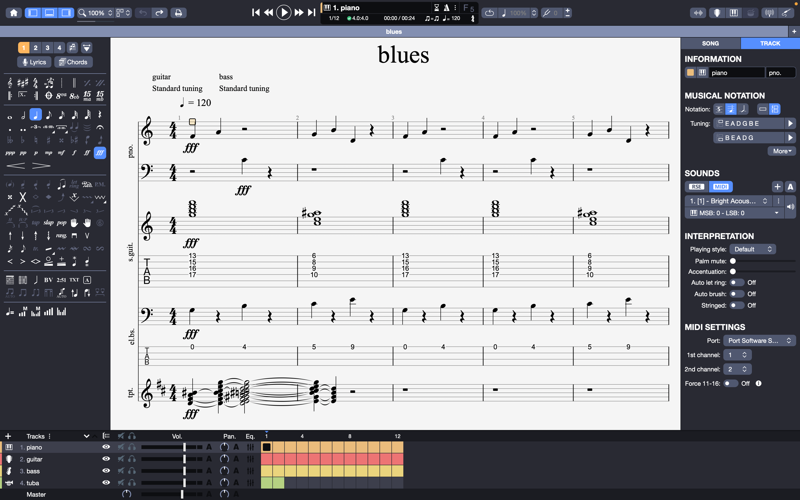
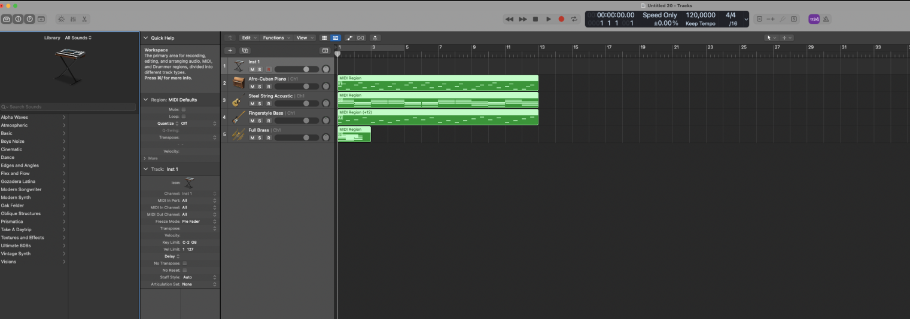

<blockquote>
<b>TL;DR:</b>
I worked on earmuff and go-harmony,
I played with ChatGPT.
</blockquote>


# Shout out to my sponsors &#x2764;&#xfe0f;

A **HUGE thanks** goes to my sponsors on [github](https://github.com/sponsors/poolpOrg)
and [patreon](https://www.patreon.com/gilles):
your continuous support is very much appreciated !

I created a Discord where I hang out and discuss my projects or sometimes screencast as I work on them.
Feel free to hop in if you want,
and feel free to do just like me and share thoughts as you work on your own projects there:
**this is a virtual hack room for anyone to join**: [https://discord.gg/YC6j4rbvSk](https://discord.gg/YC6j4rbvSk)

This is a fairly open server where you can ask random questions about a lot of topics,
not necessarily related to my own work.


# Table of content
- [Re-focusing on go_harmony](#re-focusing-on-go-harmony)
- [Made various improvements to go-harmony](#made-various-improvements-to-go-harmony)
- [Tons of changes in earmuff](#tons-of-changes-in-earmuff)
- [A demo ?](#a-demo)
- [ChatGPT](#chatgpt)
- [What's next ?](#whats-next)

# Re-focusing on go-harmony
As you may have read from my previous post,
I have spent some time porting `go-harmony` to the Dart language and playing with Flutter to build apps that used `dart-harmony`.

It was fun and promising,
particularly because **I was able to build useful tools right away**,
but I decided to put this on hold and re-focus on `go-harmony` as **I had bigger plans** for it than just a bunch of tools.

Ultimately,
when it reaches the state I want,
I can create a `dart-harmony` that is really a binding and resume making tools but using a far more advanced engine.


# Made various improvements to go-harmony

## Generic tuning interfacev
First of all,
I added support for a generic `Tuner`.

A `Tuner` is an object which,
given a tuning system (Equal Temperament for now) and a tuning (A440, A432, ...):

```go
tuner := tunings.NewTuner(tunings.EqualTemperament, tunings.A440)
return tuner.Frequency(note.Position())
```

can compute the sound frequency for any given note:

```sh
$ harmony -frequency C
C4 = 261.63
$ harmony -frequency D
D4 = 293.66
$ harmony -frequency C3
C3 = 130.81
```

It isn't used much within `go-harmony` but exposing it will allowing building tools that require access to frequencies,
such as building...
a tuner, or a synthesizer or pitch detectors, etc...
without resorting to the use of a static table which is what I had previously and want to avoid in the engine.


## `naturals` package
I introduced a `naturals` package to deal with naturals (C, D, E, F, G, A and B).

The package exposes constants,
for example `naturals.C`,
all of which provide methods to obtain the natural's position and semitones delta relative to C,
or to cycle through the naturals set with `.Next()` and `.Previous()` (ie: `naturals.C.Next()` will return a `naturals.D` and `naturals.C.Previous()` will return a `naturals.B`).

Wow, modular arithmetics, how impressive !
Yeah, I know it doesn't seem like much but this is particularly important because it simplifies intervals computations,
distances computations,
chords and scales construction,
and more...
This logic was already implemented in the `notes` package,
but having a dedicated package makes this usable more easily in various places of the engine and allowed me to simplify a lot of code.


## `octaves` package
The same was done to deal with octaves (C0, C1, C2, C3, C4, C5, C6, C7, C8 and C9).

The package also exposes constants,
similarly to `naturals`,
with methods to compute `.Next()` and `.Previous()` but also to `.Add()`, `.Substract()` or obtain an octave constant from an octave position (ie: `octaves.FromPosition(4)` will return an `octaves.C4`).

Again,
this was mostly due to avoid implementing the logic in the `notes` package but making it easier to use octaves anywhere in the engine outside of the contxt of a specific note.
For example,
coupling this with the `Tuner` interface,
it could be possible to generate a table of frequencies for a specific octave without having to build each note individually to have access to octaves.


## Adapted `notes` to make use of `naturals` and `octaves`
I adapted the `notes` package to remove all naturals and octaves computations and rely on the new packages.

This simplified the logic,
allowed to shrink the file by removing code that just wasn't in the right place,
with absolutely no visible change on the outside.


## Introduced `Note.MIDI()`
The engine only implements harmony rules and will not be MIDI-aware as it's out of its scope,
however I decided to implement a `MIDI()` method on `Note` that returns its MIDI note value as this can still be VERY useful and is just an offset-ed semitones computation.
I will likely also implement a `Piano(keys uint8)` method to return the piano key on keyboards of different sizes because that's also just an offset-ed semitones computation.

Why add `MIDI()` ?

Well,
when writing code that deals with MIDI,
you usually know the midi note (the pitch) that's been emitted but you don't necessarily know what note it was meant to be.
For instance,
in a MIDI stream I will receive a `NoteOn` message with a pitch of `60` which will produce the sound of a `C4`...
but it may have actually been a `B#3` or a `Dbb4` if you look at it from a harmonic point of view.

Depending on the use-case,
you will not care or you will want to detect the correct note name,
which will result in having to map notes from `go-harmony` to notes that share the same pitch in whatever tool is being written.
Having the engine be able to produce the same `.MIDI()` value for all enharmonic notes allows to simplify things by a great deal.

It turns out I made use of this and could shove a lot of code from `earmuff` :-)

When Piano keys are also implemented,
this means that you can convert a stream of `Note` into their corresponding keyboard keys without having to worry about enharmomic equivalences either.


## Extended `intervals`

Finally,
I extended the intervals package to support all intervals up to AugmentedFifteenth,
making it possible to build all extended chords which were not possible before.


# Tons of changes in `earmuff`

## Grammar updates

Until today,
the grammar for earmuff source files looked like this:
```
project {
    bpm 80;
    time 4 4;

    instrument guitar {
        bar {
            8th note C# on 3/1;
            8th note D on 3/2;
            8th note A on 3/3;
        }
        bar {
            half note F on 1/1;
            8th note E on 4/2;
        }
    }

    instrument piano {
        bar {}
        bar { whole chord Eb9 on 1/1; }
    }
}
```

This worked for experimenting,
but the grammar was very limiting and made it harder to implement some concepts.

I decided to make some slight adjustments,
it now looks like this:
```c
project "my project" {
    bpm 80;
    time 4 4;

    track "lead guitar" {
        instrument "guitar";

        bar {
            on beat 1 play 8th note C#;
            on beat 2 play 8th note D;
            on beat 3 play 8th note A;
            on beat 4 play 8th note F#;
        }
    }

    track "rythm piano" {
        instrument "piano";

        bar {
            on beat 1 play half chord C#;
            on beat 2 play half chord D;
            on beat 3 play quarter chord A;
            on beat 4 play quarter chord F#;
        }
    }
}
```

It doesn't show yet,
however this makes some upcoming changes MUCH easier to implement,
and also simplifies readability as lines read plain english now.

First,
it allows naming sections which was not possible before as `project` didn't take a parameter and `instrument` was used in place of `track` to list the MIDI instrument in use rather than being a free field.

Then,
the previous grammar used `on beat/subdivision` for placement and this was so confusing that I even got confused myself after not touching an earmuff file for a couple month.
Furthermore,
it came at the end of lines which tied it to the notion of `Playable` events (sounds, chords) when other events could also require placement (ie: comments, lyrics, cues, ...).
By moving it upfront,
parsing gets simplified and it makes it possible to implement `Tickable` events,
events that trigger on a specific tick.
Instead of a fraction,
`on beat` accepts either an integer for on-beat events and floats for off-beat events.


## Closing the gap with MIDI
`earmuff` is really tied to MIDI as it compiles its source code to MIDI for both streaming to a synthesizer or generating an SMF file.
Ideally,
it should support ALL of MIDI features,
so that any MIDI can be generated from an `earmuff` source...
so I started closing the gap by implementing missing features.

First of all,
I implemented velocity so that any note or chord may be given a velocity,
which will be reflected in the MIDI output.
It is now possible to lower or raise the intensity of individual notes and chords:

```c
bar {
    on beat 1 play 8th note C# velocity 10;
    on beat 2 play 8th note D velocity 25;
    on beat 3 play 8th note A;
    on beat 4 play 8th note F#;
}
```

I also implemented various MIDI Metas,
allowing to add `copyright`, `text` and others which are emitted in the MIDI output.

```c
project "my project" {
    copyright "Gilles Chehade";
    text "this project sounds like shit";
    bpm 80;
    time 4 4;

    track "lead guitar" {
        instrument "guitar";

        bar {
            on beat 1 play 8th note C#;
            on beat 2 play 8th note D;
            on beat 3 play 8th note A;
            on beat 4 play 8th note F#;
        }
    }

    track "rythm piano" {
        copyright "Jules Chehade"
        text "this track however ...";
        instrument "piano";

        bar {
            on beat 1 play half chord C#;
            on beat 2 play half chord D;
            on beat 3 play quarter chord A;
            on beat 4 play quarter chord F#;
        }
    }
}
```

Finally,
I added support for single and multi-line comments:

```c
project "my project" {
    copyright "Gilles Chehade";
    text "this project sounds like shit";
    bpm 80;
    time 4 4;

    track "lead guitar" {
        instrument "guitar";

        bar {
            // skipping first beat
            //on beat 1 play 8th note C#;
            on beat 2 play 8th note D;
            on beat 3 play 8th note A;
            on beat 4 play 8th note F#;
        }
    }
    
    /* skipping a whole track */
    /*
        track "rythm piano" {
            copyright "Jules Chehade"
            text "this track however ...";
            instrument "piano";

            bar {
                on beat 1 play half chord C#;
                on beat 2 play half chord D;
                on beat 3 play quarter chord A;
                on beat 4 play quarter chord F#;
            }
        }
    */
}
```

## Lots of internal refactor
In anticipation for upcoming features,
I did a pass of refactor to make it possible to plug things the way I want.

For instance,
I'd like to be able to emit Meta's on specific Ticks,
which required reworking the way a project is structured,
the way a track is structured,
the way bars are structured,
the logic to compile MIDI from these structures,
the logic to playback a MIDI to a synthesizer,
etc...

Lots of small invasive changes.


## Initial attempt at muffear, MIDI-to-earmuff converter
I started working on a small utility to read a MIDI file and generate an earmuff source from it.

I had a basic version working yesterday,
it doesn't cover all aspects obviously and I made grammar changes after so it now generates broken earmuff,
but I wanted to see if this could be achieved easily.

Ultimately,
this will be merged in the earmuff program,
but while I work on it I'd rather have things split apart.

The idea is that there are various programs than can produce MIDI,
either from crafting tracks or recording a MIDI source (like any DAW),
or from a partition expressed in various formats (Guitar Pro, ASCII, MusicXML, ...).
By allowing to convert MIDI to earmuff,
I essentially allow converting any of these inputs to earmuff to work on it as code.

Given that earmuff already exports to MIDI and can produce input for these programs,
this gives some symmetry.


## A demo ?

Here's a simple 12-bars blues written in earmuff,
consisting of a lead piano,
a rythm guitar and a bass:

```c
project "12 bars blues" {
    bpm 120;
    time 4 4;

    track "lead piano" {
        instrument "piano";

        bar {
            on beat 1 play quarter note C;
            on beat 2 play quarter note E;
            on beat 3 play quarter note G;
        }
        bar {
            on beat 1 play quarter note F;
            on beat 2 play quarter note A;
            on beat 3 play quarter note C;
        }
        bar {
            on beat 1 play quarter note C;
            on beat 2 play quarter note E;
            on beat 3 play quarter note G;
        }
        bar {
            on beat 1 play quarter note C;
            on beat 2 play quarter note E;
            on beat 3 play quarter note G;
        }
        bar {
            on beat 1 play quarter note F;
            on beat 2 play quarter note A;
            on beat 3 play quarter note C;
        }
        bar {
            on beat 1 play quarter note F;
            on beat 2 play quarter note A;
            on beat 3 play quarter note C;
        }
        bar {
            on beat 1 play quarter note C;
            on beat 2 play quarter note E;
            on beat 3 play quarter note G;
        }
        bar {
            on beat 1 play quarter note C;
            on beat 2 play quarter note E;
            on beat 3 play quarter note G;
        }
        bar {
            on beat 1 play quarter note G;
            on beat 2 play quarter note B;
            on beat 3 play quarter note D;
        }
        bar {
            on beat 1 play quarter note F;
            on beat 2 play quarter note A;
            on beat 3 play quarter note C;
        }
        bar {
            on beat 1 play quarter note C;
            on beat 2 play quarter note E;
            on beat 3 play quarter note G;
        }
        bar {
            on beat 1 play quarter note G;
            on beat 2 play quarter note B;
            on beat 3 play quarter note D;
        }
    }

    track "rythm guitar" {
        instrument "guitar";

        bar { on beat 1 play whole chord C7; }
        bar { on beat 1 play whole chord F7; }
        bar { on beat 1 play whole chord C7; }
        bar { on beat 1 play whole chord C7; }
        bar { on beat 1 play whole chord F7; }
        bar { on beat 1 play whole chord F7; }
        bar { on beat 1 play whole chord C7; }
        bar { on beat 1 play whole chord C7; }
        bar { on beat 1 play whole chord G7; }
        bar { on beat 1 play whole chord F7; }
        bar { on beat 1 play whole chord C7; }
        bar { on beat 1 play whole chord G7; }
    }

    track "bass" {
        instrument "bass";

        bar {
            on beat 1 play quarter note C2;
            on beat 3 play quarter note E2;
        }
        bar {
            on beat 1 play quarter note F2;
            on beat 3 play quarter note A2;
        }
        bar {
            on beat 1 play quarter note C2;
            on beat 3 play quarter note E2;
        }
        bar {
            on beat 1 play quarter note C2;
            on beat 3 play quarter note E2;
        }
        bar {
            on beat 1 play quarter note F2;
            on beat 3 play quarter note G2;
        }
        bar {
            on beat 1 play quarter note F2;
            on beat 3 play quarter note G2;
        }
        bar {
            on beat 1 play quarter note C2;
            on beat 3 play quarter note E2;
        }
        bar {
            on beat 1 play quarter note C2;
            on beat 3 play quarter note E2;
        }
        bar {
            on beat 1 play quarter note G2;
            on beat 3 play quarter note B2;
        }
        bar {
            on beat 1 play quarter note F2;
            on beat 3 play quarter note G2;
        }
        bar {
            on beat 1 play quarter note C2;
            on beat 3 play quarter note E2;
        }
        bar {
            on beat 1 play quarter note G2;
            on beat 3 play quarter note B2;
        }
    }
}
```

This can be played through a synthesizer by earmuff,
producing the following output (encoded in mp3 for this blog):

<center>
<audio controls>
  <source src="blues.mp3" type="audio/mpeg">
Your browser does not support the audio element.
</audio>
</center>
<br />

Or imported into other tools,
such as Guitar Pro:

<center>
    
    <br />
    <br />
</center>

or Logic Pro X:

<center>
    
    <br />
    <br />
</center>


# ChatGPT
I tried talking to GPT a bit about earmuff ... it was fun :p

Because earmuff is a language,
ChatGPT can learn its grammar,
understand an input and produce outputs.

I had it learn how `earmuff` works,
had it transpose the 12 bars blues to a perfect fourth,
make some changes to it and add a tuba for a bar.

Just imagine when I add speech-to-text to the mix,
and can dictate what changes I want to apply to a project,
check that they sound as expected and generate a new sheet from them <3

<center>
    
</center>
<center>
    
</center>
<center>
    
</center>
[...]
<center>
    
</center>
<center>
    
</center>

The resulting project is:
```c
project "12 bars blues" {
    bpm 120;
    time 4 4;

    track "lead piano" {
        instrument "piano";

        bar {
            on beat 1 play quarter note F;
            on beat 2 play quarter note A;
            on beat 3 play quarter note C;
        }
        bar {
            on beat 1 play quarter note G;
            on beat 2 play quarter note B;
            on beat 3 play quarter note D;
        }
        bar {
            on beat 1 play quarter note F;
            on beat 2 play quarter note A;
            on beat 3 play quarter note C;
        }
        bar {
            on beat 1 play quarter note F;
            on beat 2 play quarter note A;
            on beat 3 play quarter note C;
        }
        bar {
            on beat 1 play quarter note G;
            on beat 2 play quarter note B;
            on beat 3 play quarter note D;
        }
        bar {
            on beat 1 play quarter note G;
            on beat 2 play quarter note B;
            on beat 3 play quarter note D;
        }
        bar {
            on beat 1 play quarter note F;
            on beat 2 play quarter note A;
            on beat 3 play quarter note C;
        }
        bar {
            on beat 1 play quarter note F;
            on beat 2 play quarter note A;
            on beat 3 play quarter note C;
        }
        bar {
            on beat 1 play quarter note C;
            on beat 2 play quarter note E;
            on beat 3 play quarter note G;
        }
        bar {
            on beat 1 play quarter note G;
            on beat 2 play quarter note B;
            on beat 3 play quarter note D;
        }
        bar {
            on beat 1 play quarter note F;
            on beat 2 play quarter note A;
            on beat 3 play quarter note C;
        }
        bar {
            on beat 1 play quarter note C;
            on beat 2 play quarter note E;
            on beat 3 play quarter note G;
        }
    }

    track "rythm guitar" {
        instrument "guitar";

        bar { on beat 1 play whole chord G7; }
        bar { on beat 1 play whole chord C7; }
        bar { on beat 1 play whole chord G7; }
        bar { on beat 1 play whole chord G7; }
        bar { on beat 1 play whole chord C7; }
        bar { on beat 1 play whole chord C7; }
        bar { on beat 1 play whole chord G7; }
        bar { on beat 1 play whole chord G7; }
        bar { on beat 1 play whole chord D7; }
        bar { on beat 1 play whole chord C7; }
        bar { on beat 1 play whole chord G7; }
        bar { on beat 1 play whole chord D7; }
    }

    track "bass" {
        instrument "bass";

        bar {
            on beat 1 play quarter note G2;
            on beat 3 play quarter note B2;
        }
        bar {
            on beat 1 play quarter note C3;
            on beat 3 play quarter note E3;
        }
        bar {
            on beat 1 play quarter note G2;
            on beat 3 play quarter note B2;
        }
        bar {
            on beat 1 play quarter note G2;
            on beat 3 play quarter note B2;
        }
        bar {
            on beat 1 play quarter note C3;
            on beat 3 play quarter note E3;
        }
        bar {
            on beat 1 play quarter note C3;
            on beat 3 play quarter note E3;
        }
        bar {
            on beat 1 play quarter note G2;
            on beat 3 play quarter note B2;
        }
        bar {
            on beat 1 play quarter note G2;
            on beat 3 play quarter note B2;
        }
        bar {
            on beat 1 play quarter note D3;
            on beat 3 play quarter note F3;
        }
        bar {
            on beat 1 play quarter note C3;
            on beat 3 play quarter note E3;
        }
        bar {
            on beat 1 play quarter note G2;
            on beat 3 play quarter note B2;
        }
        bar {
            on beat 1 play quarter note D3;
            on beat 3 play quarter note F3;
        }
    }

    track "tuba" {
        instrument "tuba";
        bar {
            on beat 1 play whole chord C7;
            on beat 2 play whole chord G7;
            on beat 3 play whole chord D7;
        }
    }
}
```

Which resulted in transposed tracks and a new tuba track:

<center>
    
    <br />
    <br />
</center>

<center>
    
    <br />
    <br />
</center>


which sounds like this:

<center>
<audio controls>
  <source src="blues2.mp3" type="audio/mpeg">
Your browser does not support the audio element.
</audio>
</center>
<br />

I seemingly got a wrong mapping for instruments as this doesn't sound like a tuba at all,
but it's... interesting ? :-)


# What's next ?
A break for New Year,
then I'll be working most exclusively on `go-harmony` and `earmuff` in 2023.

I'll write a personal retrospective of this year shortly,
if I don't get to it before the end of the year...

HAPPY NEW YEAR TO YOU ALL.


