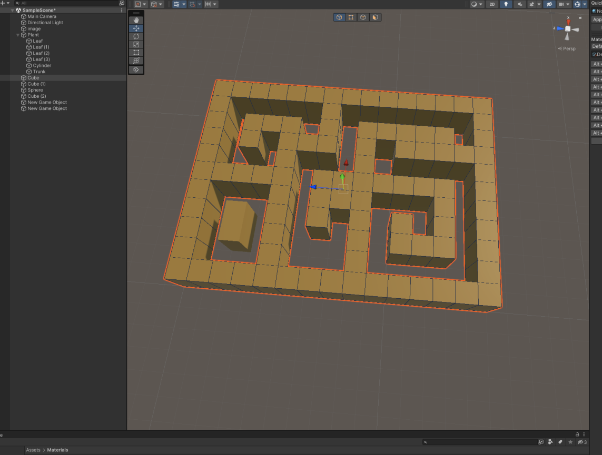
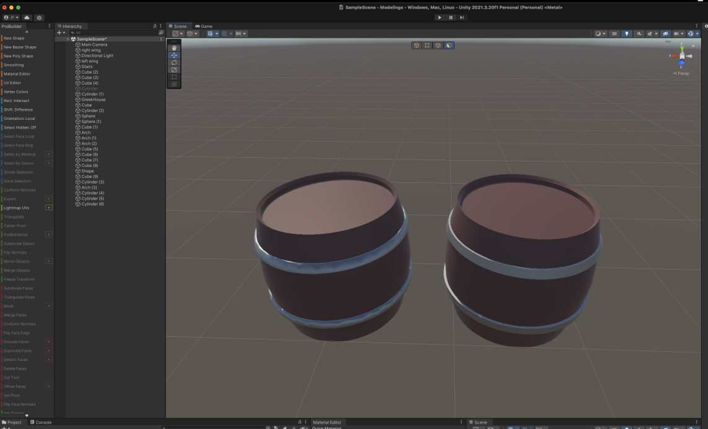
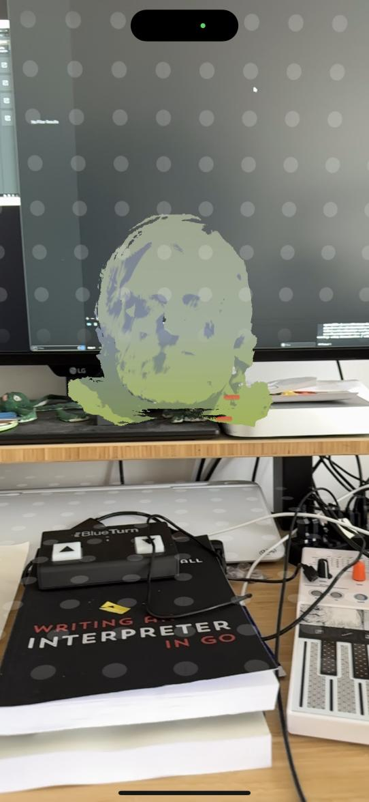


music and unity training,
a bit of X programming in Go,
began a journey in Jujulang a new languae,
wrote a PoC set database called setdb,
did some minor OpenSMTPD stuff.


# First of all, a new website
As you can see,
the website has changed quite a lot since **just a few days ago**.

My last posts have been a mix of tech and non tech stuff,
so I thought I needed to rework things a bit,
as not everyone cares about everything I do.

The website is now **split into categories** (for now personal, technology and music),
and I'll try to keep articles focused on their categories so that if you don't care about what I do in a specific field,
you can just ignore these posts.

Also,
I will try to move from a traditional "blog" with lengthy articles,
to a more personal and "dynamic" website where I'll post a mix of **lengthy articles**,
**complete series**,
but also very **short paragraph-length posts**,
pictures,
musics,
anything I want to share without the self-pressure of having to produce a big article surrounding it.
This means **I can produce content more often**,
sometimes multiple times a day,
sometimes leaving time because I work on something a bit bigger.


# Unity AR/VR training
I have had a very short quarter,
in terms of spare time,
given that **I had two long-standing trainings** taking place.

**I won't talk about the music production article as it will be worth an article of its own**,
in the music category,
but it consumed five weeks of this quarter between the training and the personal projects that were due for the certification.

I **had a month of spare time to work on tech projects** before **beginning a second training in AR/VR this time**,
even though it turned out to be very basic AR/VR introduction with **lots of 3D modeling**:

<center>
    
</center>

<center>
    
</center>

<center>
    
</center>

<center>
    
</center>

(I have about a dozen more of these, but you get the general idea...),
a bit of build and deploy for specific devices like this build on iPhone which spawns physics enabled bubbles on a button press:

<center>
    
</center>

or these two projections of 3D objects,
a cube and a 3D scan of my face,
in AR:

<center>
    
    
</center>

But I also learnt how to create animations,
events triggers and so on:

<center>
<video controls>
  <source src="2023-06-12 12-22-48.mkv" type="video/mp4">
  Your browser does not support the video tag.
</video>
</center>

So why do I care about this ?

**General knowledge and an interest in VR**,
I figured maybe with **some experimenting** I could translate my recent works in music-related code into **something fun**.


# Had a bit of fun with xgb
Yeaaaaaaaaars ago,
I began working on a window manager called [fion](https://github.com/poolpOrg/fion) because **I wanted to understand how window managers worked** and I wanted a `ion` clone.
I came up with **something that did work** as these screenshots show:

<center>


</center>

It looked as I wanted,
but it was half-baked,
absolutely **not finished and usable**,
and I got carried away with life events so I never got a chance to work on it again.

Fast-forward four years.

I **spend an awful lot of time in macOS**,
either for work or music,
and despite all the hype about how beautiful it is...
well **I absolutely HATE its window manager**,
there's no way around it,
**I HATE the UI for macOS and I wish I could run ion or a clone on top of macOS**.

There are a few hacks but ultimately,
the only way I'd be comfortable relying on such hacks...
is if I wrote the window manager myself and knew how it worked...
and it turns out that,
well,
I already wrote a small window manager and already know how it works.

I had a look again at `fion` and realised that,
**as much as I like C**,
I **no longer enjoy writing C on anything not low-level**.
So I began having a look at alternatives to C and libxcb,
and found that a Go binding to libxcb called `xgb`.

I started toying a bit with it,
**did not achieve anything interesting yet**,
this is absolutely **not a serious project** so I'll dive into this on and off,
the hate for macOS window manager has not reached the point I absolutely need to fix it,
maybe I'll have something in a few years.


# SetDB
I had played a bit in the past with **a project to build a set-only** (as in set-theory) database,
and I had a small PoC hanging around in a folder
(and yes, before you tell me, I know that redis has a set API).

It turns out that at work I encountered a case where this seemed like a good fit,
**all it lacked was a DSL** (a query language),
so I implemented one and published a very early version of `go-setdb`.

Let me quote the README because I don't see a reason to rephrase here ;-)

## What is SetDB ?
SetDB is a database to manage sets, as in set theory, and which provides a DSL to query the database for specific set operations.

## What's the license ?

SetDB is published under **the ISC license**, do what you want with it but keep the copyright in place and don't complain if code blows up.

## But doesn't X, Y or Z already do that ?

Yes, you can technically use several solutions ranging from full-blown SQL databases to data structure servers, however **they are not necessarily all very practical for the use-cases that I have**. Also, I like writing code so sometimes I do it just because.

## How does it work ?

SetDB manipulates two kind of sets: persistent sets and transient sets, the former being persisted across queries and the latter existing solely as a result set.

It provides a very basic query language, currently only supporting operations that return result sets (union, intersection, difference, symmetric difference). The query language allows the creation of new sets but isn't complete yet and doesn't cover operations not returning sets (subset of, superset of, ... though **they are actually implemented already behind the scene**).

```sh
$ setdb-cli
setdb> x
ERR: set x does not exist
setdb> x = {}
[]
setdb> x
[]
setdb> {1, 2, 3} & {3}
[3]
setdb> {1, 2, 3} | {4}
[3 4 2 1]
setdb> {1, 2, 3} - {1}
[2 3]
setdb> {1, 2, 3} ^ {1}
[2 3]
setdb> x = {1, 2, 3} & {2, 3} | 4 ^ 2
[3 4]
setdb> x
[3 4]
setdb>
```

Sets are handled as patterns, allowing the inclusion of other sets and dynamic resolving:
```sh
setdb> y = {1, 2, 3}
[2 3 1]
setdb> x = y
[2 1 3]
setdb> y = {1, 2, 3, 4}
[1 2 3 4]
setdb> x
[1 2 3 4]
setdb> z = {1, 2, 5 }
[1 2 5]
setdb> x = y & z
[2 1]
setdb> x = {x | 1}
ERR: cyclic reference is forbidden
setdb> a = {1}
[1]
setdb> b = a
[1]
setdb> c = b
[1]
setdb> a = c
ERR: cyclic reference is forbidden
setdb>
```

They are not typed and can contain integers and strings at this point, including both in the same set. I have yet to decide if I want to have strict type checking on sets, which is trivial to implement, I just don't see a reason why at this point.

```sh
setdb> fruits = {'grape', 'orange', 'strawberry'}
['grape' 'orange' 'strawberry']
setdb> vegetables = {'spinash', 'onions'}
['spinash' 'onions']
setdb> healthy = {fruits | vegetables}
['grape' 'orange' 'spinash' 'onions' 'strawberry']
setdb> gross = {'onions'}
['onions']
setdb> healthy
['onions' 'orange' 'strawberry' 'grape' 'spinash']
setdb> healthy - gross
['orange' 'strawberry' 'spinash' 'grape']
setdb> mixed = {'grape', 1, 2, 3, 'watermelon'}
['grape' 1 2 3 'watermelon']
etdb> mixed & {1,2}
[1 2]
setdb> mixed & 'grape'             
['grape']
setdb>
```

## What's missing ?

- code cleanup
- do a pass to decide on final syntax for the DSL
- implement set dereference so a set can contain the content of another set, not the other set itself (ie: x = {*y})
- implement various caching strategies (some were implemented but temporarily removed)
- disk and memory optimizations have been discussed, they are just not implemented yet


## Code

For now, the code is a moving target, so unless you know what you're doing, don't import it.

Otherwise, look at the example implementations in cmd/, one implements a server and the other a command line tool that also ships a client.

Code is available in my Github repository for [go-setdb](https://github.com/poolpOrg/go-setdb).




# Jujulang
I'm working on a language.

Why ?
Well because I like writing code no one cares about :-)

So I wrote Jujulang,
an interpreted language that's the **bastard child of C, Golang and Python**.
It supported functions,
expressions,
flow control,
loops, etc...
and it was all fun...

```go
fn main() {
    println('hello world !')
}
```

until I decided that it was not so fun to rely only on an AST evaluator,
but I should rather **make this language compiled**.
So I managed to have it generate LLVM IR,
then I managed to build a small native executable for a simple main with just a return value, then I realized it was quite hard and I needed some help so here I am now.

I bought myself two books ([see the books section](/books/technology)),
one which told me how to do what I already knew how to do,
and one teaching me something I used to know twenty years ago but completely forgot how to do.
Joke aside,
they are _excellent_ books and I _highly_ recommend them.

I'm currently **halfway through generating bytecode for jujulang**,
with a **VM evaluating that bytecode**,
which will lead me to a better interpreter than what I had...
at which point I'll start looking back at LLVM again for native executables.

I KNOW no one will use juju,
it serves no purpose,
**it's just personal interest**,
leave me alone.

I might start a serie on this website,
going through all the steps of this,
I don't know.
Depends if there's demand.


# OpenSMTPD-related stuff

## OpenSMTPD 7.3.0p0 (portable) released
It's **been a while since OpenSMTPD portable was left behind**,
no one doing synchronizations with upstream since I left.

A discussion had even been opened,
asking if the project was dead and if the repository shouldn't be archived,
despite me saying I'd help anyone get on track if they pick up from where I left.

Then **Omar Polo came out of nowhere**,
synchronized the repository with upstream,
pushed some of the portable diffs to OpenBSD,
made sure it built on various distros ...
and asked me if we could make a release.

He essentially **took the dying portable project**,
**revived it**,
**brought it back to date** and **crafted a release in less than two weeks**...
this was **awesome work**.

I didn't do much but provide some guidance,
history context behind choices and signed the release,
so this was quite refreshing and made me want to help more :-)

He [released OpenSMTPD 7.3.0p0](https://www.mail-archive.com/misc@opensmtpd.org/msg05872.html),
the first portable release in years,
which made a lot of people happy.

Which leads us to...


## OpenSMTPD 7.3.0p1 (portable) about to be released
Obviously,
**as with each portable release**,
[someone pops his/her head after the release to notify of something not working](https://www.mail-archive.com/misc@opensmtpd.org/msg05885.html).

Issue was investigated and solved by...
Omar again,
who fixed and crafted a new release which should be published very shortly as I just signed it and pushed it to the website (which I still maintain).


## filter-rspamd release
Two weeks ago,
I was doing some freelance work and was **very focused on what I was doing**.
I worked for hours on end,
which is unusual because **I often get distracted by mails**.

At the end of the day,
I realise that **I haven't received mails for hours which is VERY unusual**,
so I quickly log to the mail server and see **it's crashed**.
I restart it and it starts right away,
I look at the logs and I realise there's a crash in `filter-rspamd` due to a failed login attempt.

As I start looking at the code to understand the issue,
**mails buffered by my backup MX start flowing** and one mentions a crash in `OpenSMTPD`,
which seems to be caused by `filter-rspamd`.
As mails continue flowing,
I see that **someone had reported the issue**,
and it was **investigated and fixed by Omar** while my server was down.

The issue was a parsing error in `filter-rspamd`,
caused by **a special case** which could be avoided with a small change in the filter protocol.
The change **had been made for all filter messages... except this one**, obviously.

Omar submitted a change to the protocol to OpenBSD,
but also submitted a PR for `filter-rspamd` to fix parsing with current filter protocol
AND work with the next version of the protocol.

All I had to do was ... read his diff and release a new `filter-rspamd`,
easy peasy.


# Other stuff...
To be honest,
I also did other stuff,
I just don't feel like talking about it yet.


# What's next ?
Vacaciones en Malaga.
Sol,
playa y tapas.