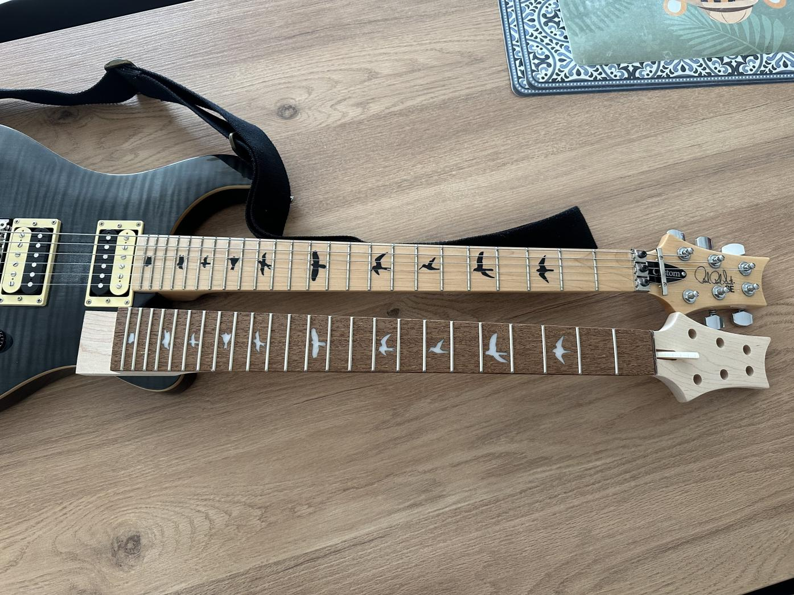
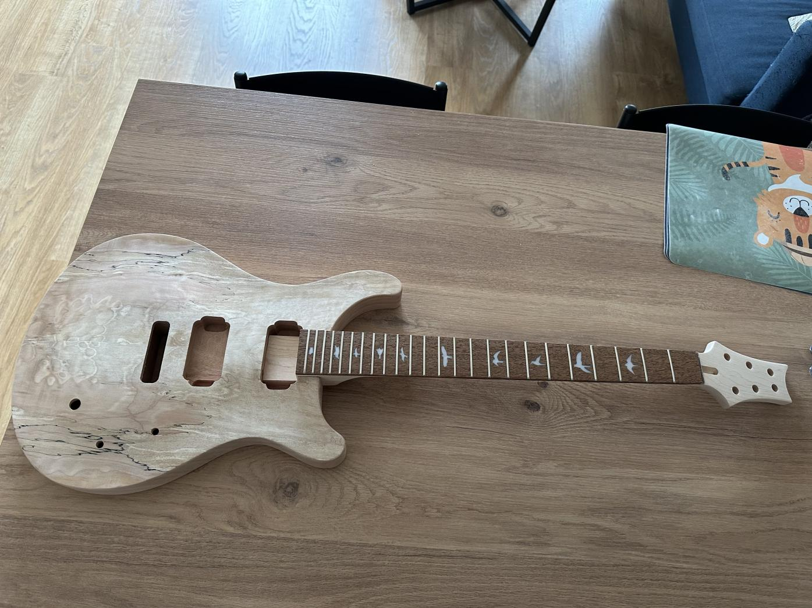
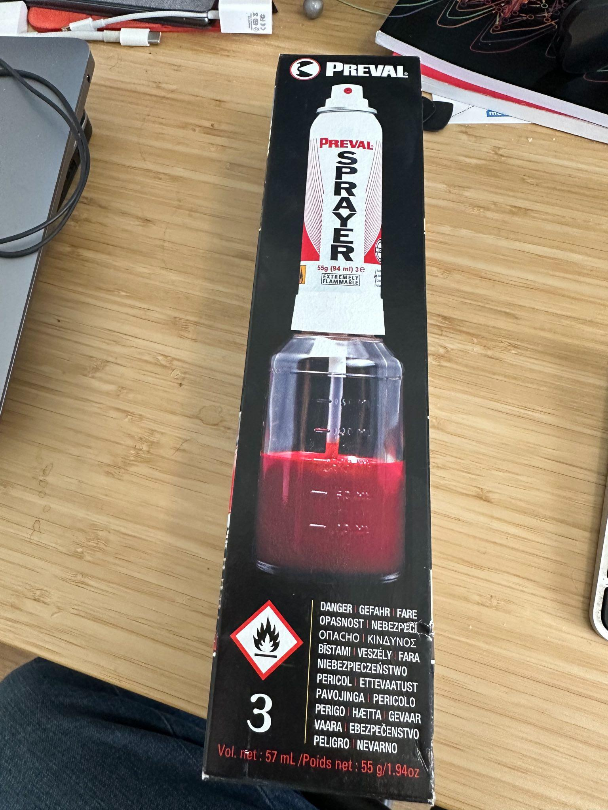


Received the new neck and...
it fits perfectly !


# The neck
UPS just delivered the new neck,
which is a 24 frets PRS clone:

   

Not much to say about it,
it is high quality Canadian Maple with Jatoba fretboard,
feels nice,
looks nice though it will not remain as is.

I did a fitting test and it fits perfectly:

   

# The tools
I have also received a set of tools for making small work on the body,
like crafting contours:

   

and a paint sprayer which I intend to use for painting the head and the body:

   

The reason I needed the tools is because I want to reshape the head,
but also to add contours to the body as it is a bit too ... fat for me.
I won't be doing a lot of work on it,
just the minimum so it feels comfortable playing for me.

As for the paint,
well I decided I didn't want to have a natural look,
as I already have a guitar that looks natural.
I wanted to experiment with paint to give it an awesome look.

# The paint
At first,
I wanted to use both whiteboard and chalkboard paint to have a guitar that my son could draw on,
but I decided to keep that for a separate project,
one where I won't be fitting the same quality hardware.

I fell in love with black paint last year,
and by black paint I mean [the blackest black paint](https://culturehustle.com/collections/black/products/black-3-0-the-worlds-blackest-black-acrylic-paint-150ml),
so I have a bottle on my shelf waiting to be used.

   

But I also really like the [Easy Klein](https://culturehustle.com/collections/potions/products/easyklein) from same company:

   

Finally,
I also like their [glowing pigment](https://culturehustle.com/collections/glow/products/blue-lit-the-worlds-glowiest-glow-pigment-100-pure-lit-powder-in-blue-by-stuart-semple):

   

To be fair,
I love a lot of their colors,
their emergency red is gorgeous (but sold out),
they have beautiful whites and pearl colours,
I'm likely to do something with that later.

At this point,
I ordered the three above and am waiting for delivery,
which should...
take some time as the black paint wasn't delivered too fast last year.

Where I will put what is undecided yet,
I have ideas but have not settled for a definitive design,
what is sure is that it will have black, blue and glow.

# Tuners
For the tuners,
I have settled on [Graph Tech Ratio Locking](https://thmn.to/thoprod/532247?offid=1&affid=2189),
which also come in silver and which one I'll pick will depend on what color the guitar head ends up to be.

   

So why these ?

- they are locking tuners, which is an upgrade from what I use, if you don't know what locking tuners are... I suggest you checkout a few youtube videos: they ease restringing, they ease keeping the guitar in tune, and they avoid having to rotate the tuners on and on and on, you simply lock the strings in place, do a couple turns and be done.
- these particular tuners also happen to have per-string ratios allowing the same half turn to tune half a step any string: you don't have to make half a turn on a string and a full turn on another, they all behave the same. Note to mention you can easily downtune or uptune a string to a specific tuning as if you know your intervals, you translate it to half turns.

When the neck is painted and I'm happy with it,
I'll place an order for these and show pictures of them and the setup.

# Pickups and bridge
I have not decided what I want for my pickups and bridge yet,
I'll wait till the body is done before I settle.

I already have some ideas,
a shortlist,
but I'm still undecided and could radically change my mind.

One thing for sure is that I will be using it to play jazz a lot,
but I'd like to be able to do some metal at home with it,
so my plan was to have mismatched pickups:
a very jazzy one for the neck and a very metal one for the bridge...
as I tend to only use the neck when playing jazz and only the bridge when playing metal.

I still think it would be great to have split coils,
dunno if I'll manage.

An addition I may want is a kill switch,
I like the idea of having a kill switch,
I definitely want a kill switch.

# What's next ?
I won't be able to do much until late July as I have stuff coming,
and am waiting for the paint anyways,
but I'll keep you updated.