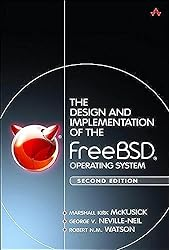


I found a printed copy of an assignment I had to do in 2005 back when I was a student to implement a system call for OpenBSD and Linux. I lost the original LaTeX file so I decided to rewrite it so I have a digital copy. The article originally covered loadable kernel modules (LKM) which is no longer a thing in OpenBSD, I trimmed that part. I also trimmed the Linux part because I didn't care about it back then and did the minimum to pass ;-)
This article is translated from French.



# Disclaimer

The content of this post is based on an assignment I wrote in 2005,
back when I was a student at Epitech,
so things have probably changed and this is by no means a tutorial:
please don't write system calls and don't submit them to OpenBSD...
unless you've been told it's a good idea by OpenBSD developers.

I REPEAT:
DO... NOT... IMPLEMENT... A... SYSCALL... WITH... THIS... ARTICLE !

This is meant for knowledge sharing and avoid losing something I wrote,
and for which I only have a paper version anymore.
Think of it as an archeology artifact.

I accidentally leaked a draft version three years ago,
which suddenly became popular and which I had to remove as I wasn't done cleaning.
This time I'll be street-smart and wait before it's finished to commit.

I have made very minor changes for meaning clarification,
but have not changed the writing style nor fixed writing errors,
this is my writing style from 18 years ago.

The examples are very simple,
they are not practical examples you should build upon,
they are meant to bootstrap your understanding.
Finding errors is an exercise to the readers,
and I encourage you to comment or [submit pull requests](https://github.com/poolpOrg/poolp.org/tree/master/content/posts/2023-07_03/index.md) to improve this article.


# A few necessary reminders
## Program vs Process
People often use the two words interchangeably but it is important to understand the difference between a program and a process, particularly because the same program may be allowed to use a system call in a process and not in another **(root vs unprivileged user)**, but also because the process is part of the syscall API **(the system call interface works with a pointer to a struct proc representing a process)**.

A program is an executable which contains a set of instructions that are meant to be executed and do something. It resides as a structured file **(a.out, elf, ...)** on the filesystem which enforces restrictions as to who can or cannot execute it **(file system permissions and ownership of the file)**.
A process is an instance of that program, running in its own memory-space, with its own privileges.

If we take `/bin/ls`, it is a program that lists directories and files. When a user executes it, a process is created which will actually run the program with the privileges of that user, in a memory space that’s not shared with other processes.

## Kernel and userland
Unix-like systems have an architecture where code is executed in two main areas: the kernel and userland.

The kernel is in charge of **providing and limiting access to devices**, **enforcing restrictions as to what an executing program can do**, and **providing programs with a virtual memory space** in which they can execute.

A program **executes in userland** and perform operations on **memory that’s allocated to it by the kernel during the initialisation of the process**. When the program needs to access a device or needs the kernel to perform an operation that it’s not allowed to perform itself, **it asks the kernel to trigger a system call**. The system call is **a function that’s part of the kernel** and that runs as part of it on behalf of the process.

## System call
**A system call is a service provided by the kernel so that a userland process can request the kernel to do something on its behalf, usually something that the userland program is not able or not allowed to do on its own**.

From the point of view of a program, it is a somewhat special function that it can call similarly to any other function, but which **doesn’t run in the process memory space**. A program only knows about the system call interface but doesn’t have access to its implementation, so it can call it, pass parameters to it, obtain a result from it, but not inspect what happens inside the system call as it runs. It can’t debug it.

This comes with side-effects. Performance-wise, a system call switches the execution to kernel which is costly. Then bugs in a system call have a different impact from bugs in a function call: **a memory corruption bug may cause the process to terminate, whereas the same memory corruption bug in a system call may cause the system to crash**.

There are two sides to a system call:

The system call implementation, which is the actual code of the system call that’s going to run inside the kernel when called, and the system call interface, which is how the system call is meant to be called from a userland application.

It is important to differentiate both as, in OpenBSD, the prototype for the system call implementation does not match the prototype for the system call interface as we’ll see shortly.




System calls serve as a gateway between user applications and the low-level operating system kernel. They're an integral part of an operating system's infrastructure that provide controlled access to hardware resources, manage processes, and handle file system interactions, among many other tasks.

While operating systems come with a standard set of system calls, there may be cases where you want to introduce custom system calls. These could be for specialized hardware, unique process management requirements, or for other OS-level customizations that are not provided by the built-in system calls.

Understanding how to add new system calls in a system like OpenBSD, thus, opens a doorway for system-level innovations and customizations.



# Implementing system calls for OpenBSD
## Prerequisites
### Use a privileged account
It is obvious that an unprivileged account is not allowed to alter the kernel as it enforces permissions on the system. For that reason, it is mandatory to use a privileged account at least for installing a modified kernel.

### Have system sources
The system sources are available directly from the OpenBSD project. For this assignement, we will need the following archives:

- src.tar.gz
- srcsys.tar.gz

They will need to be extracted at the root of the system:

```
% doas tar -C / -zxf src.tar.gz
% doas tar -C / -zxf srcsys.tar.gz
```

**(edit: replaced `sudo` with `doas`)**

### Know how to rebuild a kernel
Once you have access to the system sources, you can rebuild the kernel using the following commands:
```
# cd /usr/src/sys/arch/amd64/config
# config GENERIC
# cd ../compile/GENERIC
# make clean depend install
```

The rebuild only takes a few minutes and a backup copy of the previous kernel is performed automatically in case the new kernel is unstable.

### Rebuild the system
Rebuilding the system may be necessary if changes to the kernel affect userland tools. It may be the case for example if you alter `struct proc` which is used by tools such as `ps`, `top` or `uname`. Rebulding is as simple as:
```
# cd /usr/src
# make build
```
Rebuilding takes much more time that for a kernel and can range from several minutes to hours depending on your architecture.


## System call without parameters: `sys_goodbye()`
For a start,
we’ll implement the `sys_goodbye()` system call which takes no parameters. Its prototype is:

```c
int
goodbye(void);
```

### Implementation
```c
#include <sys/types.h>
#include <sys/param.h>
#include <sys/systm.h>
#include <sys/kernel.h>
#include <sys/proc.h>
#include <sys/mount.h>
#include <sys/syscallargs.h>

/* displays "Goodbye, cruel world !" on the console */
sys_goodbye(struct proc *p, void *v, register_t *retval)
{
	printf("Goodbye, cruel world !\n");
	return (0);
}
```

### Description
Our first system call only displays the sentence “Goodbye, cruel world !” on the console.

It allows us to see that **the prototype of a system call differs between the userland and the kernel**. OpenBSD provides a **unique API for all system calls, no matter the prototype they expose to userland**.

The headers that are included here are the minimal set required for proper operations of the syscall API. Some might seem unused by our function but will be used at build time for the kernel’s internal plumbing. The system call does not limit itself to its implementation, a few elements will add up indirectly and automatically as we’ll see later.

Our first system call will discard its parameters (`struct proc *`, `void *v` and `register_t *retval`), use `printf()` and return 0 to indicate to the caller that execution went fine.

Here, `printf()` is not to be misinterpreted for the userland `printf()`, the former is used to output to console and not standard output.


## System call with parameters: `sys_showparams()`
Our second system call, `sys_showparams()`, takes an `int` parameter and prints its value to the console. Its prototype is the following:

```c
int
showparams(int val);
```

### Implementation
```c
#include <sys/types.h>
#include <sys/param.h>
#include <sys/systm.h>
#include <sys/kernel.h>
#include <sys/proc.h>
#include <sys/mount.h>
#include <sys/syscallargs.h>

/* displays value of integer parameter to console */
sys_showparams(struct proc *p, void *v, register_t *retval)
{
	struct sys_showparams_args /* {
		syscallarg(int)		val;
	} */ *uap = v;

	printf("showparams(%d)\n", SCARG(uap, val));
	return (0);
}
```

### Description
Unlike the previous one,
this function does not ignore its parameters as it has to **extract the integer parameter passed in the userland interface**.

To do so, it declares a pointer to a `struct sys_showparams_args` structure and has it point to its second parameter, `void *v`. It becomes clear that this parameter shomehow represents the userland parameters to a system call.

The definition of `struct sys_showparams_args` is not part of our implementation because it is automatically generated at build time. Each of its fields correspond to a parameter in the userland interface and the `SCARG()` macro allows dereferencing the structure correctly, without having to worry about alignement or endianness of the architecture.

## System call returning a value: `sys_retparam()`
The system call `sys_retparam()` takes an `int` parameter and returns it if its lesser than or equal to 1024, otherwise it will fail and return -1, setting `errno` to `EINVAL`. Its prototype is similar to that of `sys_showparams()`:

```c
int
retparam(int val);
```

### Implementation
```c
#include <sys/types.h>
#include <sys/param.h>
#include <sys/systm.h>
#include <sys/kernel.h>
#include <sys/proc.h>
#include <sys/mount.h>
#include <sys/syscallargs.h>

/* returns value of integer parameter if lesser or equal to 1024 */
sys_retparam(struct proc *p, void *v, register_t *retval)
{
	struct sys_retparam_args /* {
		syscallarg(int)		val;
	} */ *uap = v;
	unsigned int val;

	val = SCARG(uap, val);
	if (val > 1024)
		return (EINVAL);

	*retval = val;

	return (0);
}
```

### Description
Things get slightly more complex and we will need to dive into what happens outside the function to understand what happens.

The problem is the following: if we must return 0 in case of a success and a positive value in case of an error, then how can we have a system call return a positive value in case of success ?

The solution resides in **the third parameter to our system call**.

**The value returned by our system call does not map to the value returned by the system call interface in userland.** The return value in our system call is only **here to allow determining if the execution was correct or set `errno`**. The value that’s returned by the userland interface is actually placed in third parameter to our system call implementation,
which is really **an array of two registers**.

**The first index of that array represents the EAX register**, **it is initialized to 0 by the syscall API before it calls our implementation that may modify it**. The second index is rarely used: it allows solving the case of `fork()` which... returns **two values**,
**one for the parent process and one for the child process**.


Article was written for amd64 where EAX and EDX registers are used for retval,
but it obviously isn't true for other platforms.

For a better understanding,
a look at `/usr/src/sys/amd64/amd64/trap.c` (swap platform for others) is needed:
it prepares parameters according to the calling convention,
triggers the system call interrupt,
maps return values from registers and errno to structures that ultimately makes them look the same for userland on all architectures.



## System call poking into struct proc: `sys_retpid()`
Our last system call, `sys_retpid()`, takes an `int` parameter which will cause the function to return the process pid if 0, the parent process pid if 1 and fail with `errno` set to `EINVAL` in all other cases. Its prototype is the following:

```c
int
retpid(int val);
```

### Implementation
```c
#include <sys/types.h>
#include <sys/param.h>
#include <sys/systm.h>
#include <sys/kernel.h>
#include <sys/proc.h>
#include <sys/mount.h>
#include <sys/syscallargs.h>

/*
 * returns current pid if val == 0
 * returns parent pid if val == 1
 * return -1 and sets errno to EINVAL otherwise
 */
sys_retpid(struct proc *p, void *v, register_t *retval)
{
	struct sys_retpid_args /* {
		syscallarg(int)		val;
	} */ *uap = v;
	unsigned int val;

	val = SCARG(uap, val);
	if (val != 0 && val != 1)
		return (EINVAL);

	if (val == 0)
		*retval = p->p_pid;
	else
		*retval = p->p_pptr->p_pid;

	return (0);
}
```

Note that the function may or may not explode,
for multiple reasons,
if you don't know why,
don't copy paste optimistic code that doesn't do proper checking and locking.

Same applies for previous functions obviously.


### Description
This last call allows illustrating that the function does not execute in userland but really in kernel, **it allows us to access memory beyond that of the current process**. Here, we dereference the `struct proc` associated to our process but also a pointer to a different `struct proc`, we can use the various linked lists inside `struct proc` to access resources **that are not available to the current process in userland**.

Note that this is just an example and that care should be taken to do proper locking when required, **if the system call accesses a resources that’s been released, the result is not the process crash but a system crash**.

### Integration
The initial version of this article dates from 2005 and presented both static linking and loadable kernel modules. **Since then, the LKM interface was removed from OpenBSD, I have removed these parts as they serve no practical purpose today** and it'll keep the article shorter.



When implementing new system calls, it's critical to keep security at the forefront of your considerations. By design, system calls bridge userland and the kernel, which, if not handled properly, can expose the system to various vulnerabilities.
 
While designing a system call, it's crucial to validate all input data. Since system calls operate with kernel-level privileges, any input data can potentially interact with critical parts of the system, and hence should be carefully scrutinized.
 
Consider carefully which capabilities your new system call should have. If a system call only needs to read data, it should not have the capability to write data. Limiting the functionality to the minimum necessary can limit the potential damage if the system call is misused.
 
Furthermore, concurrency issues can lead to race conditions in the system calls. Proper synchronization primitives should be used to avoid these scenarios. Remember, a flaw in a system call can jeopardize the entire system's security, so being mindful about potential vulnerabilities is of utmost importance.
 
Bear in mind that OpenBSD, like other Unix-like systems, follows the principle of least privilege, which suggests that a process should be granted only those privileges that are essential to its function. As a system call designer, your responsibility is to ensure your system call aligns with this principle.



#### Integration of system calls through static linking
Several files come into play during static integration of system calls:

- `/usr/src/sys/kern.syscalls.master` is the main file used for adding a system call. It is used to rebuild a set of arrays and internal structures that are used by the syscall API.
- `/usr/src/sys/kern/syscalls.c` contains the list of system calls.
- `/usr/src/sys/kern/init_sysent.c` contains the sysent table. Each element of the table describes the number of parameters to the syscall, the structure that’s associated to these parameters and the function that implements the system call.
- `/usr/src/sys/sys/syscallargs.h` contains the definition to structures associated to system calls.
- `/usr/src/sys/sys/syscall.h` contains the system call number associated to our system calls represented by macros.

The first step is to edit `/usr/src/sys/kern.syscalls.master` and find an unused system call number, adding a new one if none is available. The file format is very simple, it consists of a syscall number, a system call kind and a pseudo-prototype.

Once modified, the autogenerated files can be rebuilt through these commands:

```
# cd /usr/src/sys/kern
# make init_sysent.c
```

The files described above are rebuilt to take into account the new system calls and produce the structures needed for their parameters. All is left to do is rebuild the kernel after having added the files containing the implementations of the system calls.

System calls are machine independant,
the implementation files are placed into `/usr/src/sys/kern`.

You then need to edit /usr/src/sys/kern/files and add the following lines:
```
file kern/sys_goodbye.c
file kern/sys_showparam.c
file kern/sys_retparam.c
file kern/sys_retpid.c
```
and rebuild the kernel.

At this point, **once the system is rebooted with the new kernel, our system calls are usable by userland application that know their numbers** through the use of the `syscall()` system call.

To be able to use them by name,
**you will have to update the include files** `/usr/include/sys/syscall.h` and `/usr/include/sys/sycallargs.h` with the ones generated during the `make init_sysent.c` phase,
**then rebuild the libc after adding our object files** (without their sys_ prefix) in `/usr/src/lib/libc/sys/Makefile.inc`.

The libc is rebuilt with the following commands:
```
# cd /usr/src/lib/libc
# make install
````

The system calls will be immediately available without a need for a system reboot.


# A word from the future, 2023
Be kind to 2005's `gilles@`,
feel free to comment or submit PR to update this article and modernize it.

In case you are wondering,
while this would not apply to NetBSD or FreeBSD as is,
the interfaces and structures are close enough that it can get you started.
If desired,
I could write a thing or two on that topic in the future.

In case you're also wondering,
this won't help you writing syscalls for Linux.
I had written an assignment for that too,
implementing the exact same syscalls and detailing the process,
but I didn't enjoy much Linux back then and, well, it showed :laughing:


# Related reads...

I recommand you the reading of these two books:

| | |
|---|---|
| <a href="https://www.amazon.fr/Design-Implementation-FreeBSD-Operating-System/dp/0321968972?_encoding=UTF8&qid=&sr=&linkCode=li3&tag=poolporg07-21&linkId=dd504b9e2ec7d9191f4d7c04278f20ac&language=fr_FR&ref_=as_li_ss_il" target="_blank"></a> |<a href="https://www.amazon.fr/dp/B002MZAR6I?&linkCode=li3&tag=poolporg07-21&linkId=5173f2ce403ea0775bb0efcea49902cf&language=fr_FR&ref_=as_li_ss_il" target="_blank"></a> |
