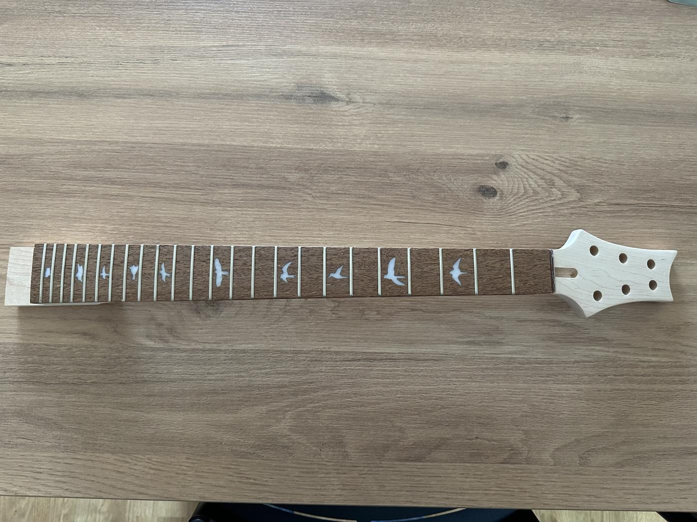
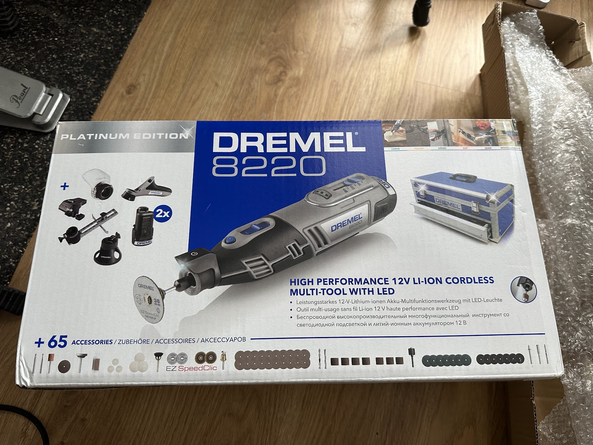
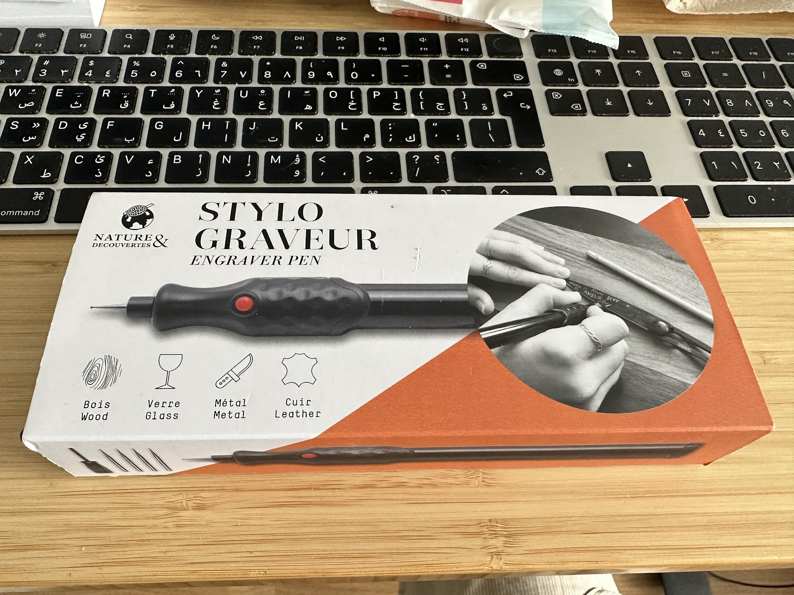


Came back from vacation,
started working on the neck but realised I really needed more tools.
Luckily,
I could get some that weren't too expensive.


# Working on the head
I had ordered and received this neck,
which fits nicely,
but I wanted to rework the head a bit so it looked a little less PRSey.
Unfortunately,
after spending an hour trying to manually reshape and sand,
I figured I was doing it wrong and needed some automated tools...
otherwise I'd still be working on the head in December.

   

So I looked into inexpensive tools and found one,
the [Dremel 8220](https://amzn.to/44Iq9bF),
that could be used for cutting, sanding, drilling and other rotative tasks.
It costed me 145 EUR,
which doesn't seem that much spent given that I have other needs for such a tool.

   

For about 35 EUR more,
there was [a pack that also included a clamp](https://amzn.to/3Oriqcp) which seemed a good idea:
holding the neck while working on it was painful and I managed to get a splinter in the process.

   

Since I was already on a shopping spree,
I also found [an engraver pen](https://www.natureetdecouvertes.com/livres-loisirs/loisirs-creatifs/kits-materiel-creatifs/stylo-graveur-53149600?gclsrc=3p.ds&&gclsrc=3p.ds&msclkid=45b37202e850100ac11116c3fc1bce4c&gclsrc=3p.ds),
which seemed like a good idea as I have plans for it.
The one I got is from a French store called Nature et Découverte,
but there are [a ton of them available at Amazon](https://amzn.to/451BVh7).

   

# Paint is late, not really a problem...
My order for pain has not shipped yet due to a shortage in one of the items,
and they will pack and send as a whole anyways so...
that's not a big deal anyways as I need to reshape the head first.

# What's next ?
I will start doing it next week,
as I just got back from vacations,
and my kid is at home at the moment which makes it hard to do anything noisy.
I'll post pictures of the head as soon as it is as I want it to be !
