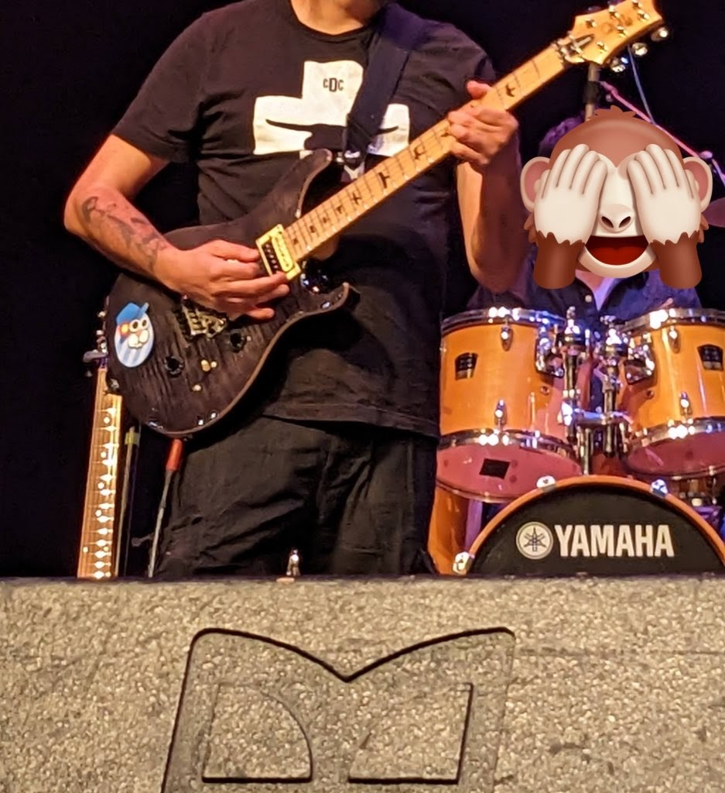
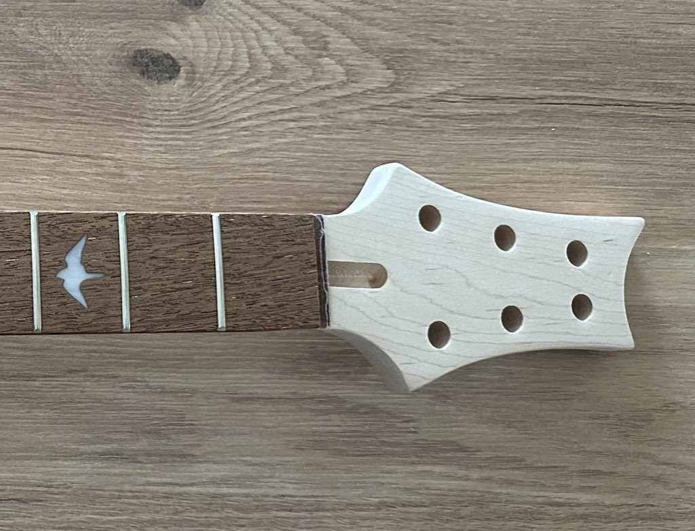
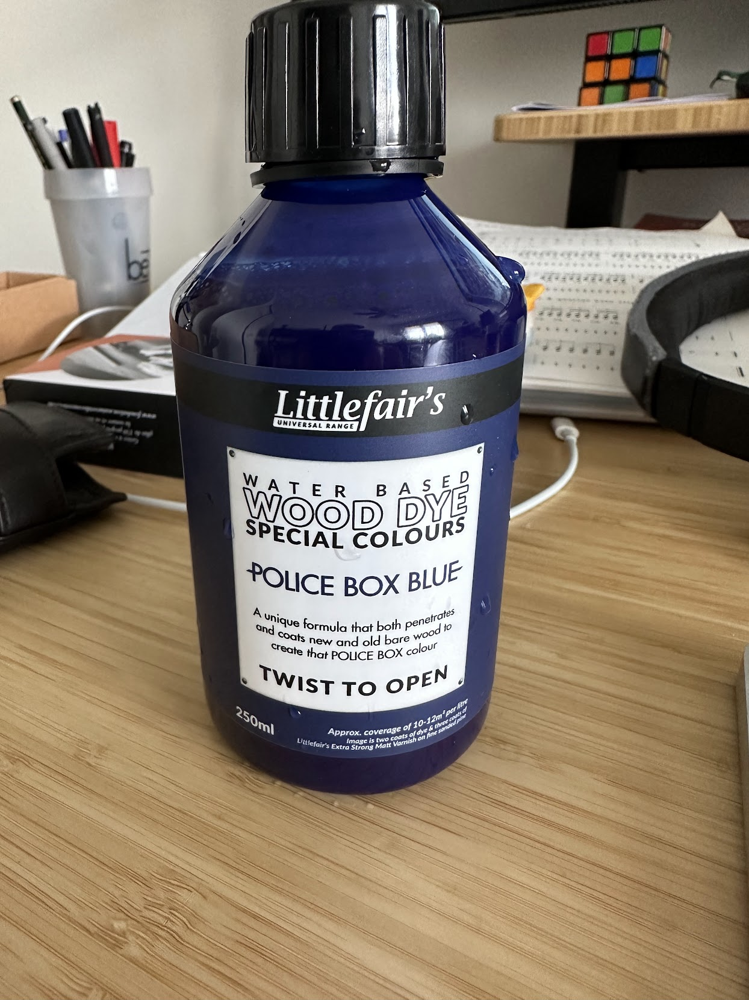
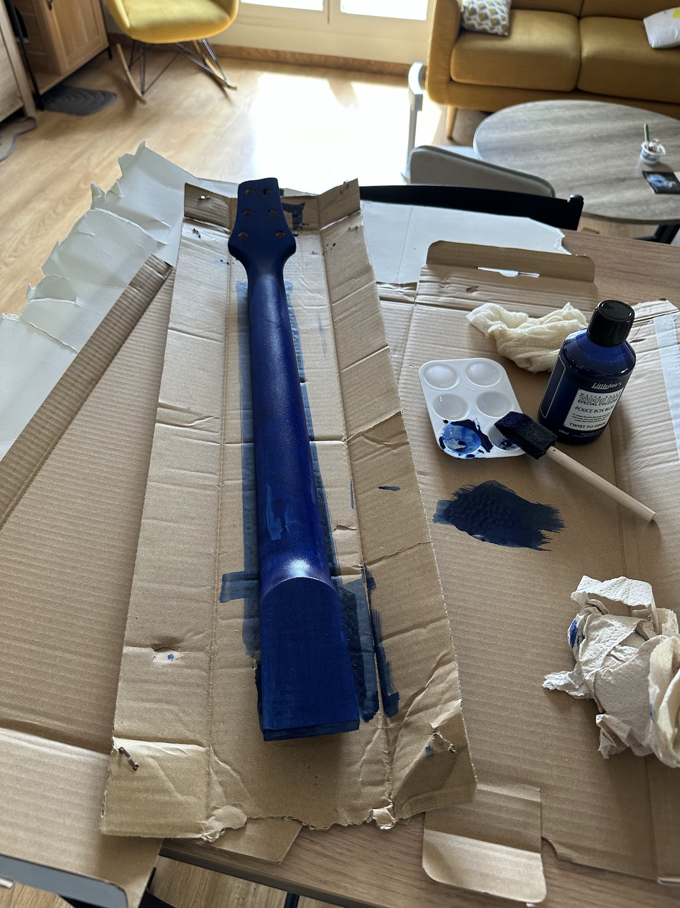




# Donner une forme à la tête
Pour commencer,
j'ai voulu donner une esthétique différente à la tête.

Le manche que j'ai acheté est un manche PRS,
j'aime beaucoup et ma guitare du moment est une PRS:

    

... mais elle est trop caractéristique et un peu trop pointue à mon goût pour ce projet:

    

Je me suis dit que j'allais faire une petite découpe pour arrondir un peu tout ça,
et donc j'ai obtenu le résultat suivant:

    

Je suis assez content du résultat,
elle fait plus "douce",
j'aime beaucoup.

# Teinture du manche

Comme je l'ai dit dans mon [précédent article de la série](/fr/posts/2023-07-26/construire-ma-propre-guitare-partie-4/),
je compte peindre la guitare en bleu Klein et en noir "trou noir"...
mais après un peu de recherche,
je me suis rendu compte que ce n'était pas forcément une très bonne idée pour le manche.

Contrairement au corps,
le manche va être soumis a pas mal de friction entre le pouces et les cordes,
et il est recommandé de plutôt prendre une teinture qui va pénétrer le bois.

J'ai donc cherché un très joli bleu,
pour le dos et la tête,
et un noir très intense,
pour les frettes,
histoire de bien aller avec ce que j'ai choisi pour le corps.

Le noir est encore en attente de livraison,
mais le bleu est arrivé et j'ai donc pu commencer à teindre.

    

    

Après trois tours de ponçage et teinture,
j'ai le résultat suivant que je trouve magnifique:

    

    

Il me reste plus qu'à attendre que le reste arrive !