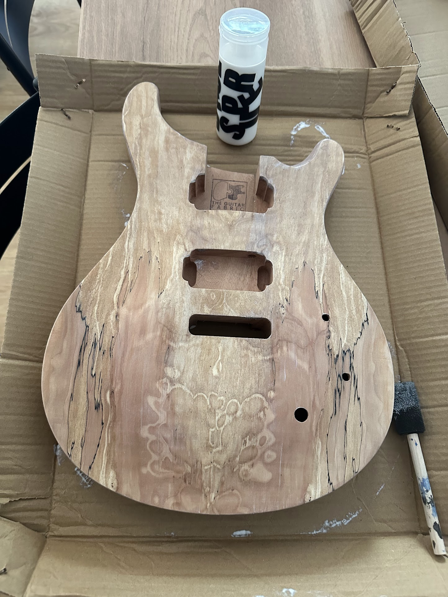
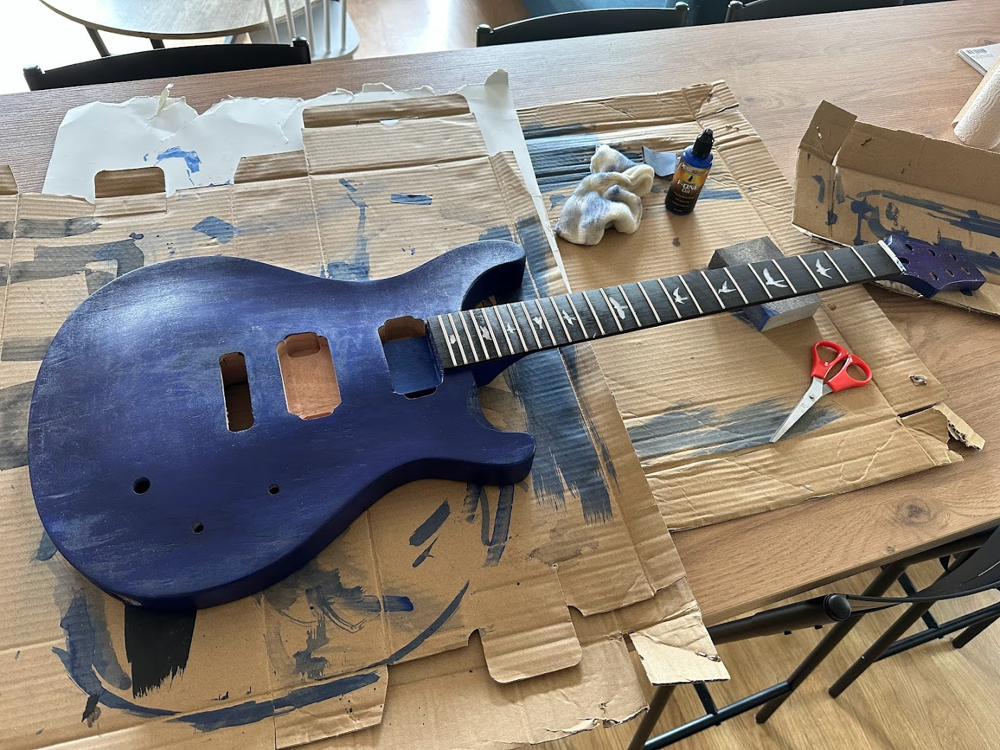
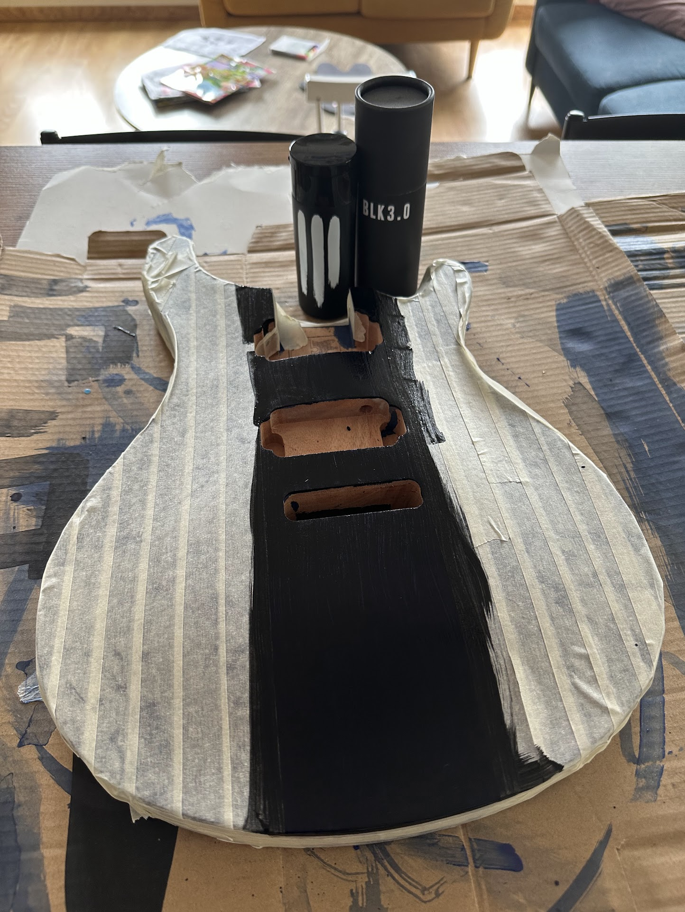
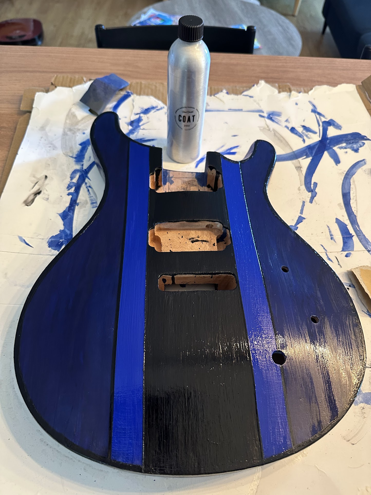
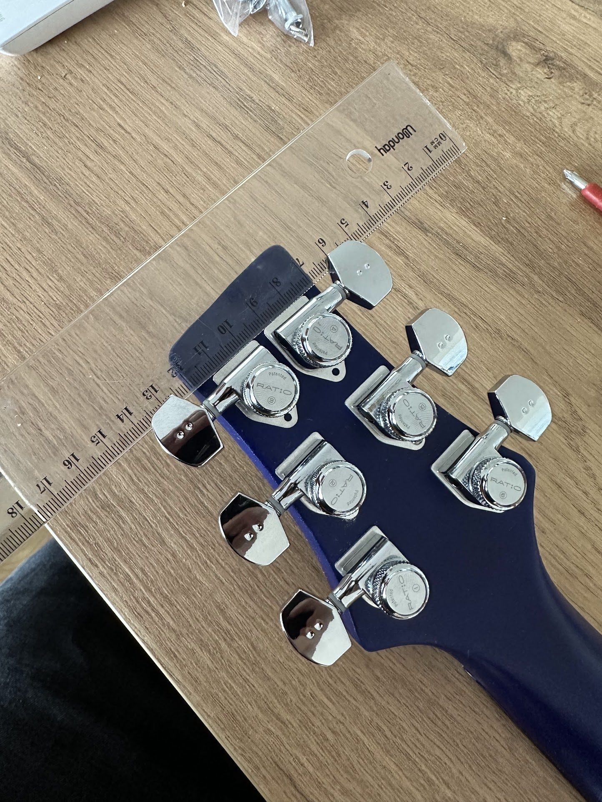
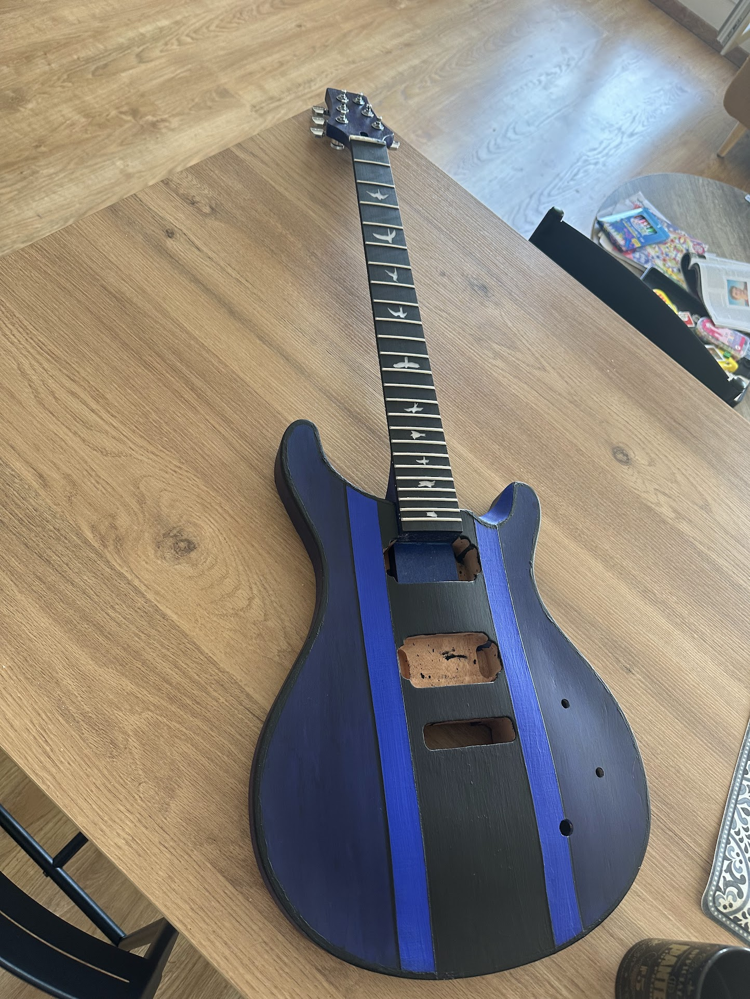
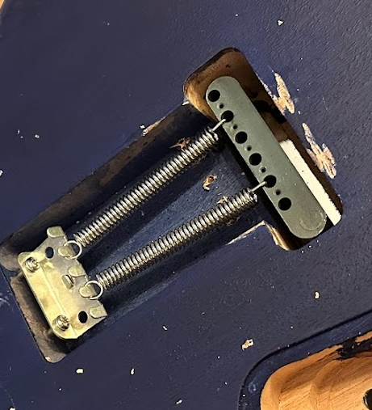
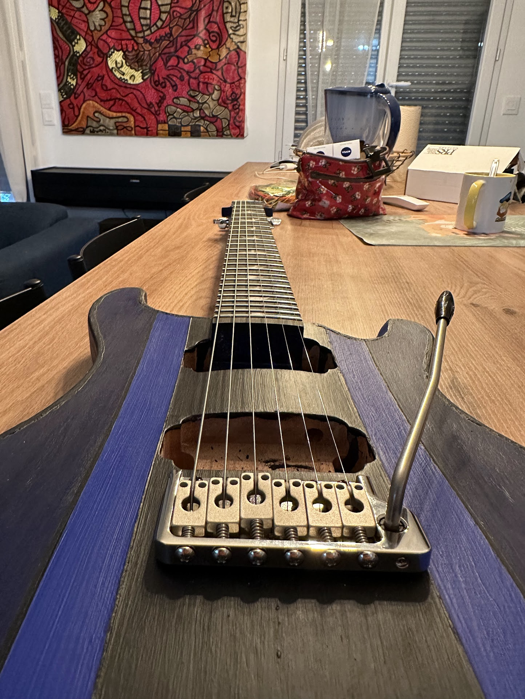


Epic fail.


# Pfiou....
J'ai fini de construire ma guitare.

Et quand je dis "j'ai fini de construire ma guitare",
ce que je veux _vraiment_ dire c'est que le projet est un échec,
que je n'ai pas pu jouer avec et qu'elle a fini sa vie à la recyclerie.
C'est un peu triste,
mais je ne regrette pas d'avoir essayé,
j'ai appris beaucoup de choses,
et je me suis bien amusé malgré tout.

Si j'ai mis autant de temps à écrire cette suite,
c'est que j'ai eu du mal à accepter l'échec.
J'ai eu besoin de prendre du recul,
de digérer,
et de me dire que ce n'était pas grave...

Non,
plus sérieusement,
un peu de flemme et de procrastination,
parsemé de quelques évènements personnels qui ont pris le dessus sur mes loisirs.

Je me motive aujourd'hui pour terminer cette série et apporter un peu de finalité à ce projet,
en espérant qu'elle motivera des gens à tester par eux-mêmes avec un peu plus de succès que moi je l'espère.

Donc voici ce qui s'est passé depuis le dernier épisode.

# Teinture du corps
J'ai d'abord passé une première couche de base mate,
en prévision de la teinture et de la peinture.

    

J'ai passé une première couche de teinture bleue sur le corps...

    

... puis une seconde quelques heures après lorsque la première était sèche.

    

J'avais envie d'un mélange de bleu "police", de bleu de Klein et de noir "trou noir",
donc j'ai commencé par masquer ce qui ne serait pas teint en noir avec du scotch de peinture,
et j'ai passé une première couche de noir...

suivi d'une seconde le lendemain.

    

Le résultat était très sympa,
avec un noir très intense,
et un bleu qui laissait apparaître les veines du bois:

    

J'ai ensuite ajouté deux bandes de bleu de Klein entre la bande noire et le bleu police,
en délimitant par des petites bandes noires,
puis j'ai finalisé avec une couche de vernis mate.

    

# Mécaniques

J'ai ensuite installé les mécaniques,
rien de bien compliqué,
j'ai simplement placé les mécaniques dans les trous et utilisé une règle pour contrôler l'alignement et marquer les points de perçage.

    

# Collage du manche au corps
J'ai ensuite collé le manche au corps avec de la colle à bois,
et c'est la première grosse erreur que j'ai commise:
il ne faut pas teindre ou peindre le manche avant de le coller au corps.

    

    

À ce stade,
naïvement je pense avoir réussi l'opération,
le manche semble bien collé au corps.

    

# Installation du chevalet

Le moment qui me stressait le plus,
l'installation du chevalet.

    

À ce stade,
je réalise que le manche n'est pas complètement aligné avec le chevalet...
alors que le manche était bien en butée dans la découpe du corps sans aucun jeu,
et que le chevalet était bien placé dans la découpe.

J'avais un peu d'espoir de pouvoir corriger ça en jouant un peu sur le réglage du chevalet,
mais j'ai vite réalisé que c'était impossible.

Dans tous les cas,
le corps ayant été collé et teint,
plus moyen de demander un échange donc je me suis dit que je ne risquais rien à continuer.

    

J'ai fini d'installé le chevalet ...

    

... puis installé les cordes pour voir l'étendue des dégats.

    

# Le projet fini

Une petite vue de l'ensemble ?

    

Le résultat est esthétiquement sympa,
je me voyais déjà jouer avec,
mais j'ai vité réalisé que c'était impossible:
le cordes n'étaient pas parallèles au manche.

Visuellement,
ça ne choque pas,
mais le décalage est tel que les cordes ne sont pas jouables,
et selon la position certaines techniques ne sont juste pas réalisables:
un simple bend peut faire glisser la corde sur la frette hors du manche passé la 17ème frette.

Même en étant très optimiste...
je ne pouvais pas jouer avec cette guitare.

Un autre problème est survenu deux jours plus tard:
je me rends compte que le manche est complètement décollé du corps.

    

Après avoir retiré les cordes,
je retente de coller le manche au corps et laisser plus de temps,
mais j'apprends par la suite que la colle à bois ne colle pas sur de la teinture ou de la peinture.
La sanction ne tarde pas,
le manche se décolle à nouveau.

Je fini donc par visser le manche au corps...
c'est bien il tient...
mais la guitare reste injouable à cause du décalage entre le manche et le chevalet.

# Conclusion

Évidemment une déception puisque je ne peux pas jouer avec,
et que j'ai investi quelques centaines d'euros dans le projet,
mais je ne regrette pas d'avoir essayé,
j'ai beaucoup appris et je me suis bien amusé malgré tout.

J'ai découvert que la construction d'une guitare n'est pas un projet trivial,
qu'il faut être très précis,
que la moindre erreur peut être fatale,
et que la patience est une qualité indispensable.

J'ai appris que j'aimais bien la peinture,
que j'aime bien l'odeur du bois,
mais que je n'aime pas le travail de précision et donc que je ne me vois pas en faire une seconde.

Sachant que j'envisageais un stage de lutherie pour fabriquer ma guitare en 2024,
cette leçon a quelques centaines d'euros m'a évité de perdre plusieurs milliers d'euros dans un stage qui ne m'aurait pas plu.

Je vais donc me contenter de jouer avec mes guitares achetées dans le commerce :-)

